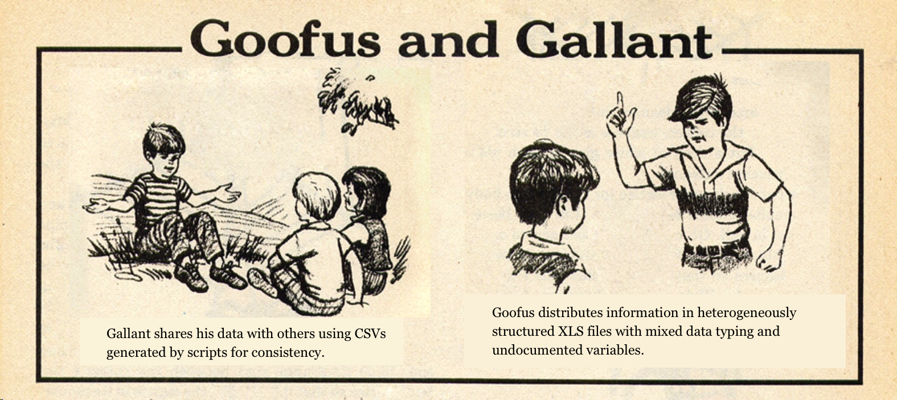

```{r setup, include=FALSE}
knitr::opts_chunk$set(echo = TRUE)
```

# Introduction to data hell


Our goal is to download, import, and clean up the files posted at [California Office of Statewide Health Planning and Development Hospital Quarterly Financial and Utilization Data Files](http://oshpd.ca.gov/hid/Products/Hospitals/QuatrlyFinanData/CmpleteData/default.asp) from 2000-2015. The end result should be a data frame with one row per hospital per year and over 100 columns of information, set up so that I could easily do whatever analysis I wanted with it.

The data of interest are provided in files grouped annually for 2000-2015. Someone studying public spending on healthcare over this time period would be interested in these data. For example, an analyst might want to look at time trends on spending within each hospital, examine hospital characteristics (like size, affiliation) and their relationship with expenditures, or compute total hospital spending by city or county within each year.

This seems straightforward, but turns out to be challenging due to surprise inconsistencies in how this agency prepared the Excel files. It took me about 10 hours to figure everything out and write this up, and I didn't even do any actual analysis! This is slightly more complex than typical data issues I encounter, but it's an "in the wild" example of manageable size, and worth studying to see how you can solve issues as they pop up.


## Conceptual takeaways

Some lessons you can take away from reading through this:

* Using looping really does save us a lot of repetition when it's working right! Imagine if you had copied and pasted code and made changes for each year: use functions to read in 2000, use functions for 2001, etc. Even the most saintly among us would probably forget to change something somewhere.

* However, there are some one-off problems to deal with, and you will spend most of your time dealing with exceptions to the rule. In this case, we have a conspiracy of human-introduced inconsistencies in file names, column names, column formatting, manually "blanked" cells in Excel, and undocumented extra columns.

* The R functions and packages we use help a lot in avoiding manual typing out of things, but the `readxl` package --- like many others in R --- is still in relatively early development. It shows some limitations here in handling certain aspects of these spreadsheets that drive me to seek less-than-elegant solutions.

* Excel is great for entering in data by-hand, but is a very poor format for transmitting data. Much of my time in this process was spent dealing with Excel-specific issues (primarily where it thinks the "last cell" is) that would not have arisen if the files had been provided as flat text CSVs in the first place.

In this case, I *could* have done this all more quickly by: downloading each of the files individually, opening them up one-by-one in Excel, creating a "master" Excel file, manually pasting in the data from each one of the files into the master file, fixing up column type issues within Excel, exporting this to a single CSV, and importing the CSV into R. However, this is an unappealing solution:

* It does not provide documentation of my process: copying/pasting data or manually telling Excel to export to CSV doesn't leave a digital "trail" behind. You'd have to take my word for what I said I did. Maybe I am a liar, very sloppy, or not forthcoming! Writing code automatically documents your process.

* It provides many opportunities for additional human error (like the Reinhart and Rogoff failure to drag the Excel formula all the way down). For example, maybe I thought I copied data for 2009, and tried to paste it at the bottom of the master spreadsheet. However, I hit a wrong key and the copying didn't work, and instead I end up pasting 2008's data twice without noticing.

* I would need to be smart about running checks on the data to detect issues like the above. I might not notice there was a problem like the above until after I already have the data in and I make a plot by year and see zero data for 2009.

* If I do make a mistake and find it late in the process, I might have to re-do *everything* about to fix it since it might not be obvious where I screwed up. With R, you just need to change a few lines of code.



# Downloading the data automatically

The first step: get the data off the web and onto my computer in a folder called "Downloaded_data", which has the same parent folder as the working directory I set using RStudio project options. I'm going to load some libraries in anticipation of future tasks:

```{r load_libraries, message=FALSE, warning=FALSE}
library(readxl)
library(dplyr)
library(lubridate)
```

## URL patterns

Let's examine all the URLs for the 2000-2015 data to identify patterns and figure out an efficient way to write a loop.

* 2015: <http://oshpd.ca.gov/hid/Products/Hospitals/QuatrlyFinanData/Qtr2015/2015_R4_Q4.xls>
* 2014: <http://oshpd.ca.gov/hid/Products/Hospitals/QuatrlyFinanData/Qtr2014/2014_R4_Q4.xls>
* 2013: <http://oshpd.ca.gov/hid/Products/Hospitals/QuatrlyFinanData/Qtr2013/2013_Q4R4.xls>
* 2012: <http://oshpd.ca.gov/hid/Products/Hospitals/QuatrlyFinanData/Qtr2012/2012R4_Q4.xls>
* 2011: <http://oshpd.ca.gov/hid/Products/Hospitals/QuatrlyFinanData/Qtr2011/2011R4_Q4.xls>
* 2010: <http://oshpd.ca.gov/hid/Products/Hospitals/QuatrlyFinanData/Qtr2010/2010_Q4R4_Rev2.xls>
* 2009: <http://oshpd.ca.gov/hid/Products/Hospitals/QuatrlyFinanData/Qtr2009/2009_Q4R4.xls>
* 2008: <http://oshpd.ca.gov/hid/Products/Hospitals/QuatrlyFinanData/Qtr2008/2008Q4R4_Revised.xls>
* 2007: <http://oshpd.ca.gov/hid/Products/Hospitals/QuatrlyFinanData/Qtr2007/2007_Q4R4.xls>
* 2006: <http://oshpd.ca.gov/hid/Products/Hospitals/QuatrlyFinanData/Qtr2006/2006_Q4R4.xls>
* 2005: <http://oshpd.ca.gov/hid/Products/Hospitals/QuatrlyFinanData/Qtr2005/2005_R4Q4_Rev5-07.xls>
* 2004: <http://oshpd.ca.gov/hid/Products/Hospitals/QuatrlyFinanData/Qtr2004/2004_R4Q4_Rev5-07.xls>
* 2003: <http://oshpd.ca.gov/hid/Products/Hospitals/QuatrlyFinanData/Qtr2003/2003_R4QR_Rev5-07.xls>
* 2002: <http://oshpd.ca.gov/hid/Products/Hospitals/QuatrlyFinanData/Qtr2002/2002_R4Q4_Rev5-07.xls>
* 2001: <http://oshpd.ca.gov/hid/Products/Hospitals/QuatrlyFinanData/Qtr2001/2001_R4Q4_Rev5-07_1.xls>
* 2000: <http://oshpd.ca.gov/hid/Products/Hospitals/QuatrlyFinanData/Qtr2000/2000_R4Q4_Rev5-07.xls>

If we were lucky, these would all follow a regular pattern. We are not completely lucky, and here's what I observe:

* All files are inside a web directory of the form `http://oshpd.ca.gov/hid/Products/Hospitals/QuatrlyFinanData/Qtr[YEAR]` where we replace `[YEAR]` with the appropriate year, so this part is consistent.
* All files have extension `.xls`, also consistent (they could have but did not switch to `.xlsx`).
* Files for 2000, 2002, 2004, and 2005 are named in pattern `[YEAR]_R4Q4_Rev5-07`.
* File for 2001 is named `2001_R4Q4_Rev5-07_1`.
* File for 2003 has a typo in the name vs. the pattern from 2000, 2002, 2004, and 2005: `2003_R4QR_Rev5-07`. (It's subtle -- do you see it?) Oops!
* Files for 2006, 2007, 2009, and 2013 are named in pattern `[YEAR]_Q4R4`.
* File for 2008 named `2008Q4R4_Revised`.
* File for 2010 named `2010_Q4R4_Rev2`.
* File for 2011 and 2012 named `[YEAR]R4_Q4`. 
* File for 2014 and 2015 named `[YEAR]_R4_Q4`.
* Place your bets on the file name for 2016?

What would make sense here is to use a bit of looping to generate these URLs without a ton of copying and pasting by piecing together the parts that do follow a consistent pattern with the parts that don't, which I'll use conditional logic to control. Then when I download these spreadsheets, I'll rename the files something better and consistent for posterity: `CA_OSHPD_utilization_[YEAR].xls`, inside a folder called `Downloaded_data`. That will make reading the data in after downloading simpler, in theory.

## Easy part: making the file names to use for saving

Let's make a vector of the new file names to use (i.e. what will I call the downoaded files). Usually when you download by hand it just gives files the same name they came with, but when you download programmatically, you have a choice. Let's make good choices, or at least better ones than the people who prepared the data made.

To do this, I will use the `paste0` function, which takes character strings (or numbers to convert to characters) and then smushes them together into a single string with no separator. `paste0` uses R's recycling, so giving it [character vector of length 1] + [vector of years] + [character vector of length 1] will give us a vector as long as the number of years where the character vectors are all repeated.

```{r make_filenames}
years <- 2000:2015
extension <- ".xls"
# On Rebecca's computer: working directory is Lectures folder.
# This path goes one level up from there (that's the .. part),
# and then into a folder called Downloaded_data.
# You will need to create or modify these directories based on
# where you are doing things!!
(new_filenames <- paste0("../Downloaded_data/CA_OSHPD_utilization_", years, extension))
```

I put parentheses around the object assignment so that it makes `new_filenames` and then shows me what `new_filenames` is. The output from the above looks good: I've made a vector of names to give the downloaded files that is very nice and consistent.

## Using `for` loops and `if` to generate URLs

Now that we know what we'll call the downloaded files, let's make a vector of the actual URLs to download from. We'll try to avoid manual repetition by making a variable that stores the common part of the URL, and a variable that captures the stuff that does change, and `paste0`ing it all together:

```{r make_URLs}
# the common part for everything
base_url <- "http://oshpd.ca.gov/hid/Products/Hospitals/QuatrlyFinanData/Qtr"

# initialize (pre-allocate) vector for the urls
urls <- character(length(years))

# give its entries names so we don't have to refer to the index
# like 1, 2, 3, ... but rather "2000", "2001", "2002", ...
names(urls) <- years

# loop over years:
for(yr in years) {
    # depending on the year, there's a part of the filename that
    # changes which we figured out by looking at patterns
    # call this changing part "nm"
    if(yr %in% c(2000, 2002, 2004:2005)) {
        nm <- "_R4Q4_Rev5-07"
    } else if(yr == 2001) {
        nm <- "_R4Q4_Rev5-07_1"
    } else if(yr == 2003) {
        nm <- "_R4QR_Rev5-07"
    } else if(yr %in% c(2006:2007, 2009, 2013)) {
        nm <- "_Q4R4"
    } else if(yr == 2008) {
        nm <- "Q4R4_Revised"
    } else if(yr == 2010) {
        nm <- "_Q4R4_Rev2"
    } else if(yr %in% 2011:2012) {
        nm <- "R4_Q4"
    } else if(yr %in% 2014:2015) {
        nm <- "_R4_Q4"
    }
    # now combine all the pieces of the URL to get the full one
    # the "yr" and "nm" parts are what change in the loop
    # urls[as.character(yr)] takes the yr, makes it a character,
    # and then treats that as a name in the named vector urls
    # e.g. if yr is 2000, then as.character(yr) is "2000"
    # so that's pointing to urls["2000"]
    urls[as.character(yr)] <- paste0(base_url, yr, "/", yr, nm, extension)
}
urls
```

Looks good, yeah?

# Downloading the files

Now let's download these files using a loop, from the right URL and saving in the right filename, printing a warning if one of the years didn't work. We'll use the `download.file` command for this. We have to tell it where to download from (`url = `), where to save (`destfile =`) using relative paths, and how to write the file (`mode =`). The operating system needs to write the file with a different `mode` depending if it's something like plain text (which you can look at and what you see is what you get) or something more complicated like a special document type or program. Use `mode = "w"` when downloading plain text (e.g. CSVs), and `mode ="wb"` when downloading files that only open in something special (like Excel).

When we use `download.file`, it downloads the file (duh), but this happens outside of R and doesn't make a new object --- it's just dropping it on your hard drive. The R object `download.file` *does* return is an integer that lets you know if everything is okay (`0` is okay, anything else is bad). We'll store that integer to a temporary variable called `file_check` so that we can make sure things went fine.

```{r download, cache=TRUE, error=TRUE}
for(i in seq_along(urls)) {
    # download the Excel files:
    # mode "wb" means to write a binary file (like Excel or zip)
    # for plain text like a csv, use "w" instead
    file_check <- download.file(url = urls[i],
                                destfile = new_filenames[i],
                                mode = "wb")
    # value returned from download.file is 0 if everything worked
    if(file_check != 0) {
        print(paste0(years[i], " did not work, uh oh!"))
    }
}
```

Thanks to being careful with the detail in the URLs, this worked! If it hadn't, I would have gotten an error message on one of the years, and so I would have to double-check that the URL was really what I wanted.


# Reading in the data

## A simple first attempt

Now I have files saved locally in `Downloaded_data`. Next, I want to import these Excel files into R.

The obvious thing to do is use the `read_excel` function from the `readxl` package to read each file into a data frame. But I still need to loop over each file from 2000 through 2015, and I don't want to make a bunch of extra data frames lying around and have to give each its own special name. A good way to organize this is to make a **list** object to hold each data frame, so I'll do that and call it `yearly_frames`. I'll give `yearly_frames` names (using the years for each slot) in case it's useful later.

One thing that could go wrong is I might accidentally point to a file that doesn't exist because something had gotten bungled earlier. I'm checking for this before I try `read_excel`, just to be extra safe.

```{r read_in_data, cache=TRUE, error=TRUE}
# pre-allocate a list for the data for each year
yearly_frames <- vector("list", length(urls))
# give names to these for easier indexing
names(yearly_frames) <- years

for(i in seq_along(new_filenames)) {
    # extra check that file exists
    if(file.exists(new_filenames[i])) {
        yearly_frames[[i]] <- read_excel(new_filenames[i])
    }
}
```

This doesn't look good!

The abundant `DEFINEDNAME:` messages turn out not to be errors, but appears to convey the `readxl` package's confusion over some cells in the Excel spreadsheet apparently having cell names. That's a thing you can do in Excel, in case you've never seen it before. These cell names are meta-information that will not make it into our data, which is fine in this case. I found this out by Googling `DEFINEDNAME:` and `read_excel`, and it turns out this a known issue with this package (see [here](https://github.com/hadley/readxl/issues/82)). Sometimes we just get weird stuff in R output and have to deal with it, and this looks like one of those times.

## Trying to fix column types

The bigger issue is the warning about column type issues that come up at the end: in particular, a phone number (column 13, based on the output) in some year that was treated as numeric but should not have been because phone numbers aren't really *numeric* even though they sure sound like it.

So, at this point I want to re-do this loop, but now I'm adding in extra arguments to `read_excel` to be consistent about the column types for each year since `read_excel` may be guessing wrong when the values are inconsistently formatted or should really be characters but look like numbers (e.g. with ID numbers).

This means going to the [data documention PDF](http://oshpd.ca.gov/hid/Products/Hospitals/QuatrlyFinanData/QFUR2000AfterDoc.pdf) and looking at the columns to figure out what should be character and what should be numeric. The first two columns are identifiers (number and name), and should be character. Columns 4 and 5 are dates. Columns 6-17 should be character. The rest of the 121 columns appear to be numeric quantities, mostly dollar amounts or counts.

The documentation for `read_excel` (using `?read_excel` to pull up the help) indicates we can pass a character vector to the `col_types` argument containing `"blank"`, `"numeric"`, `"date"` or `"text"` as its entries, with each entry corresponding to a column.

Note: this is different than what we saw in Week 5 when we used the `read_csv` function from `readr` to bring in the Billboard Hot 100 data. The conceptual idea is the same, but there we wanted a single string (i.e. character vector of length 1) that encoded what happened to each column like `"ccciDiiiii"` or something. What `read_csv` looks for is apparently different, probably to keep us on our toes and stave off dementia.

The code below makes a nice character vector the specifies the type for each column in order:

```{r set_column_types}
OSHPD_col_types <- c("text", "text", "numeric", "date", "date",
                     rep("text", 17 - 6 + 1),
                     rep("numeric", 121 - 17))
```

Let's try reading in the files again using `col_types`. This time, anticipating potential further issues, I'll make the loop print messages if there are problems. Putting in `print` statements into your loop to give you status updates is often a good idea!

```{r read_in_data_2, cache=TRUE, error=TRUE}
for(i in seq_along(new_filenames)) {
    # extra check that file exists
    if(file.exists(new_filenames[i])) {
        print(paste0("Now trying ", years[i]))
        yearly_frames[[i]] <- read_excel(new_filenames[i],
                                         col_types = OSHPD_col_types)
    }
}
```

## 2013: "`col_names` and `col_types` must have the same length"

That error message we just got seems to suggest that things were going okay until the `r years[i]` file has an unexpected number of columns (or some other reason for getting a mismatch between number of column types and the column names), and that's breaking things. So let's look at this year on its own without saying what `col_types` is to get to the bottom of this (note that current value of `i` is where the loop broke so this gets me `r years[i]` as intended):

```{r check_out_2013, cache=TRUE, error=TRUE}
plain_2013 <- read_excel(new_filenames[i])
ncol(plain_2013) == length(OSHPD_col_types)
```

When I compare the *number* of columns on the file I read in with the number of columns I said to read in for `col_types`, those appear to match.

What about the names of the columns in `r years[i]`, could something be up there? I'll look at how long the names are when I read it in on its own without `col_types`, and how they compare to a file that worked when I did set `col_types` (specifically, the first file, for year `r years[1]`). I'm using `all.equal` to compare the two character vectors:

```{r check_out_2013_more, cache=TRUE, error=TRUE}
length(colnames(plain_2013)) == length(OSHPD_col_types)
all.equal(colnames(plain_2013), colnames(yearly_frames[[1]]))
```

### A side journey into column name inconsistencies

Doesn't look like anything is wrong with how many columns there are, though the names don't match those from the first file we read in (data for `r years[1]`) --- why?! Let's just look at the first few column names:

```{r name_check}
head(colnames(plain_2013), 10)
head(colnames(yearly_frames[[1]]), 10)
```

It looks like the first year of data used underscores in the column names in the original file, while this weird 2013 file had spaces instead. That *shouldn't* be related to the problems I'm having because I'm not combining things yet, but does mean I should manually specify the column names as well as types when reading the data in to get consistency across years. (Inconsistency in column names would be a big problem when we try to combine everything because then R doesn't want to match up like column with like column!) So going forward, I'll use the names as set up in `r years[1]` for every year.

## Back to 2013: messing with `col_names` and `col_types`

After more digging into how the `read_excel` function determines `col_names`, we can try saying `col_names = FALSE` to not use any for this file, and see if that provides any clues into our errors:

```{r check_out_2013_even_more, cache=TRUE, error=TRUE}
names_types_2013 <- read_excel(new_filenames[i],
                               col_names = FALSE,
                               col_types = OSHPD_col_types)
```

That got us back to our previous error message from when we had only set `col_types`. I don't really know what I'm doing, so just experimenting, maybe we can use the `col_names` from the first year of data?

```{r check_out_2013_even_even_more, cache=TRUE, error=TRUE}
names_types_2013_2 <- read_excel(new_filenames[i],
                                 col_names = colnames(yearly_frames[[1]]),
                                 col_types = OSHPD_col_types)
```

This is a slightly different error message than before. What gives?!

## "Fake blank" cells of doom

Googling this new error message `Error: Need one name and type for each column`, I encounter [a suggestion here](https://github.com/hadley/readxl/issues/81) that there may be blank columns in the Excel file causing it. (You can also see in that github thread that I raised this issue for our data with the `readxl` package author.) When I open up the file, I don't see any blank columns, but there could be some on the right side of the data.

You might be thinking, I don't see any data past column DQ, which is the 121st column, and that is how many things I want to read in. Why is this a problem? Well, this is some Excel-specific nonsense: there was some data in columns after DQ at some point in this spreadsheet's history, but they were blanked out by a person, though not deleted. Excel treats these columns as if they have data in them. They clearly don't any longer, but `read_excel` is still getting a signal from Excel making it think there's something all the way over there to be read in. Confusing? Very!

How can we figure this out since we can't *see* a blank column? If we press *Command*-*fn*-*Right arrow* on a Mac laptop in Excel, (*Cntl-End* on a full Windows keyboard), it jumps to what Excel believes is the last cell. Do so for the 2013 data, and you see this is indeed one column over from the visible range of the data.

So yes, this column to the right of where we think our data stops is actually a "fake blank" column that we'll need to account for. Thus, we should be able to get the import to work if add an entry for one more column as type `"blank"` for 2013. `read_excel` will then drop this `"blank"` column automatically without complaining. We can combine this with the rest of the column types using `c()`.

```{r reimport_2013_no_blanks, cache=TRUE, error=TRUE}
blanks_2013 <- read_excel("../Downloaded_data/CA_OSHPD_utilization_2013.xls",
                          col_types = c(OSHPD_col_types, "blank"))
dim(blanks_2013)
```

## Whack-a-mole in 2014 and 2015

Victory! Now I just have to make a change in the loop for 2013's columns to add conditional logic to deal with one more entry to the `col_types` for that stupid blank column. Also, for consistency, I want to manually specify column names and skip the header row for each file with `skip = 1`. (Before, it was using the header row just to get the column names, but now I don't want it to do that since they change from file to file, so we need to tell `read_excel` to skip it.)

Brace yourself for several hundred lines of errors to scroll past:

```{r read_in_data_3, cache=TRUE, error=TRUE}
# set the column names based on the first year of data previously read in
OSHPD_col_names <- colnames(yearly_frames[[1]])

for(i in seq_along(new_filenames)) {
    if(file.exists(new_filenames[i])) {
        print(paste0("Now trying ", years[i]))
        # set column names and types for standardized import
        cnames <- OSHPD_col_names
        ctypes <- OSHPD_col_types
        # 2013 is a special case -- add one more column
        if(years[i] == 2013) {
            cnames <- c(OSHPD_col_names, "missing")
            ctypes <- c(OSHPD_col_types, "blank")
        }
        yearly_frames[[i]] <- read_excel(new_filenames[i],
                                         col_names = cnames,
                                         col_types = ctypes,
                                         skip = 1) # ignore header
    }
}
```

Dang! This time, we got that error message for 2015, but also all those warnings with 2014 in column 18 (`r OSHPD_col_names[18]` is what we're calling that variable).

## 2014: manually fixing a column type

First, fixing the 2014 issue: When I open the 2014 file in Excel, I see some ding-dong has encoded column 18 as text instead of a number (there are little green warning flags about this in the Excel sheet). It really should be a number (it's a count of beds), but `read_excel` is picking up the sheet's strong desire to represent this data as character.

I'll make an exception for 2014 and read column 18 in as a character, and then convert it to numeric using `as.numeric` inside the `funs` for `mutate_each_` in `dplyr`. I prefer this solution over messing with the original Excel file for reproducibility reasons.

Note: the `_` at the end of `mutate_each_` means we use what's called *standard evaluation*, where the variables are given as character vector values rather than "naked" as we usually do with `dplyr` (e.g. `select(country, year, lifeExp)` from `gapminder` has no quotes). This is convenient in this case because I want to refer to the variable to convert by *position* in the column name vector I made rather that typing it manually. See the [non-standard evaluation vignette](https://cran.r-project.org/web/packages/dplyr/vignettes/nse.html) for more details, but the gist is that the underscore version of the function lets use use quotes around variables.

```{r read_in_data_4, cache=TRUE, error=TRUE}
for(i in seq_along(new_filenames)) {
    if(file.exists(new_filenames[i])) {
        print(paste0("Now trying ", years[i]))
        # set column names and types for standardized import
        cnames <- OSHPD_col_names
        ctypes <- OSHPD_col_types  
        if(years[i] == 2013) {
            cnames <- c(OSHPD_col_names, "missing")
            ctypes <- c(OSHPD_col_types, "blank")
        }
        # special character column type in 2014
        if(years[i] == 2014) {
            ctypes[18] <- "text"
        }
        yearly_frames[[i]] <- read_excel(new_filenames[i],
                                         col_names = cnames,
                                         col_types = ctypes,
                                         skip = 1) # ignore header
        # convert 2014 column 18 to numeric
        if(years[i] == 2014) {
            # use mutate_each_ (not plain mutate) so that I can refer
            # to columns as quoted values in conversion
            yearly_frames[[i]] <- yearly_frames[[i]] %>%
                mutate_each_(funs(as.numeric),
                             OSHPD_col_names[18])
        }
    }
}
```

## 2015: an unexpected "gift"

Okay, so now 2013 and 2014 are fixed. What is 2015's problem? We'll try reading it in on its own with nothing special as a starter diagnostic.

```{r check_out_2015, cache=TRUE, error=TRUE}
plain_2015 <- read_excel(new_filenames[i])
ncol(plain_2015)
```

The warning about the phone number in column 13 I can deal with. But my bigger problem is someone thought it would be nice to provide undocumented extra columns for 2015. So kind! Why do we have `r ncol(plain_2015)` instead of `r length(OSHPD_col_names)`? What are these?

I'll make a data frame comparing the variable in 2015 to the ones in the older files (using the column names we grabbed from 2000). Since these aren't of equal length, I'll pad out the old column names from 2000 with missing values:

```{r col_comparison, cache=TRUE, error=TRUE}
# how many extra columns did we get?
extra_col_count <- ncol(plain_2015) - length(OSHPD_col_names)
# make data frame: first column has 2015 col names, second has old ones
# with NAs to make up difference
(compare_cols <- data.frame(names_2015 = colnames(plain_2015),
                            names_other = c(OSHPD_col_names,
                                            rep("NA", extra_col_count))))
```

From this, we see that the old columns match up to the new ones, and the new ones are undocumented information apparently not provided at all for previous years. Stuff isn't moved around, it's just extra. Looking at the 2015 file, these bonus columns are all numeric. I'll take the names from what we have for these in 2015 and specify that these are numeric in the next version of this loop (warning warning: lots of warnings to follow!):

```{r read_in_data_5, cache=TRUE, error=TRUE}
# define special extra columns for 2015:
# want old names and types to be the same, but add on more
# for the extra ones in 2015 file
OSHPD_col_types_2015 <- c(OSHPD_col_types, rep("numeric", extra_col_count))
OSHPD_col_names_2015 <- c(OSHPD_col_names,
                          colnames(plain_2015)[(length(OSHPD_col_names) + 1):length(OSHPD_col_types_2015)])
                          
for(i in seq_along(new_filenames)) {
    if(file.exists(new_filenames[i])) {
        print(paste0("Now trying ", years[i]))
        # set column names and types for standardized import
        cnames <- OSHPD_col_names
        ctypes <- OSHPD_col_types  
        if(years[i] == 2013) {
            cnames <- c(OSHPD_col_names, "missing")
            ctypes <- c(OSHPD_col_types, "blank")
        }
        # special character column type in 2014
        if(years[i] == 2014) {
            ctypes[18] <- "text"
        }
        if(years[i] == 2015) {
            ctypes <- OSHPD_col_types_2015
            cnames <- OSHPD_col_names_2015
        }
        yearly_frames[[i]] <- read_excel(new_filenames[i],
                                         col_names = cnames,
                                         col_types = ctypes,
                                         skip = 1) # ignore header
        # convert 2014 column 18 to numeric
        if(years[i] == 2014) {
            # use mutate_each_ (not plain mutate) so that I can refer
            # to columns as quoted values in conversion
            yearly_frames[[i]] <- yearly_frames[[i]] %>%
                mutate_each_(funs(as.numeric),
                             cnames[18])
        }
    }
}
```

## Back to the drawing board with 2015's dates

UGH. The 2015 file read in this time, extra columns and all, but I'm getting warning messages about the two date columns (columns 4 and 5). There's nothing weird-looking with the Excel file except that the dates are styled as MM/DD/YYYY instead of M/D/YYYY like in the other files. I'll fix this using a similar approach as with the weird not-a-number-but-should-have-been column for bed county in the 2014 file: read them in as character, then convert to a date (using the `lubridate` package).

```{r read_in_data_6, cache=TRUE, error=TRUE}
# special column type for 2015 dates
OSHPD_col_types_2015[4:5] <- "text"
                          
for(i in seq_along(new_filenames)) {
    if(file.exists(new_filenames[i])) {
        print(paste0("Now trying ", years[i]))
        # set column names and types for standardized import
        cnames <- OSHPD_col_names
        ctypes <- OSHPD_col_types  
        if(years[i] == 2013) {
            cnames <- c(OSHPD_col_names, "missing")
            ctypes <- c(OSHPD_col_types, "blank")
        }
        # special character column type in 2014
        if(years[i] == 2014) {
            ctypes[18] <- "text"
        }
        if(years[i] == 2015) {
            ctypes <- OSHPD_col_types_2015
            cnames <- OSHPD_col_names_2015
        }
        yearly_frames[[i]] <- read_excel(new_filenames[i],
                                         col_names = cnames,
                                         col_types = ctypes,
                                         skip = 1) # ignore header
        # convert 2014 column 18 to numeric
        if(years[i] == 2014) {
            # use mutate_each_ (not plain mutate) so that I can refer
            # to columns as quoted values in conversion
            yearly_frames[[i]] <- yearly_frames[[i]] %>%
                mutate_each_(funs(as.numeric),
                             cnames[18])
        }
        # convert 2015 date columns (4 and 5) to dates
        # since they get read in as character to fix a problem
        if(years[i] == 2015) {
            yearly_frames[[i]] <- yearly_frames[[i]] %>%
                mutate_each_(funs(mdy),
                             cnames[4:5])
        }
    }
}
```

FINALLY! Can you believe it?

If I wasn't being transparent about this iterative bug-squashing process, basically all I would have in my final R code is this last loop and the variable definitions that went into it.


# Combining everything

After much effort, we have read all the data in and formatted it properly and consistenly across years. Let's combine the files for all years using `bind_rows` from `dplyr` to get one big file rather than 16 separate. I'm going to use the `.id` argument in the `bind_rows` function to add a column called `orig_file` for which file number each row came from for further debugging. This takes the name of the list element each thing came from and makes a column of it. We set this to be the year of each file, so it's very informative.

```{r combine}
# combine everything
CA_OSHPD_util <- bind_rows(yearly_frames, .id = "orig_file")
dim(CA_OSHPD_util)
summary(CA_OSHPD_util)
```

## Missing rows

This worked well. One thing I see is that there are some unexpected missing values in things that seem like they shouldn't have any, like the `YEAR_QTR` column. Which file did these come from?

```{r inspect_NA}
CA_OSHPD_util %>%
    filter(is.na(YEAR_QTR))
```

Some from file 2011, some from file 2015. I'm happy I made that file source column to tell me this! Let's look at those files in the list and see if there were extra rows read in at the end:

```{r inspect_NA_2}
tail(yearly_frames[["2011"]])
tail(yearly_frames[["2015"]])
```

Indeed, there were a few rows missing basically all info at the end of these two files. If I look at the original Excel files and press the keyboard command to find the real end of the file, these were "fake blank" rows (just like the fake blank columns that caused me grief with 2013). Fake blank rows are no sweat, though, not compared with the fake-blank columns breaking `read_excel`. I'll just filter out these rows by looking for `NA` values in a column that should be fully populated.

```{r remove_NA}
# combine everything
CA_OSHPD_util <- CA_OSHPD_util %>%
    filter(!is.na(YEAR_QTR))
```

# Character columns: fixing extraneous decimals

```{r show_preview}
head(CA_OSHPD_util)
```

Something I'm observing looking at the file is that some of the values in the character columns that look like numbers (`FAC_NO`, `HSA`, `HFPA`) have weird decimals added due to Excel storing the info in "general" format some years and "text" format in others:

```{r show_weird_decimals}
CA_OSHPD_util %>%
    select(FAC_NO, HSA, HFPA) %>%
    head(10)
```

These are going to be annoying if I wanted to group by any of these variables, because I need identifiers to be consistent across time and 6 extra decimal places does not help that cause. I want to take periods and any zeros after in these columns and remove them. We'll see more about this in the string-cleaning lecture, but I'll use the `gsub` function in base R inside `mutate_each` to do this to each of these variables.

```{r fix_character_cols}
CA_OSHPD_util <- CA_OSHPD_util %>%
    # translating the regular expression pattern:
    # \\. matches the location of the period.
    # 0+ matches at least one zero and possibly more following that period.
    # replacement for period + 0s is nothing (empty string)
    mutate_each(funs(gsub(pattern = "\\.0+",
                          x = .,
                          replacement = "")),
                # variables to fix:
                FAC_NO, HSA, HFPA)

CA_OSHPD_util %>%
    select(FAC_NO, HSA, HFPA) %>%
    head(10)
```

Much better! There are probably more issues at this point, but not ones I'm noticing. This is good enough for now.

# Exporting the file and memory cleanup

To finish this off, I'll save this formatted R file in a `.rds` format so that I can use it for whatever I want in the future and not worry about variable types getting screwed up.

```{r save_R}
# save the data in an R file
saveRDS(CA_OSHPD_util, "../Downloaded_data/CA_OSHPD_util.rds")
```

I'll also get rid of the list that was storing the files for each year from memory since I don't need it anymore. This isn't strictly needed, but if these files were larger, I'd definitely want to do this to free up memory.

```{r clear_mem}
rm(yearly_frames)
```

# Session information

```{r session_info}
sessionInfo()
```