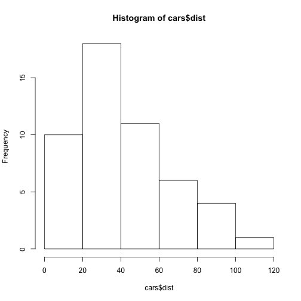
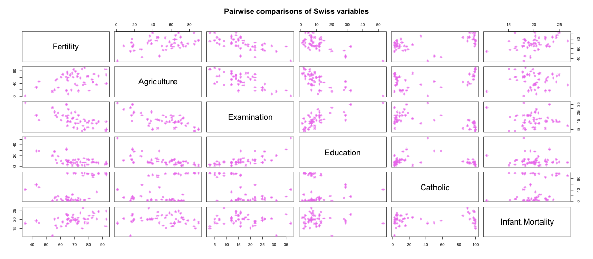

CSSS 508, Week 1
===
author: Rebecca Ferrell
date: March 30, 2016
transition: rotate
width: 1100
height: 750


Course information
===
type: section


Course goals
===
incremental: true

- Develop intermediate data analysis skills in R
- Learn programming basics
- Drink reproducibility Kool-Aid
- Pick up some handy statistical techniques


Logistics
===

- Savery 117 on Wednesdays, 3:30-5:20
- Format: lecture -> short break -> lab exercise (approximately)
- Materials: <http://rebeccaferrell.github.io/CSSS508>
- Office hours: TBD, will be in Padelford C-14A
- Grading:
    + Final grade: Cr/NC, **60% to get Cr**
    + Homework most weeks (70% of grade), combo of reading and programming
    + Participation = peer grading the HW (30% of grade)
    + Grades and discussion forums maintained on Canvas page


Peer grading, really?!
===

Yes, peer grading...

- Write your reports better knowing others will see them
- Learn new tricks from reading others' code, "appreciate the little things"
- Randomly assigned peers, turnaround time: 1 week (due before next class)
- You'll get a rubric and are expected to leave constructive comments
- High scoring assignments will be adapted into keys (with your permission)
- Talk to me if you want more feedback


Getting help on the Canvas forums
===
incremental: true

Don't be Goofus:

> tried lm(y~x) but it iddn't work wat do i do

Instead, be Gallant: 

> ```
y <- seq(1:10) + rnorm(10)
x <- seq(0:10)
model <- lm(y ~ x)
```
> Running the block above gives me the following error, anyone know why?
```
Error in model.frame.default(formula = y ~ x, drop.unused.levels = TRUE) : 
  variable lengths differ (found for 'x')
```

Rough schedule
===
incremental: true

1. Intro to R, RStudio, and R Markdown
2. Making awesome plots with `ggplot2`
3. Summarizing and combining data: `dplyr`
4. R data structures
5. Data cleaning: import/export, `tidyr`, dates
6. Programming and functions
7. More programming and functions
8. String/text processing
9. Taking requests for final weeks!


Data sources
===
Do you have a source of data you'd like to see used in this class? Talk to me: <rferrell@uw.edu>

- Must have no restrictions on public use
- Pertinent to social science, public policy, global health
- Examples:
    + Census public use microdata sample
    + City of Seattle, King County, State of WA
    + World Health Organization, World Bank, United Nations
    + Data made public from studies


Using R Markdown Within RStudio
===
type: section


R and RStudio
===
incremental: true

 is a programming language and software environment for statistics. You will learn how to write R code in this course.

 is a front-end for R. You do not have to use it to use R, but it will make your life easier:

- Organizes your code, output, and plotting windows
- Code auto-completion and syntax highlighting
- GUI for viewing data, objects in your environment
- Much easier to make R Markdown documents


Selling you on R Markdown
===
incremental: true

Killer feature of R/RStudio is ease of making R Markdown files:

* Document analyses as you go with integrated text, code, and output
     + No rerunning, recopying, repasting
     + Easy for collaborators to understand
     + Show as little or as much of the guts as you want
* Make presentations (like this one!), webpages, reports in html, Word formats
* Works with LaTeX for PDFs, more formatting control


RStudio
===
Open up RStudio now ([CSSCR lab instructions](https://rebeccaferrell.github.io/CSSS508/CSSCR.html)), and choose *File* > *New File* > *R Script*. Let's get oriented with the interface:

- Top left: code editor pane, viewing data (tabbed)
- Bottom left: console for running code (`>` prompt)
- Top right: list of objects in environment, code history tab
- Bottom right: tabs for browsing files, viewing plots, managing packages, and viewing help files

You can change the layout in *Preferences* > *Pane Layout*.


Editing and running code
===

There are several ways to run R code in RStudio:

1. Highlight lines in the editor window and click **Run** or hit *Cntl-Enter* (*Command-Enter* on a Mac) to run them all
2. Type individual lines in the console and press *Enter*
3. In R Markdown documents, click within a code block ("chunk") and click on a choice in the **Chunks** dropdown

The console will show the lines you ran followed by any printed output. If you mess up (e.g. leave off a parenthesis), R might show a `+` sign prompting you to finish the command:
```
> (11 - 2
+
```
Finish the command or hit *Esc* to get out of this.


R as a calculator
===
incremental: true

In the console, type `123 + 456 + 789` and hit *Enter*.


```r
123 + 456 + 789
```

```
[1] 1368
```

Now in your blank R document in the editor, try typing the line `sqrt(400)` and either clicking **Run** or hitting *Cntl-Enter*.


```r
sqrt(400)
```

```
[1] 20
```


Functions and help
===
incremental: true

`sqrt` is an example of a **function** in R.

If we didn't have a good guess as to what `sqrt` will do, we can type `?sqrt` in the console and look at the **Help** panel on the right.


```r
?sqrt
```

**Arguments** are the inputs to a function. In this case, the only argument to `sqrt` is a number or set of numbers `x`.


Making R Markdown documents
===
incremental: true

Let's try making an R Markdown file:

1. Choose *File* > *New File* > *R Markdown...*
2. Make sure HTML output is selected and click OK
3. Save the file somewhere, call it `my_first_Rmd.Rmd`
4. Click the *Knit HTML* button
5. Watch the progress in the R Markdown pane, then gaze upon your result! You may also open up the file in your computer's browser if you so desire.


YAML headers
===
incremental: true

The header of an .Rmd file is a YAML block (Yet Another Markup Language) code, and everything else is part of the main document.

```
---
title: "Untitled"
author: "Rebecca Ferrell"
date: "March 30, 2016"
output: html_document
---
```
To mess with global formatting, [you can modify the header](http://rmarkdown.rstudio.com/html_document_format.html):

```
output:
  html_document:
    theme: readable
```

R Markdown syntax
===

**bold/strong emphasis**

*italic/normal emphasis*

# Header

## Subheader

### Subsubheader

> Block quote from
> famous person

***

`**bold/strong emphasis**`

`*italic/normal emphasis*`

`# Header`

`## Subheader`

`### Subsubheader`

```
> Block quote from
> famous person
```

More R Markdown syntax
===
left: 30%

1. Ordered lists
1. Are real easy
  1. Even with sublists
  
* Unordered lists
* Are also real easy
  + Also even with sublists

[URLs are trivial](http://www.uw.edu)


***

```
1. Ordered lists
1. Are real easy
  + Even with sublists
```

```
* Unordered lists
* Are also real easy
  + Also even with sublists
```

`[URLs are trivial](http://www.uw.edu)`

``


Nerdy syntax
===

You can put some math $y= \left( \frac{2}{3} \right)^2$ right up in there.

$$\frac{1}{n} \sum_{i=1}^{n} x_i = \bar{x}_n$$

Or a sentence with `code-looking font`.


```
y <- 1:5
z <- y^2
```

***

`You can put some math $y= \left( \frac{2}{3} \right)^2$ right up in there`

`$$\frac{1}{n} \sum_{i=1}^{n} x_i = \bar{x}_n$$`

`` Or a sentence with `code-looking font`. ``


    ```
    y <- 1:5
    z <- y^2
    ```

Your turn
===

Now try editing and re-knitting `my_first_Rmd.Rmd` to give it some pizzazz: add sections, have it number the sections, make a list, throw in the UW logo, change the theme, insert a gratuitous equation...

* [Ways to modify the overall document appearance](http://rmarkdown.rstudio.com/html_document_format.html)
* [Ways to format parts of your document](http://rmarkdown.rstudio.com/authoring_basics.html)


R Markdown formatting caveat
===
incremental: true

To keep R Markdown dead-simple, it lacks some features you might occasionally want to use. Your options for fancier documents are:

* Use HTML/CSS for custom formatting
* Use LaTeX and .Rnw files instead of .Rmd

For day-to-day use, plain vanilla R Markdown does the job.


R code and R Markdown
===

Lines of R code make up what are called **chunks**. Code is sandwiched between sets of three backticks and `{r}`.

    ```{r}
    summary(cars)
    ```


```r
summary(cars)
```

```
     speed           dist       
 Min.   : 4.0   Min.   :  2.00  
 1st Qu.:12.0   1st Qu.: 26.00  
 Median :15.0   Median : 36.00  
 Mean   :15.4   Mean   : 42.98  
 3rd Qu.:19.0   3rd Qu.: 56.00  
 Max.   :25.0   Max.   :120.00  
```


Chunk options
===
incremental: true

Chunks have options that control what happens with its code, such as:

* `echo=FALSE`: keeps R code from being shown in the document
* `results='hide'`: hides R's (non-plot) output from the document
* `warning=FALSE, message=FALSE`: suppresses R warnings or messages from the document, e.g. about versions
* `eval=FALSE`: show R code in the document without running it
* `cache=TRUE`: saves results of running that chunk so if it takes a while, you won't have to re-run it each time you re-knit the document
* `fig.height=5, fig.width=5`: modify the dimensions of any plots that are generated in the chunk (units are in inches)


Playing with chunk options
===

Try adding or changing the chunk options (separated by commas) for the two chunks in `my_first_Rmd.Rmd` and re-knitting to check what happens.

You can also name your chunks by putting something after the `r` before the chunk options.

    ```{r summarize_cars, echo=FALSE}
    summary(cars)
    ```
After you name your chunks, look what happens in the dropdown on the bottom left of your editor pane.


In-line R code
===

Sometimes we want to insert a value directly into our text. We do that using code in single backticks starting off with `r`.


`Four score and seven years ago is the same as` `` `r 4*20 + 7` `` `years.`

Four score and seven years ago is the same as 87 years.

Maybe we've saved a variable in a chunk we want to reference in the text:

```r
x <- sqrt(77) # <- is how we assign variables
```

`The value of ` `` `x` `` `rounded to the nearest two decimals is` `` `r round(x, 2)` ``.

The value of `x` rounded to the nearest two decimals is 8.77.


What I just showed you is AMAZING
===
incremental: true

Having R dump values directly into your document protects you from silly mistakes:

* Never wonder "how did I come up with this quantity?" ever again --- just look at your formula in your .Rmd file
* Consistency, no "find/replace" mishaps: reference a variable in-line throughout your document without manually updating if the calculation changes (e.g. reporting sample sizes)
* You are more likely to make a typo in a "hard-coded" number than you are to write R code that somehow runs but gives you the wrong thing


Example: keeping document date current
===

In your YAML header, make the date come from R's `Sys.time()` function by changing:

`date: "March 30, 2016"`

to:

`date: "` `` `r Sys.time()` `` `"`

Fancier option: use `format(Sys.Date(), format="%B %d, %Y")` instead to take today's date and make it read nicely.


Data frames
===
type: section


What's up with cars?
===
incremental: true

In the sample R Markdown document you are working on, `cars` is a built-in **data frame**. You can look at it in a couple of ways:

`View(cars)`: pops up a spreadsheet-looking viewer ("interactive" use only, don't put in R Markdown document!) or


```r
head(cars) # prints first 6 rows, see tail() too
```

```
  speed dist
1     4    2
2     4   10
3     7    4
4     7   22
5     8   16
6     9   10
```


Tell me more about cars...
===
incremental: true


```r
str(cars) # str[ucture]
```

```
'data.frame':	50 obs. of  2 variables:
 $ speed: num  4 4 7 7 8 9 10 10 10 11 ...
 $ dist : num  2 10 4 22 16 10 18 26 34 17 ...
```

```r
summary(cars)
```

```
     speed           dist       
 Min.   : 4.0   Min.   :  2.00  
 1st Qu.:12.0   1st Qu.: 26.00  
 Median :15.0   Median : 36.00  
 Mean   :15.4   Mean   : 42.98  
 3rd Qu.:19.0   3rd Qu.: 56.00  
 Max.   :25.0   Max.   :120.00  
```


Drawing (ugly) pictures of cars
===


```r
hist(cars$speed)
```


***


```r
hist(cars$dist)
```




Drawing (marginally less ugly) pictures of cars
===


```r
hist(cars$dist,
     xlab = "Distance (ft)",
     main = "Observed stopping distances of cars")
```
***


Doing a little car math
===

If you put an assignment `<-` in parentheses `()`, R will print the output of the assignment out for you in your document. Otherwise, it won't show the value.

```r
( dist_mean <- mean(cars$dist) )
```

```
[1] 42.98
```

```r
( speed_mean <- mean(cars$speed) )
```

```
[1] 15.4
```


Drawing (frankly still ugly) pictures of cars
===


```r
plot(dist ~ speed, data = cars,
     xlab = "Speed (mph)",
     ylab = "Stopping distance (ft)",
     main = "Speeds and stopping distances of cars",
     pch = 16)
abline(h = dist_mean, col = "firebrick")
abline(v = speed_mean, col = "cornflowerblue")
```
***


Swiss time
===

Let's *switch gears* to the `swiss` data frame built in to R.

First, use `?swiss` to see what things mean.

Add chunks to your R Markdown document inspecting `swiss`, defining variables, doing some exploratory plots using `hist` or `plot`. You can experiment with [colors](http://www.stat.columbia.edu/~tzheng/files/Rcolor.pdf) and [shapes](http://www.cookbook-r.com/Graphs/Shapes_and_line_types/).


Looking at everything at once
===

```r
pairs(swiss, pch = 8, col = "violet", main = "Pairwise comparisons of Swiss variables")
```




Linear regression
===


```r
( f_ae_reg <- lm(Fertility ~ Agriculture + Education, data = swiss) )
```

```

Call:
lm(formula = Fertility ~ Agriculture + Education, data = swiss)

Coefficients:
(Intercept)  Agriculture    Education  
   84.08005     -0.06648     -0.96276  
```

Try running `summary(f_ae_reg)`.


Installing packages
===
incremental: true

Let's make a table that looks a little less code-y in the output. To do this, we'll want to install a **package** called `pander`.

In the console: `install.packages("pander", repos = "http://cran.us.r-project.org")`.

* You can leave off the `repos` argument if you configure your default repository settings: *Preferences* > *Packages* > *CRAN mirror*. I suggest the Hutch.  

* Once you install a package, you don't need to re-install it until you update R.


Making tables
===

```r
library(pander) # loads pander, do once in your session
pander(summary(swiss), style = "rmarkdown", split.tables = 120)
```


|   Fertility   |  Agriculture  |  Examination  |   Education   |    Catholic     |  Infant.Mortality  |
|:-------------:|:-------------:|:-------------:|:-------------:|:---------------:|:------------------:|
| Min.   :35.00 | Min.   : 1.20 | Min.   : 3.00 | Min.   : 1.00 | Min.   :  2.150 |   Min.   :10.80    |
| 1st Qu.:64.70 | 1st Qu.:35.90 | 1st Qu.:12.00 | 1st Qu.: 6.00 | 1st Qu.:  5.195 |   1st Qu.:18.15    |
| Median :70.40 | Median :54.10 | Median :16.00 | Median : 8.00 | Median : 15.140 |   Median :20.00    |
| Mean   :70.14 | Mean   :50.66 | Mean   :16.49 | Mean   :10.98 | Mean   : 41.144 |   Mean   :19.94    |
| 3rd Qu.:78.45 | 3rd Qu.:67.65 | 3rd Qu.:22.00 | 3rd Qu.:12.00 | 3rd Qu.: 93.125 |   3rd Qu.:21.70    |
| Max.   :92.50 | Max.   :89.70 | Max.   :37.00 | Max.   :53.00 | Max.   :100.000 |   Max.   :26.60    |


Data looks a little nicer this way
===

```r
pander(head(swiss, 5), style = "rmarkdown", split.tables = 120)
```


|       &nbsp;       |  Fertility  |  Agriculture  |  Examination  |  Education  |  Catholic  |  Infant.Mortality  |
|:------------------:|:-----------:|:-------------:|:-------------:|:-----------:|:----------:|:------------------:|
|   **Courtelary**   |    80.2     |      17       |      15       |     12      |    9.96    |        22.2        |
|    **Delemont**    |    83.1     |     45.1      |       6       |      9      |   84.84    |        22.2        |
|  **Franches-Mnt**  |    92.5     |     39.7      |       5       |      5      |    93.4    |        20.2        |
|    **Moutier**     |    85.8     |     36.5      |      12       |      7      |   33.77    |        20.3        |
|   **Neuveville**   |    76.9     |     43.5      |      17       |     15      |    5.16    |        20.6        |


Homework
===
type: section

Write up a .Rmd file showing some exploratory analyses of the Swiss fertility data. Upload both the .Rmd file and the .html file to Canvas.

Mix in-line R calculations, tables, R output, and plots with text describing the relationships you see. You must use in-line R calculations/references at least once (e.g. with functions like `nrow`, `mean`, `sd`, `cor`, `median`, `min`, `quantile`) and may not hard-code any numbers referenced in your text.

Your document should be pleasant for a peer to look at, with some organization using sections or lists, and all plots labeled clearly. Use chunk options `echo` and `results` to limit the code/output you show in the .html. Discussion of specific values should be summarized in sentences in your text --- not as printed code and output --- and rounded so as not to be absurdly precise.


Grading rubric
===

* 0: Didn't turn anything in
* 1: Turned in but low effort, ignoring many directions
* 2: Decent effort, followed directions with some minor issues
* 3: Nailed it
