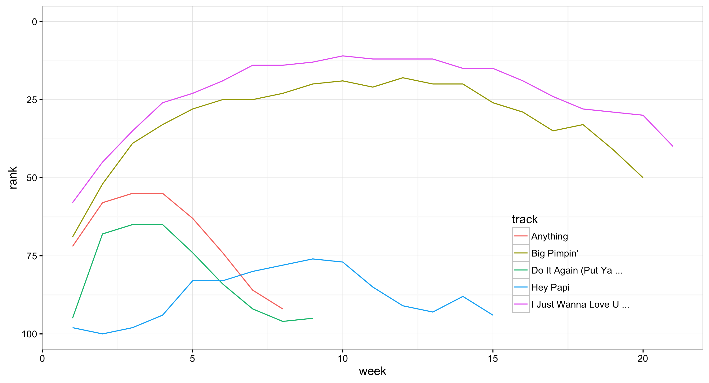

CSSS 508, Week 5
===
author: Rebecca Ferrell
date: April 27, 2016
transition: rotate
width: 1100
height: 750


Today's theme: "data janitor work"
===

Issues around getting data in and out of R and making it analytically ready:

- Working directories and projects
- Importing and exporting data
- Cleaning and reshaping data: `tidyr`
- Dates and times
- Controlling factor variables


Directories
===
type: section

Your working directory
===

The **working directory** is where R will look for and save things by default. You can find out what it is using the function `getwd()`. On my computer when I ran this, it happens to be:

```r
getwd()
```

```
[1] "/Users/rferrell/Dropbox/CSSS508/Lectures"
```


Changing your working directory
===

You can use `setwd(dir = "C:/path/to/new/working/directory")` to change the working directory.

Comments:
* Windows users: make sure to change back slashes (`\`) to forward slashes (`/`) for the filepaths
* Recommendation is to put `setwd` at the very beginning of your `.R` or `.Rmd` code so that someone using a different computer knows they need to modify it


Dropboxes
===

If you're working in a shared Dropbox folder or a similar setup where folders for different users have a common structure after some point, something like this can be a good idea:


```r
# CHANGE ON YOUR MACHINE
individual_path_to_dropbox <- "/Users/rferrell/Dropbox" 
common_in_dropbox <- "CSSS508/our_data_analysis"
setwd(file.path(individual_path_to_dropbox, common_in_dropbox))
```


Projects in RStudio
===

Better way to deal with working directories: RStudio's **project** feature in the top-right dropdown. This has lots of advantages:

* Sets your working directory to be the project directory
* Can remember objects in your workspace, command history, etc. next time you re-open that project
* Reduce risk of intermingling different work using the same variable names (e.g. `n`) by using separate RStudio instances for each project
* Easy to integrate with version control systems (e.g. `git`)


Relative paths
===

Once you've set the working directory, you can refer to folders and files within using relative paths.


```r
library(ggplot2)
a_plot <- ggplot(data = cars, aes(x = speed, y = dist)) +
    geom_point()
ggsave("Graphics/cars_plot.png", plot = a_plot)
```

The above would save an image called "cars_plot.png" inside an existing folder called "Graphics" within my working directory.


Importing and exporting data
===
type: section


Special data access packages
===

Are you working with a popular data source? Try Googling to see if it has a devoted R package on CRAN or on Github (use `devtools::install_github` for these). Examples:

* `WDI`: World Development Indicators (World Bank)
* `WHO`: World Health Organization API
* `censusapi`: Census API
* `acs`: American Community Survey
* `quantmod`: financial data from Yahoo, FRED, Google


Delimited text files
===

Besides a package, the easiest way to work with external data is for it to be stored in a delimited text file, e.g. comma-separated values (**csv**) or tab-separated values (**tsv**).

```
"Subject","Depression","Sex","Week","HamD","Imipramine"
101,"Non-endogenous","Male",0,26,NA
101,"Non-endogenous","Male",1,22,NA
101,"Non-endogenous","Male",2,18,4.04305
101,"Non-endogenous","Male",3,7,3.93183
101,"Non-endogenous","Male",4,4,4.33073
101,"Non-endogenous","Male",5,3,4.36945
103,"Non-endogenous","Female",0,33,NA
103,"Non-endogenous","Female",1,24,NA
103,"Non-endogenous","Female",2,15,2.77259
```

readr
===

R has a variety of built-in functions for importing data stored in text files, like `read.table` and `read.csv`. I recommend using the versions in the `readr` package instead: `read_csv`, `read_tsv`, and `read_delim`:

- Faster!
- Better defaults (e.g. doesn't automatically convert character data to factors)
- A little smarter about dates and times
- Handy function `problems()` you can run if there are errors


readr importing example
===

```r
# install.packages("readr")
library(readr)
```
Let's import some data about song ranks on the Billboard Hot 100 back in 2000:

```r
billboard_2000_raw <- read_csv(file = "https://raw.githubusercontent.com/hadley/tidyr/master/vignettes/billboard.csv")
```

The data URL with a line break for readability:
```
https://raw.githubusercontent.com/hadley/tidyr/master/
vignettes/billboard.csv
```

Did everything go OK?
===
incremental: true

Look at the data types for the last few columns:


```r
# str(billboard_2000_raw)
str(billboard_2000_raw[, 65:ncol(billboard_2000_raw)])
```

```
Classes 'tbl_df', 'tbl' and 'data.frame':	317 obs. of  17 variables:
 $ wk60: int  NA NA NA NA NA NA NA NA NA NA ...
 $ wk61: int  NA NA NA NA NA NA NA NA NA NA ...
 $ wk62: int  NA NA NA NA NA NA NA NA NA NA ...
 $ wk63: int  NA NA NA NA NA NA NA NA NA NA ...
 $ wk64: int  NA NA NA NA NA NA NA NA NA NA ...
 $ wk65: int  NA NA NA NA NA NA NA NA NA NA ...
 $ wk66: chr  NA NA NA NA ...
 $ wk67: chr  NA NA NA NA ...
 $ wk68: chr  NA NA NA NA ...
 $ wk69: chr  NA NA NA NA ...
 $ wk70: chr  NA NA NA NA ...
 $ wk71: chr  NA NA NA NA ...
 $ wk72: chr  NA NA NA NA ...
 $ wk73: chr  NA NA NA NA ...
 $ wk74: chr  NA NA NA NA ...
 $ wk75: chr  NA NA NA NA ...
 $ wk76: chr  NA NA NA NA ...
```


What went wrong?
===
incremental: true

`readr` uses the values in the first 1000 rows to guess the type of the column (integer, logical, numeric, character). There are not many songs in the data that charted for 60+ weeks --- and none in the first 1000 that charted for 66+ weeks! 

To be safe, `readr` assumed the `wk66`-`wk76` columns were character. Use the `col_types` argument to fix this:


```r
# paste is a concatenation function
# i = integer, c = character, D = date
# rep("i", 76) does the 76 weeks of integer ranks
bb_types <- paste(c("icccD", rep("i", 76)), collapse="")

billboard_2000_raw <- read_csv(file = "https://raw.githubusercontent.com/hadley/tidyr/master/vignettes/billboard.csv", col_types = bb_types)
```


Excel files
===

The simplest thing to do with Excel files (`.xls` or `.xlsx`) is open them up, export to CSV, then import in R --- and compare carefully to make sure everything worked!

For Excel files that might get updated and you want the changes to flow to your analysis, I recommend using an R package such as `readxl` or `openxlsx`. For Google Docs Spreadsheets, there's the `googlesheets` package.

You won't keep text formatting, color, comments, or merged cells so if these mean something in your data (*bad*!), you'll need to get creative.


write_csv, write_tsv, write_delim
===

Getting data out of R into a delimited file is very similar to getting it into R:


```r
write_csv(billboard_2000_raw, path = "billboard_data.csv")
```

This saved the data we pulled off the web in a file called "billboard_data.csv" in my working directory.


Saving in R formats
===

Exporting to a CSV drops R metadata, such as whether a variable is a character or factor. You can save objects (data frames, lists, etc.) in R formats to preserve this.

* `.Rds` format:
    + Used for single objects, doesn't save original the object name
    + Save: `write_rds(old_object_name, "path.Rds")`
    + Load: `new_object_name <- read_rds("path.Rds")`
* `.Rdata` or `.Rda` format:
    + Used for saving multiple files where the original object names are preserved
    + Save: `save(object1, object2, ... , file = "path.Rdata")`
    + Load: `load("path.Rdata")` with no assignment

dput
===
incremental: true

For asking for help, it is useful to prepare a snippet of your data with `dput`:


```r
dput(head(cars, 8))
```

```
structure(list(speed = c(4, 4, 7, 7, 8, 9, 10, 10), dist = c(2, 
10, 4, 22, 16, 10, 18, 26)), .Names = c("speed", "dist"), row.names = c(NA, 
8L), class = "data.frame")
```

The output of `dput` can be copied and assigned to an object in R:

```r
temp <- structure(list(speed = c(4, 4, 7, 7, 8, 9, 10, 10), dist = c(2, 
10, 4, 22, 16, 10, 18, 26)), .Names = c("speed", "dist"), row.names = c(NA, 8L), class = "data.frame")
```


Reading in data from other software
===

Working with Stata or SPSS users? You can use a package to bring in their saved data files:

* `foreign` for Stata, SPSS, Minitab
* `sas7bdat` for SAS

As always, Google it.


Cleaning up data
===
type: section


Initial spot checks
===
incremental: true

* Did the last rows/columns from the original file make it in?
    + May need to use different package or manually specify range
* Are the column names in good shape?
    + Modify a `col_names` argument or fix with `rename`
* Are there "decorative" blank rows or columns to remove?
    + `filter` or `select` out those rows/columns
* How are missing values represented: `NA`, blank, period, `999`?
    + Use `mutate` with `ifelse` to fix these (perhaps *en masse* with looping)
* Are there character data (e.g. ZIP codes with leading zeroes) being incorrectly represented as numeric or vice versa?
    + Modify `col_types` argument, or use `mutate` and `as.numeric`


"Pretty-messy" data
===
incremental: true

| **Program**       | **Female** | **Male** |
|---------------|-------:|-----:|
| Evans School  |     10 |    6 |
| Arts & Sciences |    5 |    6 |
| Public Health |      2 |    3 |
| Other         |      5 |    1 |

* What is an observation?
    + A group of students from a program of a given gender
* What are the variables?
    + Program, gender
* What are the values?
    + Program: Evans School, Arts & Sciences, Public Health, Other
    + Gender: Female, Male -- **in the column headings, not its own column!**
    + Count: **spread over two columns!**


Billboard is just "ugly-messy"
===
incremental: true


```r
View(billboard_2000_raw)
```

* What are the **observations** in the data?
    + Week since entering the Billboard Hot 100 per song
* What are the **variables** in the data?
    + Year, artist, track, song length, date entered Hot 100, week since first entered Hot 100 (**spread over many columns**), rank during week (**spread over many columns**)
* What are the **values** in the data?
    + e.g. 2000; 3 Doors Down; Kryptonite; 3 minutes 53 seconds; April 8, 2000; Week 3 (**stuck in column headings**); rank 68 (**spread over many columns**)


tidy data
===
incremental: true

**Tidy data** (aka "long data") are such that:

1. The values for a single observation are in their own row.
2. The values for a single variable are in their own column.
3. The observations are all of the same nature.

Why do we want tidy data?

* Required for plotting in `ggplot2`
* Required for many types of statistical procedures (e.g. hierarchical or mixed effects models)
* Fewer confusing variable names
* Fewer issues with missing values and "imbalanced" repeated measures data


tidyr
===
incremental: true

The `tidyr` package provides functions to tidy up data, similar to `reshape` in Stata or `varstocases` in SPSS. Key functions:

* `gather`: takes a set of columns and rotates them down to make two new columns: one storing the original column names (`key`), and one with the values in those columns (`value`)
* `spread`: inverts `gather` by taking two columns and rotating them up
* `separate`: pulls apart one column into multiple (common with freshly `gather`ed data where values had been embedded in column names)
    + `extract_numeric` does a simple version of this for the common case when you just want grab the number part
* `unite`: inverts `separate` by gluing together multiple columns into one character column (less common)

gather
===
incremental: true

Let's use `gather` to get the week and rank variables out of their current layout into two columns (big increase in rows, big drop in columns):

```r
library(dplyr)
library(tidyr)
billboard_2000 <- billboard_2000_raw %>%
    gather(key = week, value = rank, starts_with("wk"))
dim(billboard_2000)
```

```
[1] 24092     7
```
`starts_with` and other helper functions from `dplyr::select` work here too. Could instead use: `gather(key = week, value = rank, wk1:wk76)` to pull out these continguous columns.


gathering better?
===
incremental: true


```r
summary(billboard_2000$rank)
```

```
   Min. 1st Qu.  Median    Mean 3rd Qu.    Max.    NA's 
   1.00   26.00   51.00   51.05   76.00  100.00   18785 
```

* We don't want to keep the 18785 rows with missing ranks (i.e. observations for weeks since entering the Hot 100 that the song was no longer on the Hot 100).


gathering better: na.rm
===
incremental: true

The argument `na.rm` to `gather` will remove rows with missing ranks.

```r
billboard_2000 <- billboard_2000_raw %>%
    gather(key = week, value = rank, starts_with("wk"),
           na.rm = TRUE)
summary(billboard_2000$rank)
```

```
   Min. 1st Qu.  Median    Mean 3rd Qu.    Max. 
   1.00   26.00   51.00   51.05   76.00  100.00 
```


separate
===
incremental: true

The track length column isn't analytically friendly. Let's convert it to a number rather than the character (minutes:seconds) format:

```r
billboard_2000 <- billboard_2000 %>%
    separate(time, into = c("minutes", "seconds"),
             sep = ":", convert = TRUE) %>%
    mutate(length = minutes + seconds / 60) %>%
    select(-minutes, -seconds)
summary(billboard_2000$length)
```

```
   Min. 1st Qu.  Median    Mean 3rd Qu.    Max. 
  2.600   3.667   3.933   4.031   4.283   7.833 
```

extract_numeric
===
incremental: true

`tidyr` provides a convenience function to grab just the numeric information from a column that mixes text and numbers:


```r
billboard_2000 <- billboard_2000 %>%
    mutate(week = extract_numeric(week))
summary(billboard_2000$week)
```

```
   Min. 1st Qu.  Median    Mean 3rd Qu.    Max. 
   1.00    5.00   10.00   11.47   16.00   65.00 
```

For more sophisticated conversion or pattern checking, you'll need to use string parsing (to be covered later).


spread motivation
===

`spread` is the opposite of `gather`, which you use if you have data for the same observation taking up multiple rows.

Example of data that we probably want to spread (unless we want to plot each statistic in its own facet):

| **Group** | **Statistic** | **Value** |
|-------|-----------|------:|
| A     | Mean      |  1.28 |
| A     | Median    |   1.0 |
| A     | SD        |  0.72 |
| B     | Mean      |  2.81 |
| B     | Median    |     2 |
| B     | SD        |  1.33 |

A common cue to use `spread` is you have measurements of different quantities in the same column. 


spread illustration: before
===
incremental: true


```r
(too_long_data <- data.frame(Group = c(rep("A", 3), rep("B", 3)), Statistic = rep(c("Mean", "Median", "SD"), 2), Value = c(1.28, 1.0, 0.72, 2.81, 2, 1.33)))
```

```
  Group Statistic Value
1     A      Mean  1.28
2     A    Median  1.00
3     A        SD  0.72
4     B      Mean  2.81
5     B    Median  2.00
6     B        SD  1.33
```

spread illustration: after
===
incremental: true


```r
(just_right_data <- too_long_data %>%
    spread(key = Statistic, value = Value))
```

```
  Group Mean Median   SD
1     A 1.28      1 0.72
2     B 2.81      2 1.33
```

Charting the charts of 2000: data prep
===

Let's look at songs that hit #1 at some point and look how they got there vs. the songs that didn't:


```r
# find best rank for each song
best_rank <- billboard_2000 %>%
    group_by(artist, track) %>%
    summarize(min_rank = min(rank),
              weeks_at_1 = sum(rank == 1)) %>%
    mutate(`Peak rank` = ifelse(min_rank == 1, "Hit #1", "Didn't #1"))

# merge onto original data
billboard_2000 <- billboard_2000 %>%
    left_join(best_rank, by = c("artist", "track"))
```

Charting the charts of 2000: ggplot2
===


```r
library(ggplot2)
billboard_trajectories <- ggplot(
    data = billboard_2000,
    aes(x = week, y = rank,
        group = track, color = `Peak rank`)
    ) +
    geom_line(aes(size = `Peak rank`), alpha = 0.4) +
    # rescale time: early weeks more important
    scale_x_log10(breaks = seq(0, 70, 10)) +
    # want rank 1 on top, not bottom
    scale_y_reverse() + theme_classic() +
    scale_color_manual(values = c("black", "red")) +
    scale_size_manual(values = c(0.25, 1)) +
    theme(legend.position = c(0.90, 0.25),
          legend.background = element_rect(fill="transparent"))
```


Charting the charts of 2000: beauty!
===


Observation: there appears to be censoring around week 20 for songs falling out of the top 50 that I'd want to follow up on.


Which songs were #1 the most weeks?
===
incremental: true


```r
billboard_2000 %>%
    select(artist, track, weeks_at_1) %>%
    distinct(artist, track, weeks_at_1) %>%
    arrange(desc(weeks_at_1)) %>%
    head(7)
```

```
Source: local data frame [7 x 3]

               artist                   track weeks_at_1
                (chr)                   (chr)      (int)
1     Destiny's Child Independent Women Pa...         11
2             Santana            Maria, Maria         10
3 Aguilera, Christina Come On Over Baby (A...          4
4             Madonna                   Music          4
5       Savage Garden      I Knew I Loved You          4
6     Destiny's Child             Say My Name          3
7   Iglesias, Enrique             Be With You          3
```

Dates and times
===
type: section


Getting usable dates from Billboard
===
incremental: true

We have the date the songs first charted, but not the dates for later weeks. We can calculate these now that the data is tidy:


```r
billboard_2000 <- billboard_2000 %>%
    mutate(date = date.entered + (week - 1) * 7)
billboard_2000 %>% arrange(artist, track, week) %>%
    select(artist, date.entered, week, date, rank) %>% head(4)
```

```
Source: local data frame [4 x 5]

  artist date.entered  week       date  rank
   (chr)       (date) (dbl)     (date) (int)
1  2 Pac   2000-02-26     1 2000-02-26    87
2  2 Pac   2000-02-26     2 2000-03-04    82
3  2 Pac   2000-02-26     3 2000-03-11    72
4  2 Pac   2000-02-26     4 2000-03-18    77
```


Preparing to plot over calendar time
===


```r
plot_by_day <- ggplot(billboard_2000,
                      aes(x = date, y = rank, group = track)) +
    geom_line(size = 0.25, alpha = 0.4) +
    # just show the month abbreviation label (%b)
    scale_x_date(date_breaks = "1 month", date_labels = "%b") +
    scale_y_reverse() + theme_bw() +
    # add lines for start and end of year:
    # input as dates, then make numeric for plotting
    geom_vline(xintercept = as.numeric(as.Date("2000-01-01", "%Y-%m-%d")), col = "red") +
    geom_vline(xintercept = as.numeric(as.Date("2000-12-31", "%Y-%m-%d")), col = "red")
```


Calendar time plot!
===


We see some of the entry dates are before 2000 --- presumably songs still charting during 2000 that came out earlier. 


Dates and times
===

To practice working with finer-grained temporal information, let's look at one day of Seattle Police response data I downloaded from [data.seattle.gov](http://data.seattle.gov):


```r
spd_raw <- read_csv("https://raw.githubusercontent.com/rebeccaferrell/CSSS508/master/Seattle_Police_Department_911_Incident_Response.csv")
```

The URL for the above:
```
https://raw.githubusercontent.com/rebeccaferrell/CSSS508/
master/Seattle_Police_Department_911_Incident_Response.csv
```
**Your turn**: inspect `spd_raw`. Do the types of all the variables make sense?


lubridate
===


```r
str(spd_raw$`Event Clearance Date`)
```

```
 chr [1:706] "03/25/2016 11:58:30 PM" "03/25/2016 11:57:22 PM" ...
```

We want this to be in a date/time format ("POSIXct"), not character.


```r
# install.packages("lubridate")
library(lubridate)
spd <- spd_raw %>% mutate(`Event Clearance Date` = mdy_hms(`Event Clearance Date`, tz = "America/Los_Angeles"))
str(spd$`Event Clearance Date`)
```

```
 POSIXct[1:706], format: "2016-03-25 23:58:30" "2016-03-25 23:57:22" ...
```


Useful date/time functions
===
incremental: true


```r
demo_dts <- spd$`Event Clearance Date`[1:2]
(date_only <- as.Date(demo_dts, tz = "America/Los_Angeles"))
```

```
[1] "2016-03-25" "2016-03-25"
```

```r
(day_of_week_only <- weekdays(demo_dts))
```

```
[1] "Friday" "Friday"
```

```r
(one_hour_later <- demo_dts + dhours(1))
```

```
[1] "2016-03-26 00:58:30 PDT" "2016-03-26 00:57:22 PDT"
```


What time of day were incidents cleared?
===


```r
spd_times <- spd %>%
    select(`Initial Type Group`, `Event Clearance Date`) %>%
    mutate(hour = hour(`Event Clearance Date`))

time_spd_plot <- ggplot(spd_times, aes(x = hour)) +
    geom_histogram(binwidth = 2) +
    facet_wrap( ~ `Initial Type Group`) +
    theme_minimal() +
    theme(strip.text.x = element_text(size = rel(0.6)))
```


Histogram of SPD event clearances, March 25
===


Managing factor variables
===
type: section


Factor variables
===
incremental: true

Factors are such a common (and fussy) vector type in R that we need to get to know them a little better when preparing data:

* Order of factor levels controls order of categories in tables, on axes, in legends, and in facets in `ggplot2`
    + Often want to plot in interpretable/aesthetically pleasing order, e.g. from highest to lowest values -- not **"Alabama first"**
* Lowest level of a factor is treated as a reference for regression, and the other levels get their own coefficients
    + Reference levels are by default alphabetical, which doesn't necessarily coincide with the easiest to understand baseline category


SPD incident types: character to factor
===
incremental: true


```r
str(spd_times$`Initial Type Group`)
```

```
 chr [1:706] "THEFT" "THEFT" "TRESPASS" "CRISIS CALL" ...
```

```r
spd_times$`Initial Type Group` <- factor(spd_times$`Initial Type Group`)
str(spd_times$`Initial Type Group`)
```

```
 Factor w/ 30 levels "ANIMAL COMPLAINTS",..: 25 25 28 6 24 27 13 12 2 27 ...
```

```r
head(as.numeric(spd_times$`Initial Type Group`))
```

```
[1] 25 25 28  6 24 27
```

SPD incident types: releveling by volume
===


```r
spd_vol <- spd_times %>% group_by(`Initial Type Group`) %>%
    summarize(n_events = n()) %>% arrange(desc(n_events))

# set levels using order from sorted volume table
spd_times_2 <- spd_times %>% mutate(`Initial Type Group` = factor(`Initial Type Group`, levels = spd_vol$`Initial Type Group`))

# replot
time_spd_plot_2 <- ggplot(spd_times_2, aes(x = hour)) +
    geom_histogram(binwidth = 2) +
    facet_wrap( ~ `Initial Type Group`) +
    theme_minimal() +
    theme(strip.text.x = element_text(size = rel(0.6)))
```

SPD incident types: better ordered plot
===


Other ways to reorder
===

* Another way is through the `reorder` function:

```
reorder(factor_vector,
        quantity_to_order_by,
        function_to_apply_to_quantities_by_factor)
```

This is especially useful for making legends go from highest to lowest value visually using `max` as your function, or making axis labels go from lowest to highest value using `mean`. 
* Use `relevel` and use the `ref` argument to change the reference category
    + Good when fitting regressions where you don't care about the overall ordering, just which level is the reference


Reorder legend example: Jay-Z
===


```r
jayz <- billboard_2000 %>% filter(artist == "Jay-Z") %>%
    mutate(track = factor(track))

jayz_bad_legend <- ggplot(jayz, aes(x = week, y = rank, group = track, color = track)) +
    geom_line() + theme_bw() +
    scale_y_reverse(limits = c(100, 0)) + 
    theme(legend.position = c(0.80, 0.25),
          legend.background = element_rect(fill="transparent"))
```

Jay-Z with bad legend order
===



Better ordering for Jay-Z
===


```r
jayz <- jayz %>% mutate(track = reorder(track, rank, min))

jayz_good_legend <- ggplot(jayz, aes(x = week, y = rank, group = track, color = track)) +
    geom_line() + theme_bw() +
    scale_y_reverse(limits = c(100, 0)) + 
    theme(legend.position = c(0.80, 0.25),
          legend.background = element_rect(fill="transparent"))
```


Jay-Z with good legend order
===


Dropping unused levels
===
incremental: true

After subsetting you can end up with fewer *realized* levels than before, but old levels remain linked and can cause problems for regressions. Drop unused levels from variables or your whole data using `droplevels`.


```r
jayz_biggest <- jayz %>% filter(track %in% c("I Just Wanna Love U ...", "Big Pimpin'"))
levels(jayz_biggest$track)
```

```
[1] "I Just Wanna Love U ..." "Big Pimpin'"            
[3] "Anything"                "Do It Again (Put Ya ..."
[5] "Hey Papi"               
```

```r
jayz_biggest <- jayz_biggest %>% droplevels(.)
levels(jayz_biggest$track)
```

```
[1] "I Just Wanna Love U ..." "Big Pimpin'"            
```


Homework: be a data janitor!
===
type: section

Vote tallies in King County from the 2012 general election are in a 60 MB tab-delimited text file downloaded from the [WA Secretary of State](https://wei.sos.wa.gov/agency/osos/en/press_and_research/PreviousElections/2012/General-Election/Data/Documents/Forms/AllItems.aspx?RootFolder=%2Fagency%2Fosos%2Fen%2Fpress_and_research%2FPreviousElections%2F2012%2FGeneral-Election%2FData%2FDocuments%2FPrecinct_Results&FolderCTID=0x0120008B9C603856A5C84E89934BDF6A72C2ED&View={DF1C73C5-333F-4F68-8713-AD3007138C66}).

The data have no documentation, so show your detective work to answer questions about the data and clean it up in an R Markdown template on the course website.
