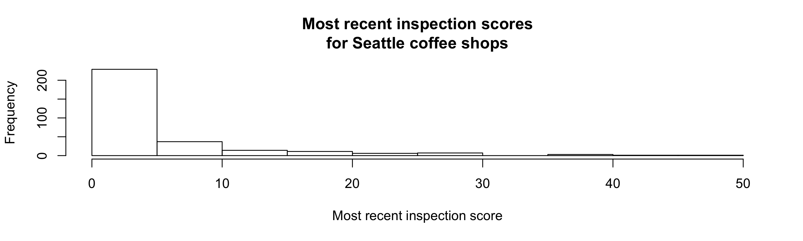

CSSS 508, Week 8
===
author: Rebecca Ferrell
date: May 18, 2016
transition: rotate
width: 1100
height: 750


Data today
===

We'll use data on food safety inspections in King County from [data.kingcounty.gov](https://data.kingcounty.gov/Health/Food-Establishment-Inspection-Data/f29f-zza5). You can see a map of the data at [dinegerous.com](http://www.dinegerous.com/).


```r
# getwd()
library(readr)
# download.file(url = "https://www.dropbox.com/s/ptm1xe43fatpl28/seattle_restaurant_inspections.Rds?raw=1", destfile = "seattle_restaurant_inspections.Rds")
restaurants <- read_rds("seattle_restaurant_inspections.Rds")
```


Basic string things
===
type: section


nchar
===
incremental: true

We've seen the `nchar` function to get the number of characters in a string. How many characters are in the ZIP codes?


```r
library(dplyr)
```


```r
restaurants %>% mutate(ZIP_length = nchar(ZIP)) %>%
    group_by(ZIP_length) %>% tally()
```

```
Source: local data frame [2 x 2]

  ZIP_length     n
       (int) (int)
1          5 68443
2         10    13
```

substr
===
incremental: true

You may be familiar with `substr` now from the voting homework. We can use it to pull out just the first 5 digits of the ZIP code.


```r
restaurants <- restaurants %>%
    mutate(ZIP_5 = substr(ZIP, 1, 5))
head(unique(restaurants$ZIP_5))
```

```
[1] "98109" "98101" "98102" "98122" "98133" "98188"
```


paste
===
incremental: true

We can combine parts of strings together using the `paste` function, e.g. to make a whole mailing address:


```r
restaurants <- restaurants %>%
    mutate(mailing_address = paste(Address, ", ", City, ", WA ", ZIP_5, sep = ""))
head(unique(restaurants$mailing_address))
```

```
[1] "10 MERCER ST, Seattle, WA 98109"      
[2] "1225 1ST AVE, SEATTLE, WA 98101"      
[3] "121 11TH AVE E, SEATTLE, WA 98102"    
[4] "1132 23RD AVE, SEATTLE, WA 98122"     
[5] "12255 AURORA AVE N, Seattle, WA 98133"
[6] "722 E PIKE ST, SEATTLE, WA 98122"     
```

paste with collapse
===
incremental: true

`readr` functions can take an argument like `col_types = "cciDcnncii"`. You can build this yourself from existing data using `class` to get the type of data, `substr`, and `paste` with the `collapse = ""` argument to take a vector and make it a single character string:


```r
# use the class function to get the type of data
column_types <- sapply(restaurants, class)
# extract 1st character
column_types_1 <- substr(column_types, 1, 1)
# use paste with collapse to get one string
(column_types_collapse <- paste(column_types_1, collapse = ""))
```

```
[1] "cDcccccfiflfciccc"
```


Make a function out of this!
===
incremental: true

Often I initially read in data using `read_csv` without `col_types`, use a function like this to get its guesses at the types, which I can then modify and feed back into `read_csv`:


```r
readr_input_types <- function(data) {
    column_types_1 <- substr(sapply(data, class), 1, 1)
    return(paste(column_types_1, collapse = ""))
}
readr_input_types(swiss)
```

```
[1] "nniinn"
```

```r
readr_input_types(restaurants)
```

```
[1] "cDcccccfiflfciccc"
```


paste0
===
incremental: true

`paste0` is a convenient version of `paste` where it'll smush together what you're pasting without any separator.


```r
paste(1:5, letters[1:5]) # sep is a space by default
```

```
[1] "1 a" "2 b" "3 c" "4 d" "5 e"
```

```r
paste(1:5, letters[1:5], sep ="")
```

```
[1] "1a" "2b" "3c" "4d" "5e"
```

```r
paste0(1:5, letters[1:5])
```

```
[1] "1a" "2b" "3c" "4d" "5e"
```


paste practice
===

`sep` controls what happens when doing entry-wise squishing of vectors you give to `paste`/`paste0`, while `collapse` controls if/how they go from a vector to a single string.

Try to guess what will happen in each of these cases, then run it to check:


```r
paste(letters[1:5], collapse = "!")
paste(1:5, letters[1:5], sep = "+")
paste0(1:5, letters[1:5], collapse = "???")
paste(1:5, "Z", sep = "*")
paste(1:5, "Z", sep = "*", collapse = " ~ ")
```


stringr
===
type: section

stringr
===

`stringr` is yet another R package from the Hadley-verse (`ggplot2`, `dplyr`, `tidyr`, `lubridate`, `readr`). It provides functions to:

* Replace some basic string functions you've just seen like `paste` and `nchar` in a way that's a bit less touchy with missing values or factors
* Convenince functions for removing whitespace or padding it out
* Perform tasks related to **pattern matching**: detect, locate, extract, match, replace, split
    + Functions use **regular expressions** to describe patterns
    + Base R versions for these exist but are more confusing to use
    

```r
library(stringr)
```


stringr basic function equivalencies
===
incremental: true

* `str_sub` is like `substr` but also lets you put in negative values to count backwards from the end (-1 is the end, -2 is second from end):


```r
str_sub("Washington", 1, -3)
```

```
[1] "Washingt"
```

* `str_c` is just like `paste` but where default is `sep = ""` (like `paste0`)


```r
str_c(letters[1:5], 1:5)
```

```
[1] "a1" "b2" "c3" "d4" "e5"
```


stringr basic function equivalencies
===
incremental: true

* `str_length` is like `nchar` but returns `NA` when given a missing value:


```r
nchar(NA)
```

```
[1] 2
```

```r
str_length(NA)
```

```
[1] NA
```


Changing cases
===
incremental: true

`str_to_upper`, `str_to_lower`, `str_to_title` convert cases, which is often a good idea to do before searching for values:


```r
head(restaurants$City)
```

```
[1] "Seattle" "Seattle" "Seattle" "Seattle" "Seattle" "Seattle"
```

```r
restaurants <- restaurants %>%
    mutate_each(funs(str_to_upper), Name, Address, City)
head(unique(restaurants$City))
```

```
[1] "SEATTLE"
```

Whitespace
===
incremental: true

Extra leading or trailing whitespace is common in text data:


```r
head(restaurants$Name, 6)
```

```
[1] "10 MERCER RESTAURANT"  " 10 MERCER RESTAURANT" " 10 MERCER RESTAURANT"
[4] "10 MERCER RESTAURANT " " 10 MERCER RESTAURANT" "10 MERCER RESTAURANT" 
```

Any character column is potentially affected. Let's find all the character columns:


```r
column_types <- sapply(restaurants, class)
char_columns <- names(column_types)[column_types == "character"]
```

Using `str_trim` to clean up whitespace
===
incremental: true

Then we can use the `str_trim` function in `stringr` to clean them up all at once:


```r
# use mutate_each_ to trim all the character columns
restaurants <- restaurants %>%
    mutate_each_(funs(str_trim), char_columns)
head(unique(restaurants$Name), 10)
```

```
 [1] "10 MERCER RESTAURANT"   "1000 SPIRITS"          
 [3] "11TH AVENUE INN"        "1ST CUP CAFFE"         
 [5] "125TH ST GRILL"         "95 SLIDE"              
 [7] "12TH AVE CAFFE"         "13 COINS"              
 [9] "14 CARROT CAFE"         "15TH AVE BAKERY & CAFE"
```


Regular expressions and pattern matching
===
type: section


What are regular expressions?
===
incremental: true

**Regular expressions** or **regex**es are how we describe patterns we are looking for in text in a way that a computer can understand. We write an **expression**, apply it to a string input, and then can do things with **matches** we find.

* **Literal characters** are defined snippets to search for like `SEA` or `206`
* **Metacharacters** let us be flexible in describing patterns:
    + backslash `\`, caret `^`, dollar sign `$`, period `.`, pipe `|`, question mark `?`, asterisk `*`, plus sign `+`, parentheses `(` and `)`, square brackets `[` and `]`, curly braces `{` and `}`
    + To treat a metacharacter as a literal character, need to **escape** it with two preceding backslashs `\\`, e.g. to match `(206)` including the parentheses, you'd use `\\(206\\)` in your regex


Simple regex searches with str_detect
===
incremental: true

I want to get inspections for coffee shops. I'll say a coffee shop is anything that has "COFFEE", "ESPRESSO", or "ROASTER" in the name. The regex for this is `COFFEE|ESPRESSO|ROASTER` because `|` is a metacharacter that means "OR". Use the `str_detect` function, which returns `TRUE` if it finds what you're looking for and `FALSE` if it doesn't:


```r
coffee <- restaurants %>% filter(str_detect(Name, "COFFEE|ESPRESSO|ROASTER"))
head(unique(coffee$Name))
```

```
[1] "701 COFFEE"                         
[2] "ALKI HOMEFRONT SMOOTHIES & ESPRESSO"
[3] "ALL CITY COFFEE"                    
[4] "ALLEGRO ESPRESSO BAR"               
[5] "ANALOG COFFEE"                      
[6] "ATELIER COFFEE COMPANY, LTD"        
```

Is your coffee SAFE???
===
incremental: true

Let's take each unique business identifier, keep the most recent inspection score, and look at a histogram of scores:


```r
recent_coffee_scores <- coffee %>% select(Business_ID, Name, Score, Date) %>% group_by(Business_ID) %>% filter(Date == max(Date)) %>% distinct()
hist(recent_coffee_scores$Score, xlab = "Most recent inspection score", main = "Most recent inspection scores\nfor Seattle coffee shops")
```




Looking for patterns with str_detect
===
incremental: true

Let's look for phone numbers whose first three digits are 206 using `str_detect`. We will want it to work whether they have parentheses around the beginning or not, but NOT to match 206 occurring elsewhere:


```r
area_code_206_pattern <- "^\\(?206"
phone_test_examples <- c("2061234567", "(206)1234567", "(206) 123-4567", "555-206-1234")
str_detect(phone_test_examples, area_code_206_pattern)
```

```
[1]  TRUE  TRUE  TRUE FALSE
```

* `^` is a metacharacter meaning "look only at the *beginning* of the string"
* `\\(?` means look for a left parenthesis (`\\(`), but it's optional (`?`)
* `206` is the literal character to look for after the optional parenthesis


How many rows have non-206 numbers?
===
incremental: true


```r
restaurants %>% mutate(has_206_number = str_detect(Phone, area_code_206_pattern)) %>% group_by(has_206_number) %>% tally()
```

```
Source: local data frame [3 x 2]

  has_206_number     n
           (lgl) (int)
1          FALSE  8779
2           TRUE 43985
3             NA 15692
```


Extracting patterns with str_extract
===
incremental: true

Let's extract the [directional part of Seattle](https://en.wikipedia.org/wiki/Street_layout_of_Seattle#Directionals) an address is in: N, NW, SE, none, etc.


```r
direction_pattern <- " (N|NW|NE|S|SW|SE|W|E)( |$)"
direction_test_examples <- c("2812 THORNDYKE AVE W", "512 NW 65TH ST", "407 CEDAR ST", "15 NICKERSON ST")
str_extract(direction_test_examples, direction_pattern)
```

```
[1] " W"   " NW " NA     NA    
```

* The first space will match a space character, then
* `(N|NW|NE|S|SW|SE|W|E)` matches one of the directions in the group
* `( |$)` is a group saying either there is a space after, or it's the end of the address string (`$` means the end of the string)


Where in the city are the addresses?
===
incremental: true


```r
restaurants %>% distinct(Address) %>% mutate(city_region = str_trim(str_extract(Address, direction_pattern))) %>% group_by(city_region) %>% tally() %>% arrange(desc(n))
```

```
Source: local data frame [8 x 2]

  city_region     n
        (chr) (int)
1          NA   951
2           S   857
3           N   595
4          NE   571
5           E   390
6          SW   366
7          NW   299
8           W   130
```


Find/replacing with str_replace
===
incremental: true

Maybe we want to do a street-level analysis of inspections (e.g. compare The Ave to Pike Street). How can we remove building numbers?


```r
address_number_pattern <- "^[0-9]*-?[A-Z]? (1/2 )?"
address_number_test_examples <- c("2812 THORNDYKE AVE W", "1ST AVE", "10A 1ST AVE", "10-A 1ST AVE", "5201-B UNIVERSITY WAY NE", "7040 1/2 15TH AVE NW")
str_replace(address_number_test_examples, address_number_pattern, replacement = "")
```

```
[1] "THORNDYKE AVE W"   "1ST AVE"           "1ST AVE"          
[4] "1ST AVE"           "UNIVERSITY WAY NE" "15TH AVE NW"      
```

How does the building number regex work?
===

Let's break down `"^[0-9]*-?[A-Z]? (1/2 )?"`:

* `^[0-9]` means look for a digit between 0 and 9 (`[0-9]`) at the beginning (`^`)
* `*` means potentially match more digits after that
* `-?` means optionally (`?`) match a hyphen (`-`)
* `[A-Z]?` means optionally match (`?`) a letter (`[A-Z]`)
* Then we match a space (` `)
* `(1/2 )?` optionally matches a 1/2 followed by a space since this is apparently a thing with some address numbers


Replacing the street numbers with...nothing
===
incremental: true


```r
restaurants <- restaurants %>% mutate(street_only = str_replace(Address, address_number_pattern, replacement = ""))
head(unique(restaurants$street_only), 12)
```

```
 [1] "MERCER ST"         "1ST AVE"           "11TH AVE E"       
 [4] "23RD AVE"          "AURORA AVE N"      "E PIKE ST"        
 [7] "E ALDER ST"        "BOREN AVE N"       "PACIFIC HWY S"    
[10] "EASTLAKE AVE E"    "15TH AVE SW STE A" "3RD AVE"          
```


Can we remove units/suites too?
===
incremental: true

Getting rid of unit/suite references is tricky, but a decent attempt would be to drop anything including and after "#", "STE", "SUITE", "SHOP", "UNIT":


```r
address_unit_pattern <- " (#|STE|SUITE|SHOP|UNIT).*$"
address_unit_test_examples <- c("1ST AVE", "RAINIER AVE S #A", "FAUNTLEROY WAY SW STE 108", "4TH AVE #100C", "NW 54TH ST")
str_replace(address_unit_test_examples, address_unit_pattern, replacement = "")
```

```
[1] "1ST AVE"           "RAINIER AVE S"     "FAUNTLEROY WAY SW"
[4] "4TH AVE"           "NW 54TH ST"       
```

How'd the unit regex work?
===
incremental: true

Breaking down ` (|#|STE|SUITE|SHOP|UNIT).*`:

* First we match a space
* `(#|STE|SUITE|SHOP|UNIT)` matches one of those words
* `.*$` matches *any* character (`.`) after those words, zero or more times (`*`), until the end of the string (`$`)


Removing units/suites in restaurant data
===
incremental: true


```r
restaurants <- restaurants %>% mutate(street_only = str_trim(str_replace(street_only, address_unit_pattern, replacement = "")))
head(unique(restaurants$street_only), 15)
```

```
 [1] "MERCER ST"        "1ST AVE"          "11TH AVE E"      
 [4] "23RD AVE"         "AURORA AVE N"     "E PIKE ST"       
 [7] "E ALDER ST"       "BOREN AVE N"      "PACIFIC HWY S"   
[10] "EASTLAKE AVE E"   "15TH AVE SW"      "3RD AVE"         
[13] "E CHERRY ST"      "GLENDALE WAY S"   "LAKE CITY WAY NE"
```


Which streets had the most restaurants with scores above 45?
===
incremental: true

Let's get one row per restaurant per date with the score, and see which streets the ones above 45 are on:

```r
restaurants %>% select(Business_ID, Name, Date, Score, street_only) %>% distinct() %>% filter(Score > 45) %>% group_by(street_only) %>% tally() %>% arrange(desc(n))
```

```
Source: local data frame [231 x 2]

         street_only     n
               (chr) (int)
1       S JACKSON ST    56
2  UNIVERSITY WAY NE    56
3      RAINIER AVE S    51
4  M L KING JR WAY S    42
5  CALIFORNIA AVE SW    33
6    GREENWOOD AVE N    27
7        S WELLER ST    26
8          4TH AVE S    25
9          S KING ST    22
10          12TH AVE    21
..               ...   ...
```


Splitting up strings
===
incremental: true

You can split up strings using `tidyr::separate`, seen in Week 5. Another option is `str_split`, which will split strings based on a pattern separating bits and put components in a list. `str_split_fixed` will do that but with a matrix instead (so can't have varying numbers of separators):


```r
head(str_split_fixed(restaurants$Violation_description, " - ", n = 2))
```

```
     [,1]  
[1,] "4200"
[2,] "2500"
[3,] "1600"
[4,] ""    
[5,] "3400"
[6,] "2120"
     [,2]                                                              
[1,] "Food-contact surfaces maintained, clean, sanitized"              
[2,] "Toxic substances properly identified,..."                        
[3,] "Proper cooling procedure"                                        
[4,] ""                                                                
[5,] "Wiping cloths properly used, stored, proper sanitizer"           
[6,] "Proper cold holding temperatures ( 42 degrees F to 45 degrees F)"
```


Next week
===

Homework 6 assigned last week is due next week, and peer reviews due the week after.

In class next week, you'll be working on a lab with the restaurant inspection data. You can finish it at home and turn it in the final week of class. (No peer reviews -- I'll grade this one.)
