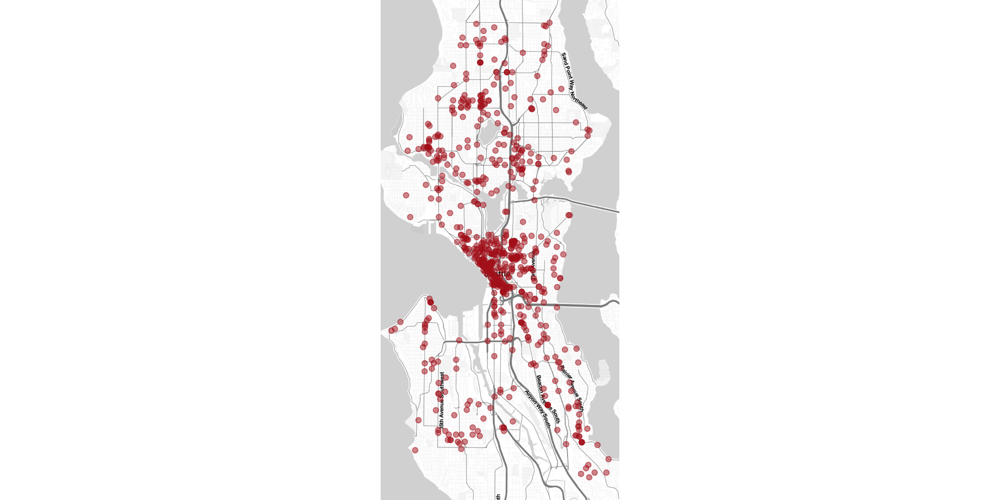
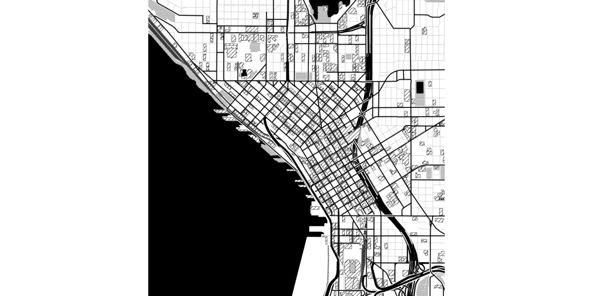
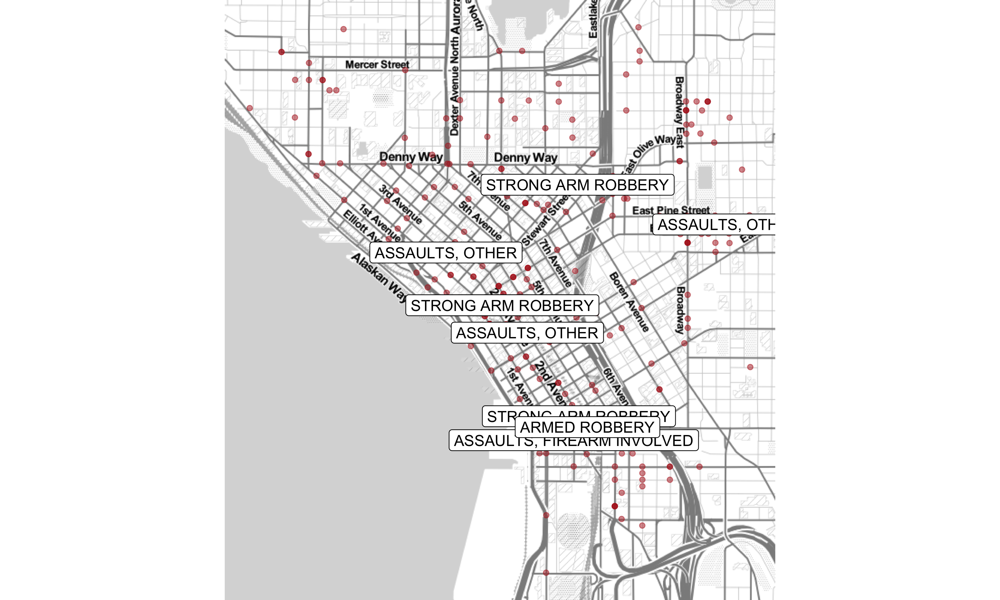

CSSS 508, Week 9
===
author: Rebecca Ferrell
date: May 25, 2016
transition: rotate
width: 1100
height: 750


Today
===

* `ggmap` for mashing up maps with `ggplot2`
* Labeling points and `ggrepel`
* Lab: visualizing restaurant safety over space and time


ggmap
===
type: section


ggmap
===

`ggmap` is a package that goes with `ggplot2` so that you can plot spatial data directly onto map images downloaded from Google Maps, OpenStreetMap, and Stamen Maps.

What this package does for you:

1. Queries servers for a map (`get_map`) at the location and scale you want
2. Plots the raster image as a `ggplot` object
3. Lets you add more `ggplot` layers like points, 2D density plots, text annotations
4. Additional functions for interacting with Google Maps (e.g. getting distances by bike)


One day of SPD incidents
===

In Week 5, we looked at types of incidents the Seattle Police Department responded to in a single day. Now, we'll look at where those were.


```r
library(ggplot2); library(ggmap); library(readr); library(dplyr)
```


```r
spd_raw <- read_csv("https://raw.githubusercontent.com/rebeccaferrell/CSSS508/master/Seattle_Police_Department_911_Incident_Response.csv")
```


Quick map plotting with qmplot
===

`qmplot` will automatically set the map region based on your data:

```r
qmplot(data = spd_raw, x = Longitude, y = Latitude, color = I("firebrick"), alpha = I(0.5))
```




Mapping without data: qmap
===


```r
qmap(location = "mary gates hall university of washington", zoom = 15, maptype = "watercolor", source = "stamen")
```


get_map
===

Both `qmplot` and `qmap` are wrappers for a function called `get_map` that retrieves a base map layer. Some options:

* `location =` search query or numeric vector of longitude and latitude
* `zoom = ` a zoom level (3 = continent, 10 = city, 21 = building)
* `source = ` `"google"`, `"osm"`, `"stamen"`
* `maptype = `
    + Google: `"terrain"`, `"terrain-background"`, `"satellite"`, `"roadmap"`, `"hybrid"`
    + Stamen: good artistic/minimal options! `"watercolor"`, `"toner"`, `"toner-background"`, `"toner-lite"`
* `color = ` `"color"` or `"bw"`


Toner example
===


```r
qmap(location = "pike place market", zoom = 14, maptype = "toner-background", source = "stamen")
```




Google Maps example
===


```r
qmap(location = "seattle", zoom = 8, maptype = "terrain", source = "google")
```


Subsetting geographic data
===

Let's look at locations of incidents near downtown.


```r
# query the map server
downtown_map <- get_map(location = "pike place market", zoom = 14)
# grab the bounding box coordinate data frame
downtown_bb <- attributes(downtown_map)[["bb"]]
# subset the data based on bounding box
downtown_seattle_incidents <- spd_raw %>%
    filter(downtown_bb[["ll.lat"]] <= Latitude &
               Latitude <= downtown_bb[["ur.lat"]] &
               downtown_bb[["ll.lon"]] <= Longitude &
               Longitude <= downtown_bb[["ur.lon"]])
```


Adding density layers
===

Call `qmplot` with no `geom`, and then add density layers:


```r
qmplot(data = downtown_seattle_incidents, geom = "blank", x = Longitude, y = Latitude, maptype = "toner-lite", darken = 0.5) + stat_density_2d(aes(fill = ..level..), geom = "polygon", alpha = .2, color = NA) + scale_fill_gradient2("Incident concentration", low = "white", mid = "yellow", high = "red")
```


Density plot
===


Labeling points
===

Let's label the assaults and robberies specifically in downtown:


```r
assaults <- downtown_seattle_incidents %>% mutate(assault_label = ifelse(`Event Clearance Group` %in% c("ASSAULTS", "ROBBERY"), `Event Clearance Description`, "")) %>% filter(assault_label != "")
```

Now let's plot the events and label these specifically using `geom_label` (`geom_text` also works without the background/border):


```r
qmplot(data = downtown_seattle_incidents, x = Longitude, y = Latitude, maptype = "toner-lite", color = I("firebrick"), alpha = I(0.5)) + geom_label(data = assaults, aes(label = assault_label))
```


Labeled point example
===




ggrepel
===

You can also try `geom_label_repel` or `geom_text_repel` if you install and load in the `ggrepel` package to fix overlaps:


```r
library(ggrepel)
qmplot(data = downtown_seattle_incidents, x = Longitude, y = Latitude, maptype = "toner-lite", color = I("firebrick"), alpha = I(0.5)) + geom_label_repel(data = assaults, aes(label = assault_label), fill = "black", color = "white", segment.color = "black")
```


Repelled labels example
===


Lab/homework exercise
===
type: section


Your turn!
===

Use the Lab/HW 7 template to practice making maps of the restaurant inspection data. Save your work when you're done by emailing it to yourself, and complete and submit it next week as the final homework for this class.
