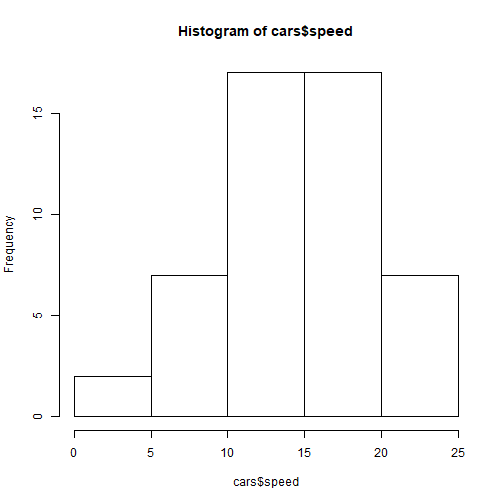
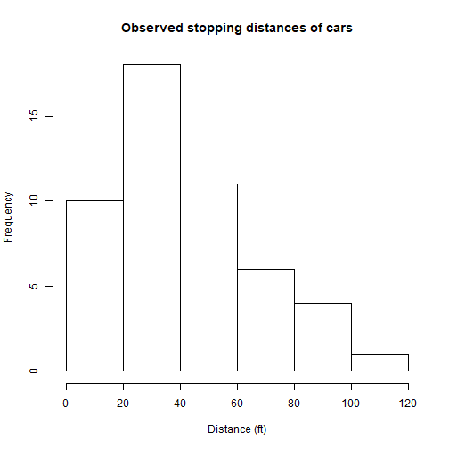
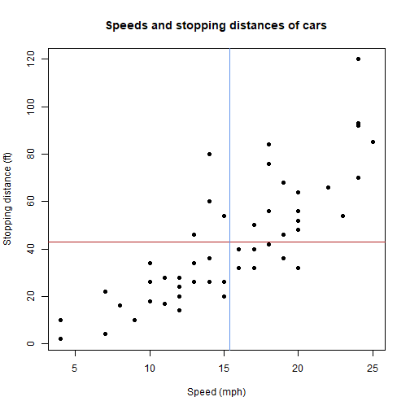

<style>
code {
   background-color: #efefef;
   font-weight:bold;
}
</style>

CSSS508 Introduction
========================================================
author: Charles Lanfear
date: March 28, 2017
width: 1600
height: 900
transition: linear


Course Goals
========================================================
incremental: true

* Develop intermediate data management and analysis skills in R
* Learn basic programming
* Introduce reproducible research practices
* Prepare you for statistics and CSSS courses

Who is this guy?
========================================================
incremental: true

Chuck Lanfear

* Instructor (*not professor*)
* 4th Year Sociology PhD student
* Research:
  + Quantitative Sociology
  + Computational Demography
  + Experimental Criminology
* Translation:
  + I write code every day
  + I am a turbo-nerd 
  + I think programming is incredibly important

Logistics
========================================================

Location: 
* Lecture: SAV117 on Wednesdays, 3:30-5:20
* Optional Lab: SAV117 on Mondays, 3:30-5:20
* Office Hours: SAV240 by Appointment

Materials: http://clanfear.github.io/CSSS508

Grading:
* Final grade: C/NC, 60% to get Credit
* **Homework** most weeks (75% of grade), combination of reading and programming
* **Peer Grading** of homeworks (25% of grade)
* Both handed in via Canvas.


Peer grading, really?
========================================================

Yes, peer grading...

* **35+ students, no TA**
* You will write your reports better knowing others will see them
* Learn new tricks from reading others' code; "appreciate the little things"

Format:
* Randomly assigned peers, turnaround time: 1 week (due before next class)
* You'll get a rubric and are expected to leave constructive comments
* High scoring assignments may be adapted into keys (with your permission)
* Email me if you want more feedback


Getting Help on the Mailing List
========================================================
incremental: true

Don't ask like this:

> tried lm(y~x) but it iddn't work wat do

Instead, ask like this: 

> ```
y <- seq(1:10) + rnorm(10)
x <- seq(0:10)
model <- lm(y ~ x)
```
> Running the block above gives me the following error, anyone know why?
```
Error in model.frame.default(formula = y ~ x, drop.unused.levels = TRUE) : 
  variable lengths differ (found for 'x')
```

Searching in R Slides
========================================================
incremental: true

I do not provide PowerPoint or PDF slides. If you want to search a lecture for a particular item, use the slide browser:

1. Open the `.html` file for the slides.
2. Hit `Esc`
   * This opens up a viewer for the entire lecture
   * You can browse left and right with the arrow keys
3. To search for text, hit `Ctrl+F` or `⌘+F` and enter the search term
4. Browse through the slides to see where that text is highlighted.

If you must take notes directly on course slides, use an add-on like Beanote for Chrome or Skitch for Safari. You can also search the provided source code on the website.

Lecture Plan
========================================================
incremental: true

1. Intro to R, RStudio, and R Markdown
2. Plotting with `ggplot2`
3. Summarizing and Combining Data: `dplyr`
4. R Data Structures
5. Data Cleaning: Import/Export, `tidyr`, Dates
6. Loops and Functions
7. Vectorization and Functions
8. Strings / Text Processing
9. Geospatial Data and Maps \*
10. Social Media Data and Text Mining \*
11. Tidy Model Results / Advanced Data Cleaning \*

\* *Optional topics*: We will do **two**. A video from will be available for 
the third. If you miss any lecture, videos of Autumn 2017 lectures are available
on the course website but may differ from this term's lectures.


R and RStudio
========================================================
type: section


Why R?
========================================================
incremental: true

R is a programming language built for statistical computing.

If one already knows Stata or similar software, why use R?

* R is *free*, so you don't need a terminal server.
* R has a *very* large community.
* R can handle virtually any data format.
* R is object oriented and makes replication easy.
* R is a *language* so it can do *everything*.
* R is a good stepping stone to other languages like Python.


R Studio
========================================================
incremental: true

R Studio is a "front-end" or integrated development environment (IDE) for R that can make your life *easier*.

RStudio can:

* Organize your code, output, and plots.
* Auto-complete code and highlight syntax.
* Help view data and objects.
* Enable easy integration of R code into documents.


Selling you on R Markdown
========================================================
incremental: true

Killer feature of R/RStudio is ease of making R Markdown files:

* Document analysis as you go with integrated text, code, and output
  + No rerunning, recopying, or repasting
  + Easy for collaborators to understand
  + Show as little or as much of the code as you want
* Make: Presentations (like this one!); HTML webpages and reports; Word docs
* Works with LaTeX for more formatting control

We'll get back to this soon!


Getting Started
========================================================

Open up RStudio now and choose *File > New File > R Script*.

Then, let's get oriented with the interface:

- Top Left: Code **editor** pane, data viewer (browse with tabs)
- Bottom Left: **Console** for running code (`>` prompt)
- Top Right: List of objects in **environment**, code **history** tab.
- Bottom Right: Tabs for browsing files, viewing plots, managing packages, and viewing help files.

You can change the layout in *Preferences > Pane Layout*

Editing and Running Code
========================================================
incremental: true

There are several ways to run R code in RStudio:

1. Highlight lines in the **editor** window and click **Run** or hit *Cntl-Enter* or *Command-Enter* to run them all.
2. Type individual lines in the **console** and press *Enter*.
3. In R Markdown documents, click within a code chunk and click on a choice in the **Chunks** dropdown.

The console will show the lines you ran followed by any printed output. If you mess up (e.g. leave off
a parenthesis), R might show a `+` sign prompting you to finish the command:


```r
> (11-2
+
```

Finish the command or hit *Esc* to get out of this.

R as a Calculator
========================================================
incremental: true

In the **console**, type `123 + 456 + 789` and hit *Enter*.

```r
123 + 456 + 789
```

```
[1] 1368
```

The `[1]` in the output indicates what line of output is shown.

Now in your blank R document in the **editor**, try typing the line `sqrt(400)` and either
clicking **Run** or hitting *Cntl-Enter*.


```r
sqrt(400)
```

```
[1] 20
```

Functions and Help
========================================================
incremental: true

`sqrt()` is an example of a **function** in R.

If we didn't have a good guess as to what `sqrt()` will do, we can type `?sqrt` in the console
and look at the **Help** panel on the right.


```r
?sqrt
```

**Arguments** are the *inputs* to a function. In this case, the only argument to `sqrt()`
is a number or a vector of numbers `x`.

Help files provide documentation on how to use functions and what functions produce.

Creating Objects
========================================================
incremental: true

R stores everything as an **object**, including data, functions, models, and output.

Creating an object can be done using the assignment operator `<-`

```r
new.object <- 144
```

You can display or "call" an object by using its name.


```r
new.object
```

```
[1] 144
```

Object names can have `_` and `.` in them, but cannot *start* with numbers.

Using Objects
========================================================
incremental: true

The **name** represents the information stored in that **object**, so you can treat the object's name
as if it were the values stored inside.


```r
new.object + 10
```

```
[1] 154
```

```r
new.object + new.object
```

```
[1] 288
```

```r
sqrt(new.object)
```

```
[1] 12
```

Creating Vectors
========================================================
incremental: true

A **vector** is a series of **elements**, such as numbers.

You can create a vector and store it as an object in the same way. To do this, use the
function `c()` which stands for "combine".

```r
new.object <- c(4, 9, 16, 25, 36)
new.object
```

```
[1]  4  9 16 25 36
```

If you name an object the same name as an existing object, it will overwrite it.

You can provide a vector as an argument for many functions.


```r
sqrt(new.object)
```

```
[1] 2 3 4 5 6
```

More Complex Objects
========================================================

The same principles can be used to create more complex objects like **matrices**, **arrays**, **lists**, and **data frames** (lists which look like matrices but can hold numerical and text information).

Most data sets you will work with will be read into R and stored as a **data frame**, so this course will mainly focus on manipulating and visualizing these objects.

Before we get into these, let's revisit R Markdown.


R Markdown
========================================================
type: section


Making R Markdown Documents
========================================================

Let's try making an R Markdown file:

1. Choose *File > New File > R Markdown...*
2. Make sure *HTML output* is selected and click OK
3. Save the file somewhere, call it `my_first_Rmd.Rmd`
4. Click the *Knit HTML* button
5. Watch the progress in the R Markdown pane, then gaze upon your result!

You may also open up the file in your computer's browser if you so desire.


Making R Markdown Documents
========================================================
incremental: true

The header of an .Rmd file is a [YAML](http://yaml.org/) (YAML Ain't Markup Language) code block, and everything else is part of the main document.

```{}
---
title: "Untitled"
author: "Charles Lanfear"
date: "March 28, 2018"
output: html_document
---
```

To mess with global formatting, [you can modify the header](http://rmarkdown.rstudio.com/html_document_format.html).

```{}
output:
  html_document:
    theme: readable
```


Making R Markdown Documents
========================================================

## Output

**bold/strong emphasis**

*italic/normal emphasis*

# Header

## Subheader

### Subsubheader

> Block quote from
> famous person

***

## Syntax

```
**bold/strong emphasis**

*italic/normal emphasis*

# Header

## Subheader

### Subsubheader

> Block quote from
> famous person
```

More R Markdown Syntax
========================================================
left: 30%

## Output

1. Ordered lists
1. Are real easy
  1. Even with sublists
  1. Or when lazy with numbering
  
* Unordered lists
* Are also real easy
  + Also even with sublists

[URLs are trivial](http://www.uw.edu)


***

## Syntax

```
1. Ordered lists
1. Are real easy
  1. Even with sublists
  1. Or when lazy with numbering

* Unordered lists
* Are also real easy
  + Also even with sublists

[URLs are trivial](http://www.uw.edu)


```

Formulae and Syntax in Markdown
========================================================

## Output 

You can put some math $y= \left( \frac{2}{3} \right)^2$ right up in there.

$$\frac{1}{n} \sum_{i=1}^{n} x_i = \bar{x}_n$$

Or a sentence with `code-looking font`.


Or a block of code:

```
y <- 1:5
z <- y^2
```

***

## Syntax

```
You can put some math $y= \left( \frac{2}{3} \right)^2$ right up in there

$$\frac{1}{n} \sum_{i=1}^{n} x_i = \bar{x}_n$$

Or a sentence with `code-looking font`.

Or a block of code:

    ```
    y <- 1:5
    z <- y^2
    ```
```

Your Turn
========================================================

Feel free to edit and re-knit `my_first_Rmd.Rmd` to give it some pizzazz: Add sections, have it number the sections, make a list, throw in the UW logo, change the theme, insert a gratuitous equation.

* [Ways to modify the overall document appearance](http://rmarkdown.rstudio.com/html_document_format.html)
* [Ways to format parts of your document](http://rmarkdown.rstudio.com/authoring_basics.html)


R Markdown formatting caveat
========================================================

To keep R Markdown dead-simple, it lacks some features you might occasionally want to use. Your options for fancier documents are:

* Use HTML with CSS for custom formatting
* Use LaTeX and .Rnw files instead of .Rmd

For day-to-day use, plain vanilla R Markdown does the job.


R code and R Markdown
========================================================

Inside Markdown documents, lines of R code make up what are called **chunks**. Code is sandwiched between sets of three backticks and `{r}`. This chunk of code...

    ```{r}
    data(cars)
    summary(cars)
    ```
Produces this output in your document:


```r
data(cars)
summary(cars)
```

```
     speed           dist       
 Min.   : 4.0   Min.   :  2.00  
 1st Qu.:12.0   1st Qu.: 26.00  
 Median :15.0   Median : 36.00  
 Mean   :15.4   Mean   : 42.98  
 3rd Qu.:19.0   3rd Qu.: 56.00  
 Max.   :25.0   Max.   :120.00  
```


Chunk Options
========================================================

Chunks have options that control what happens with its code, such as:

* `echo=FALSE`: keeps R code from being shown in the document
* `results='hide'`: hides R's (non-plot) output from the document
* `warning=FALSE, message=FALSE`: suppresses R warnings or messages from the document, e.g. about versions
* `eval=FALSE`: show R code in the document without running it
* `cache=TRUE`: saves results of running that chunk so if it takes a while, you won't have to re-run it each time you re-knit the document
* `fig.height=5, fig.width=5`: modify the dimensions of any plots that are generated in the chunk (units are in inches)


Playing with Chunk Options
========================================================

Try adding or changing the chunk options (separated by commas) for the two chunks in `my_first_Rmd.Rmd` and re-knitting to check what happens.


You can also name your chunks by putting something after the `r` before the chunk options.

    ```{r summarize_cars, echo=FALSE}
    summary(cars)
    ```
After you name your chunks, look what happens in the dropdown on the bottom left of your editor pane.

Naming chunks allows you to browse through an RMarkdown document by named chunks. 

You can also browse by sections named using headers and subheaders.


In-Line R code
========================================================
incremental: true

Sometimes we want to insert a value directly into our text. We do that using code in single backticks starting off with `r`.


`Four score and seven years ago is the same as` `` `r 4*20 + 7` `` `years.`

Four score and seven years ago is the same as 87 years.

Maybe we've saved a variable in a chunk we want to reference in the text:

```r
x <- sqrt(77) # <- is how we assign variables
```

`The value of ` `` `x` `` `rounded to the nearest two decimals is` `` `r round(x, 2)` ``.

The value of `x` rounded to the nearest two decimals is 8.77.

This is Amazing!
========================================================
incremental: true

Having R dump values directly into your document protects you from silly mistakes:

* Never wonder "how did I come up with this quantity?" ever again: Just look at your formula in your .Rmd file
* Consistency; no "find/replace" mishaps: reference a variable in-line throughout your document without manually updating if the calculation changes (e.g. reporting sample sizes)
* You are more likely to make a typo in a "hard-coded" number than you are to write R code that somehow runs but gives you the wrong thing


Example: Keeping document date current
=======================================================

In your YAML header, make the date come from R's `Sys.time()` function by changing:

`date: "March 30, 2016"`

to:

`date: "` `` `r Sys.time()` `` `"`

Fancier option: use `format(Sys.Date(), format="%B %d, %Y")` instead to take today's date and make it read nicely.


Data Frames
========================================================
type: section


What's Up with Cars?
========================================================
incremental: true

In the sample R Markdown document you are working on, we can load the built-in data
`cars`, which loads as a dataframe, a type of object mentioned earlier. Then, we can look at it in a couple different ways.

`data(cars)` loads this dataframe into the Global Environment (as a *promise*).

`View(cars)` pops up a viewer pane ("interactive" use only, don't put in R Markdown document!) or


```r
head(cars) # prints first 6 rows, see tail() too
```

```
  speed dist
1     4    2
2     4   10
3     7    4
4     7   22
5     8   16
6     9   10
```


Tell Me More About Cars
========================================================


```r
str(cars) # str[ucture]
```

```
'data.frame':	50 obs. of  2 variables:
 $ speed: num  4 4 7 7 8 9 10 10 10 11 ...
 $ dist : num  2 10 4 22 16 10 18 26 34 17 ...
```

```r
summary(cars)
```

```
     speed           dist       
 Min.   : 4.0   Min.   :  2.00  
 1st Qu.:12.0   1st Qu.: 26.00  
 Median :15.0   Median : 36.00  
 Mean   :15.4   Mean   : 42.98  
 3rd Qu.:19.0   3rd Qu.: 56.00  
 Max.   :25.0   Max.   :120.00  
```


Drawing Ugly Pictures of Cars
========================================================


```r
hist(cars$speed) # Histogram
```



***


```r
hist(cars$dist)
```


Drawing Slightly Less Ugly Pictures
========================================================


```r
hist(cars$dist,
     xlab = "Distance (ft)", # X axis label
     main = "Observed stopping distances of cars") # Title
```

***




Math with Cars
========================================================
incremental: true

If you put an assignment `<-` in parentheses `()`, R will print the output of the assignment out for you in your document. Otherwise, it won't show the value.


```r
( dist_mean  <- mean(cars$dist) )
```

```
[1] 42.98
```

```r
( speed_mean <- mean(cars$speed) )
```

```
[1] 15.4
```


Drawing Still Ugly Pictures
========================================================


```r
plot(dist ~ speed, data = cars,
     xlab = "Speed (mph)",
     ylab = "Stopping distance (ft)",
     main = "Speeds and stopping distances of cars",
     pch = 16) # Point size
abline(h = dist_mean, col = "firebrick")
abline(v = speed_mean, col = "cornflowerblue")
```

***




Swiss Time
========================================================
incremental: true

Let's switch gears to the `swiss` data frame built in to R.

First, use `?swiss` to see what things mean.

Then, load it using `data(swiss)`

Add chunks to your R Markdown document inspecting swiss, defining variables, doing some exploratory plots using hist or plot. You can experiment with [colors](http://www.stat.columbia.edu/~tzheng/files/Rcolor.pdf) and [shapes](http://www.cookbook-r.com/Graphs/Shapes_and_line_types/).


Looking at Swiss
========================================================


```r
pairs(swiss, pch = 8, col = "violet",
      main = "Pairwise comparisons of Swiss variables")
```


Installing Packages
========================================================
incremental: true

Let's make a table that looks a little less code-y in the output. To do this, we'll want to install a **package** called `pander`.

In the console: `install.packages("pander")`.

* Note that unlike the `library()` command, the name of a package to be installed must be in quotes. This is because the name here is a search term (text, not an object!) while for `library()` it is an actual R object.
* Once you install a package, you don't need to re-install it until you update R. Consequently, you should not include `install.packages()` in any markdown document or R script!

Making Tables
========================================================


```r
library(pander) # loads pander, do once in your session
pander(summary(swiss), style = "rmarkdown", split.tables = 120)
```


|   Fertility   |  Agriculture  |  Examination  |   Education   |    Catholic     | Infant.Mortality |
|:-------------:|:-------------:|:-------------:|:-------------:|:---------------:|:----------------:|
| Min.   :35.00 | Min.   : 1.20 | Min.   : 3.00 | Min.   : 1.00 | Min.   :  2.150 |  Min.   :10.80   |
| 1st Qu.:64.70 | 1st Qu.:35.90 | 1st Qu.:12.00 | 1st Qu.: 6.00 | 1st Qu.:  5.195 |  1st Qu.:18.15   |
| Median :70.40 | Median :54.10 | Median :16.00 | Median : 8.00 | Median : 15.140 |  Median :20.00   |
| Mean   :70.14 | Mean   :50.66 | Mean   :16.49 | Mean   :10.98 | Mean   : 41.144 |  Mean   :19.94   |
| 3rd Qu.:78.45 | 3rd Qu.:67.65 | 3rd Qu.:22.00 | 3rd Qu.:12.00 | 3rd Qu.: 93.125 |  3rd Qu.:21.70   |
| Max.   :92.50 | Max.   :89.70 | Max.   :37.00 | Max.   :53.00 | Max.   :100.000 |  Max.   :26.60   |


Data Look a Little Nicer This Way
========================================================


```r
pander(head(swiss, 5), style = "rmarkdown", split.tables = 120)
```


|      &nbsp;      | Fertility | Agriculture | Examination | Education | Catholic | Infant.Mortality |
|:----------------:|:---------:|:-----------:|:-----------:|:---------:|:--------:|:----------------:|
|  **Courtelary**  |   80.2    |     17      |     15      |    12     |   9.96   |       22.2       |
|   **Delemont**   |   83.1    |    45.1     |      6      |     9     |  84.84   |       22.2       |
| **Franches-Mnt** |   92.5    |    39.7     |      5      |     5     |   93.4   |       20.2       |
|   **Moutier**    |   85.8    |    36.5     |     12      |     7     |  33.77   |       20.3       |
|  **Neuveville**  |   76.9    |    43.5     |     17      |    15     |   5.16   |       20.6       |


Homework
========================================================

Write up a .Rmd file showing some exploratory analyses of the Swiss fertility data. Upload both the `.Rmd` file and the `.html` file to Canvas. You must upload *both* for credit.

Mix in-line R calculations, tables, R output, and plots with text describing the relationships you see. Include *at least* one plot and one table. You are encouraged to include more! You must use in-line R calculations/references at least once (e.g. with functions like `nrow()`, `mean()`, `sd()`, `cor()`, `median()`, `min()`, `quantile()`) and *may not hard-code any numbers referenced in your text*.

Your document should be pleasant for a peer to look at, with some organization using sections or lists, and all plots labeled clearly. Use chunk options `echo` and `results` to limit the code/output you show in the .html. Discussion of specific values should be summarized in sentences in your text---*not as printed code and output*---and rounded so as not to be absurdly precise (1 to 3 digits).

### DUE: 11:59 PM, Tuesday, April 3rd, 2018


Grading Rubric
========================================================
incremental: true

0: Didn't turn anything in.

1: Turned in but low effort, ignoring many directions.

2: Decent effort, followed directions with some minor issues.

3: Nailed it!
