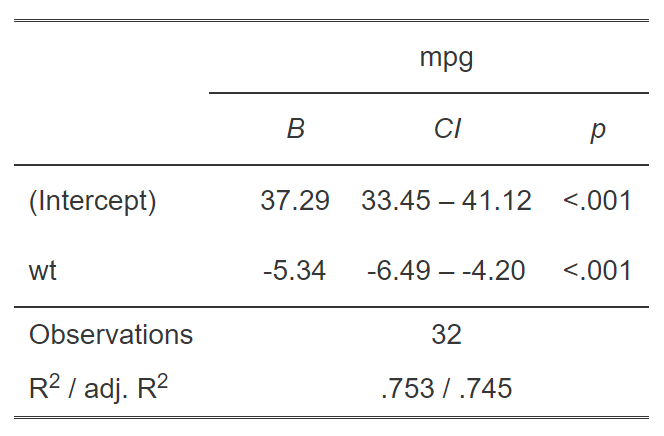
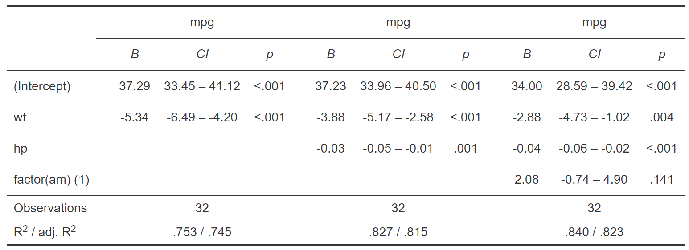
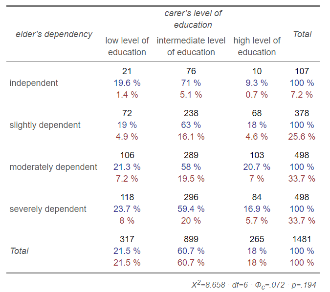

```{r setup, include=FALSE, purl=FALSE}
options(htmltools.dir.version = FALSE)
knitr::opts_chunk$set(comment = "##")
```

```{r xaringan-themer, include = FALSE, purl=FALSE}
library(xaringanthemer)
source("../csss508css.R")
```


```{r, include=FALSE}
library(tidyverse)
library(pander)
library(knitr)
`%!in%` <- Negate(`%in%`)
hook_output = knit_hooks$get('output')
knit_hooks$set(output = function(x, options) {
  if (!is.null(n <- options$out.lines)) {
    x = unlist(stringr::str_split(x, '\n'))
    if (length(x) > n) {
      # truncate the output
      x = c(head(x, n), '....\n')
    }
    x = paste(x, collapse = '\n') # paste first n lines together
  }
  hook_output(x, options)
})
opts_chunk$set(out.lines = 20)

ex_dat <- data.frame(num1 = rnorm(200, 1, 2), 
                     fac1 = sample(c(1, 2, 3), 200, TRUE),
                     num2 = rnorm(200, 0, 3),
                     fac2 = sample(c(1, 2))) %>%
  mutate(yn = num1*0.5 + fac1*1.1 + num2*0.7 + fac2-1.5  + rnorm(200, 0, 2)) %>% 
  mutate(yb = as.numeric(yn > mean(yn))) %>%
  mutate(fac1 = factor(fac1, labels=c("A", "B", "C")),
         fac2 = factor(fac2, labels=c("Yes", "No")))
```

# Topics for Today

### Working with Model Results

* Tidy model output with `broom`
* Visualizing models with `ggeffects`
* Making regression tables

### Reproducible Research

### Best Practices
   * Organization
   * Portability
   * Version Control

### Wrapping up the course

---
class: inverse
# Working with Model Results

---
# `broom`

`broom` is a package that "tidies up" the output from models such a `lm()` and `glm()`.

It has a small number of key functions:

* `tidy()` - Creates a dataframe summary of a model.
* `augment()` - Adds columns—such as fitted values—to the data used in the model.
* `glance()` - Provides one row of fit statistics for models.

```{r}
library(broom)
```

---
# Model Output is a List

`lm()` and `summary()` produce lists as output, which cannot go directly into 
tidyverse functions, particularly those in `ggplot2`.

.smaller[
```{r}
lm_1 <- lm(yn ~ num1 + fac1, data = ex_dat)
summary(lm_1)
```
]

---
# Model Output Varies!

.smallish[
Each type of model also produces somewhat different output, so you can't just reuse
the same code to handle output from every model.
]

.smaller[
```{r, op}
glm_1 <- glm(yb ~ num1 + fac1, data = ex_dat, family=binomial(link="logit"))
summary(glm_1)
```
]

---
# `broom::tidy()`

`tidy()` produces the similar output, but as a dataframe.

```{r}
lm_1 %>% tidy()
```

Each type of model (e.g. `glm`, `lmer`) has a different *method* with its own additional arguments. See `?tidy.lm` for an example.

---
# `broom::tidy()`

This output is also completely identical between different models.

This can be very 
useful and important if running models with different test statistics... or just running
a lot of models!

```{r}
glm_1 %>% tidy()
```

---
# `broom::glance()`

`glance()` produces dataframes of fit statistics for models.

If you run many models,
you can compare each model row-by-row in each column... or even plot their different
fit statistics to allow holistic comparison.

.small[
```{r}
glance(lm_1)
```
]

---
# `broom augment()`

`augment()` takes values generated by a model and adds them back to the original data.
This includes fitted values, residuals, and leverage statistics.

.small[
```{r}
augment(lm_1) %>% head()
```
]

---
# The Power of `broom`

The real advantage of `broom` becomes apparent when running many models at once. Here we run separate models for each level of `fac1`:

.small[
```{r}
ex_dat %>% group_by(fac1) %>% do(tidy(lm(yn ~  num1 + fac2 + num2, data = .))) #<<
```
]

.footnote[`do()` repeats whatever is inside it once for each level of the variable(s) in `group_by()` then puts them together as a data frame.]

---
class: inverse
# Plotting Model Results

---
# `geom_smooth()`

I have used `geom_smooth()` in many past examples.

`geom_smooth()` generates "smoothed conditional means" including loess curves and generalized additive models (GAMs).

--

Note, however, that most regression models are conditional mean models, such as ordinary least squares, generalized linear models. 

--

We can use `geom_smooth()` to add a layer depicting common bivariate models.

We'll look at this with the `gapminder` data from Week 2.

```{r}
library(gapminder)
```

---
# Default `geom_smooth()`

```{r, fig.height = 2.75, fig.width = 7, dev="svg", warning=FALSE, message=FALSE}
ggplot(data = gapminder, 
       aes(x = year, y = lifeExp, color = continent)) +
  geom_point(position = position_jitter(1,0), size = 0.5) +
  geom_smooth()
```

By default, `geom_smooth()` chooses either a loess smoother (N < 1000) or a GAM depending on the number of observations.


---
# Linear `glm`

```{r, fig.height = 2.75, fig.width = 7, dev="svg", warning=FALSE, message=FALSE}
ggplot(data = gapminder, 
       aes(x = year, y = lifeExp, color = continent)) +
  geom_point(position = position_jitter(1,0), size = 0.5) +
  geom_smooth(method = "glm", formula = y ~ x) #<<
```

We could also fit a standard linear model using either `method = "glm"` or `method = "lm"` and a formula like `y ~ x`.
---
# Polynomial `glm`
```{r, fig.height = 2.75, fig.width = 7, dev="svg", warning=FALSE, message=FALSE}
ggplot(data = gapminder, 
       aes(x = year, y = lifeExp, color = continent)) +
  geom_point(position = position_jitter(1,0), size = 0.5) +
  geom_smooth(method = "glm", formula = y ~ poly(x, 2)) #<<
```

`poly(x, 2)` produces a quadratic model which contains a linear term (`x`) and a quadratic term (`x^2`).

---

# More Complex Models

What if we want something more complex than a bivariate model?

What if we have a statistically complex model, like nonlinear probability model or multilevel model?

We need to go beyond `geom_smooth()`!

---
# But first, vocab!

We are often interested in what might happen if some variables take particular values, often ones not seen in the actual data.

--

When we set variables to certain values, we refer to them as **counterfactual values** or just **counterfactuals**.

--

For example, if we know nothing about a new observation, our prediction for that estimate is often based on assuming every variable is at its mean.

--

Sometimes, however, we might have very specific questions which require setting (possibly many) combinations of variables to particular values and making an estimate or prediction.

--

Providing specific estimates, conditional on values of covariates, is a nice way to summarize results, particularly for models with unintuitive parameters (e.g. logit models).

---
class: inverse
# `ggeffects`

---
# `ggeffects`

If we want to look at more complex models, we can use `ggeffects` to create and plot tidy 
*marginal effects*.

That is, tidy dataframes of *ranges* of predicted values that can be
fed straight into `ggplot2` for plotting model results.

We will focus on two `ggeffects` functions:

* `ggpredict()` - Computes predicted values for the outcome variable at margins of specific variables.
* `plot.ggeffects()` - A plot method for `ggeffects` objects (like `ggredict()` output)

```{r}
library(ggeffects)
```

---
# Quick Simulated Data

To best show off `ggeffects`, I need a data frame with numeric and categorical variables with strong relationships. It is easiest to just simulate it:

```{r}
ex_dat <- data.frame(num1 = rnorm(200, 1, 2), 
                     fac1 = sample(c(1, 2, 3), 200, TRUE),
                     num2 = rnorm(200, 0, 3),
                     fac2 = sample(c(1, 2))) %>%
  mutate(yn = num1 * 0.5 + fac1 * 1.1 + num2 * 0.7 +
              fac2 - 1.5  + rnorm(200, 0, 2)) %>% 
  mutate(yb = as.numeric(yn > mean(yn))) %>%
  mutate(fac1 = factor(fac1, labels = c("A", "B", "C")),
         fac2 = factor(fac2, labels = c("Yes", "No")))
```

Now we can get `ggpredict`ing!


---
# `ggpredict()`

When you run  `ggpredict()`, it produces a dataframe with a row for every unique 
value of a supplied predictor ("independent") variable (`term`). 

Each row contains an expected (estimated) value for the outcome ("dependent") variable, plus confidence intervals. 

```{r}
lm_1 <- lm(yn ~ num1 + fac1, data = ex_dat)
lm_1_est <- ggpredict(lm_1, terms = "num1")
```

If desired, the argument `interval="prediction"` will give predicted intervals instead.

---
#`ggpredict()` output

.smallish[
```{r}
lm_1_est
```
]

---
# `plot()` for `ggpredict()`

`ggeffects` features a `plot()` *method*, `plot.ggeffects()`, which produces
a ggplot when you give `plot()` output from `ggpredict()`.

.small[
```{r, warning=FALSE, message=FALSE, dev="svg", fig.height=4}
plot(lm_1_est)
```
]

---
# Grouping with `ggpredict()`

When using a vector of `terms`, `ggeffects` will plot the first along the x-axis and use
others for *grouping*. Note we can pipe a model into `ggpredict()`!

.small[
```{r, warning=FALSE, message=FALSE, dev="svg", fig.height=3.5}
glm(yb ~ num1 + fac1 + num2 + fac2, data = ex_dat, family=binomial(link = "logit")) %>%
  ggpredict(terms = c("num1", "fac1")) %>% plot()
```
]

---
# Faceting with `ggpredict()`

You can add `facet=TRUE` to the `plot()` call to facet over *grouping terms*.

.small[
```{r, warning=FALSE, message=FALSE, dev="svg", fig.height=3.5}
glm(yb ~ num1 + fac1 + num2 + fac2, data = ex_dat, family = binomial(link = "logit")) %>%
  ggpredict(terms = c("num1", "fac1")) %>% plot(facet=TRUE)
```
]

---
# Counterfactual Values

You can add values in square brackets in the `terms=` argument to specify counterfactual values.

.small[
```{r, warning=FALSE, message=FALSE, dev="svg", fig.height=3.5}
glm(yb ~ num1 + fac1 + num2 + fac2, data=ex_dat, family=binomial(link="logit")) %>%
  ggpredict(terms = c("num1 [-1,0,1]", "fac1 [A,B]")) %>% plot(facet=TRUE)
```
]

---
# Representative Values

You can also use `[meansd]` or `[minmax]` to set representative values.

.small[
```{r, warning=FALSE, message=FALSE, dev="svg", fig.height=3.5}
glm(yb ~ num1 + fac1 + num2 + fac2, data = ex_dat, family = binomial(link = "logit")) %>%
  ggpredict(terms = c("num1 [meansd]", "num2 [minmax]")) %>% plot(facet=TRUE)
```
]

---
# Dot plots with `ggpredict()`

`ggpredict` will produce dot plots with error bars for categorical predictors.

.small[
```{r, warning=FALSE, message=FALSE, dev="svg", fig.height=3.5}
lm(yn ~ fac1 + fac2, data = ex_dat) %>% 
  ggpredict(terms=c("fac1", "fac2")) %>% plot()
```
]

---
# Notes on `ggeffects`

There is a lot more to the `ggeffects` package that you can see in [the package vignette](https://cran.r-project.org/web/packages/ggeffects/vignettes/marginaleffects.html)
and the [github repository](https://github.com/strengejacke/ggeffects). This includes,
but is not limited to:

* Predicted values for polynomial and interaction terms

* Getting predictions from models from dozens of other packages

* Sending `ggeffects` objects to `ggplot2` to freely modify plots

If you need to do something more complex then `ggeffects` allows, see the [Advanced Counterfactuals](http://clanfear.github.io/CSSS508/Lectures/Week10/CSSS508_Advanced_Counterfactuals.html) slides here.

---
class: inverse
# Making Tables

---
# `pander` Regression Tables

We've used `pander` to create nice tables for dataframes. But `pander` has *methods*
to handle all sort of objects that you might want displayed nicely.

This includes 
model output, such as from `lm()`, `glm()`, and `summary()`.


```{r pander}
library(pander)
```

```{r, include=FALSE}
panderOptions("table.style", "rmarkdown")
```

---
# `pander()` and `lm()`

You can send an `lm()` object straight to `pander`:

```{r, echo=TRUE, eval=FALSE}
pander(lm_1)
```

| &nbsp;          | Estimate | Std. Error | t value | Pr(>t)    |
|:----------------|:--------:|:----------:|:-------:|:---------:|
| **(Intercept)** |  37.23   |   1.599    |  23.28  | 2.565e-20 |
| **wt**          |  -3.878  |   0.6327   | -6.129  | 1.12e-06  |
| **hp**          | -0.03177 |  0.00903   | -3.519  | 0.001451  |

Table: Fitting linear model: mpg ~ wt + hp

---
# `pander()` and `summary()`

You can do this with `summary()` as well, for added information:

```{r, eval=FALSE, echo=TRUE}
pander(summary(lm_1))
```

| &nbsp;          | Estimate | Std. Error | t value | Pr(>t)  |
|:----------------|:--------:|:----------:|:-------:|:---------:|
| **(Intercept)** |  37.23   |   1.599    |  23.28  | 2.565e-20 |
| **wt**          |  -3.878  |   0.6327   | -6.129  | 1.12e-06  |
| **hp**          | -0.03177 |  0.00903   | -3.519  | 0.001451  |


| Observations | Residual Std. Error | $R^2$  | Adjusted $R^2$ |
|:------------:|:-------------------:|:------:|:--------------:|
|      32      |        2.593        | 0.8268 |     0.8148     |

Table: Fitting linear model: mpg ~ wt + hp

---
# `sjPlot`

`pander` tables are great for basic `rmarkdown` documents, but they're not 
generally publication ready.

The `sjPlot` package produces `html` tables that look more like
those you may find in journal articles.

```{r table_packages}
library(sjPlot)
```

---
# `sjPlot` Tables

`tab_model()` will produce tables for most models.

```{r, eval=FALSE}
model_1 <- lm(mpg ~ wt, data = mtcars)
tab_model(model_1)
```

```{r, echo=FALSE, out.width="400px"}
# If you're seeing this, you are looking in my presentation files.
# I actually have to call on a saved image here because sjPlot
# doesn't display properly in .Rpres slides for some reason.

```

---
# Multi-Model Tables with `sjTable`

Often in journal articles you will see a single table that compares multiple models.

Typically, authors will start with a simple model on the left, then add variables, 
until they have their most complex model on the right.

The `sjPlot` package makes this easy to do: just give `tab_model()` more models!

---
# Multiple `tab_model()`

```{r, eval=FALSE}
model_2 <- lm(mpg ~ hp + wt, data = mtcars)
model_3 <- lm(mpg ~ hp + wt + factor(am), data = mtcars)
tab_model(model_1, model_2, model_3)
```

```{r, echo=FALSE, out.width = "1280px"}
# If you're seeing this, you are looking in my presentation files.
# I actually have to call on a saved image here because sjPlot
# doesn't display properly in .Rpres slides for some reason.

```

---
# `sjPlot` does a lot more

The `sjPlot` package does *a lot* more than just make pretty tables. It is a rabbit hole
of *incredibly* powerful and useful functions for displaying descriptive and inferential results.

View the [package website](http://www.strengejacke.de/sjPlot/) for extensive documentation.

`sjPlot` is a bit more complicated than `ggeffects` but can do just about everything 
it can do as well; they were written by the same author!

`sjPlot` is fairly new but offers a fairly comprehensive solution for `ggplot`
based publication-ready social science data visualization. All graphical functions in
`sjPlot` are based on `ggplot2`, so it should not take terribly long to figure out.

---
# `sjPlot` Example: Likert plots

```{r, echo=FALSE, out.width = "600px"}
knitr::include_graphics("img/sjPlot_likert.PNG")
```

---
# `sjPlot` Example: Crosstabs

```{r, echo=FALSE, out.width = "500px"}

```

---
# LaTeX Tables

For tables in $\LaTeX$—as is needed for `.pdf` files—I recommend looking into the `gt`, `stargazer`, or `kableExtra` packages.

--

`gt` and `kableExtra` allow the construction of complex tables in either HTML or $\LaTeX$ using
additive syntax similar to `ggplot2` and `dplyr`.

`stargazer` produces nicely formatted $\LaTeX$ tables but is idiosyncratic.

--

If you want to edit $\LaTeX$ documents, you can do it in R using Sweave documents (.Rnw).
Alternatively, you may want to work in a dedicated $\LaTeX$ editor. I recommend [Overleaf](http://www.overleaf.com)
for this purpose.

--

RMarkdown has support for a fair amount of basic $\LaTeX$ syntax if you aren't trying to 
get too fancy!

--

Another approach I have used is to manually format $\LaTeX$ tables but use in-line R calls to 
fill in the values dynamically. This gets you the *exact* format you want but without 
forcing you to update values any time something changes.

---
# Bonus: `corrplot`

The `corrplot` package has functions for displaying correlograms.

These make visualizing the correlations between variables in a data set easier.

The first argument is a call to `cor()`, the base R function for generating a correlation matrix.

[See the vignette for customization options.](https://cran.r-project.org/web/packages/corrplot/vignettes/corrplot-intro.html)

```{r, message=FALSE, warning=FALSE, eval=FALSE}
library(corrplot)
corrplot(
  cor(mtcars),
  addCoef.col = "white",
  addCoefasPercent=T,
  type="upper", 
  order="AOE")
```

---
## Correlogram

```{r, message=FALSE, warning=FALSE, eval=TRUE, echo=FALSE, dev="svg", fig.height=5}
library(corrplot)
corrplot(cor(mtcars), addCoef.col = "white", addCoefasPercent=T, type="upper", order="FPC")
```

---
class: inverse

# Reproducible Research

---
# Why Reproducibility?

Reproducibility is not *replication*.

* **Replication** is running a new study to show if and how results of a prior study hold.
* **Reproducibility** is about rerunning *the same study* and getting the *same results*.

--

Reproducible studies can still be *wrong*... and in fact reproducibility makes proving a study wrong *much easier*.

--

Reproducibility means:

* Transparent research practices.
* Minimal barriers to verifying your results.

--

*Any study that isn't reproducible can be trusted only on faith.*

---
# Reproducibility Definitions

Reproducibility comes in three forms (Stodden 2014):

--

1. **Empirical:** Repeatability in data collection.

--

2. **Statistical:** Verification with alternate methods of inference.

--

3. **Computational:** Reproducibility in cleaning, organizing, and presenting data and results.

--

R is particularly well suited to enabling **computational reproducibility**.<sup>1</sup>

.footnote[[1] Python is equally well suited.]

--

They will not fix flawed research design, nor offer a remedy for improper application of statistical methods.

Those are the difficult, non-automatable things you want skills in.

---

## Computational Reproducibility

Elements of computational reproducibility:

--

* Shared data

   + Researchers need your original data to verify and replicate your work.

--

* Shared code
   + Your code must be shared to make decisions transparent.

--

* Documentation
   + The operation of code should be either self-documenting or have written descriptions to make its use clear.

--

* **Version Control**
   + Documents the research process.
   + Prevents losing work and facilitates sharing.

---

## Levels of Reproducibility

For academic papers, degrees of reproducibility vary:

0. "Read the article"

--

1. Shared data with documentation

--

2. Shared data and all code

--

3. **Interactive document**

--

4. **Research compendium**

--

5. Docker compendium: Self-contained ecosystem

---
## Interactive Documents

**Interactive documents**—like R Markdown docs—combine code and text together into a self-contained document.
   * Load and process data
   * Run models
   * Generate tables and plots in-line with text
   * In-text values automatically filled in

--

Interactive documents allow a reader to examine your computational methods within the document itself; in effect, they are self-documenting.

--

By re-running the code, they reproduce your results on demand.

--

Common Platforms:

 * **R:** R Markdown ([an example of mine](https://clanfear.github.io/birthtiming/inst/paper/paper.html))
 * **Python:** Jupyter Notebooks

---
## Research Compendia

A **research compendium** is a portable, reproducible distribution of an article or other project.

--

Research compendia feature:

* An interactive document as the foundation

* Files organized in a recognizable structure (e.g. an R package)

* Clear separation of data, method, and output. *Data are read only*.

* A well-documented or even *preserved* computational environment (e.g. Docker)

--

`rrtools` by UW's [Ben Markwick](https://github.com/benmarwick) provides a simplified workflow to accomplish this in R.

[Here is an example compendium of mine.](https://github.com/clanfear/birthtiming)

---
## Bookdown

[`bookdown`](https://bookdown.org/yihui/bookdown/)—which is integrated into `rrtools`—can generate documents in the proper format for articles, theses, books, or dissertations.

--

`bookdown` provides an accessible alternative to writing $\LaTeX$ for typesetting and reference management.

--

You can integrate citations and automate reference page generation using bibtex files (such as produced by Zotero).

--

`bookdown` supports `.html` output for ease and speed and also renders `.pdf` files through $\LaTeX$ for publication-ready documents.

--

For University of Washington theses and dissertations, consider Ben Marwick's [`huskydown` package](https://github.com/benmarwick/huskydown) which uses Markdown but renders via a UW approved $\LaTeX$ template.

---
class: inverse
# Best Practices

## Organization and Portability

---
# Organization Systems

Organizing research projects is something you either do accidentally—and badly—or purposefully with some upfront labor.

--

Uniform organization makes switching between or revisiting projects easier.

--

I suggest something like the following:

.pull-left[
```
project/
   readme.md
   data/
     derived/
       processed_data.RData
     raw/
       core_data.csv
   docs/
     paper.Rmd
   syntax/
     functions.R
     models.R
```
]
.pull-right[
1. There is a clear hierarchy
   * Written content is in `docs`
   * Code is in `syntax`
   * Data is in `data`
2. Naming is uniform
   * All lower case
   * Words separated by underscores
3. Names are self-descriptive

]

---
# Workflow versus Project

To summarize Jenny Bryan, [one should separate workflow from projects.](https://www.tidyverse.org/articles/2017/12/workflow-vs-script/)

--

.pull-left[
### Workflow

* The software you use to write your code (e.g. RStudio)

* The location you store a project

* The specific computer you use

* The code you ran earlier or typed into your console
]

--

.pull-right[
### Project

* The raw data

* The code that operates on your raw data

* The packages you use

* The output files or documents
]

--

Projects *should not modify anything outside of the project* nor need to be modified by someone else (or future you) to run.

**Projects *should be independent of your workflow*.**

---
# Portability

For research to be reproducible, it must also be *portable*. Portable software operates *independently of workflow* such as fixed file locations.

--

**Do Not:**

* Use `setwd()` in scripts or .Rmd files.
* Use *absolute paths* except for *fixed, immovable sources* (secure data).
  + `read_csv("C:/my_project/data/my_data.csv")`
* Use `install.packages()` in script or .Rmd files.
* Use `rm(list=ls())` anywhere but your console.

--

**Do:**

* Use RStudio projects (or the [`here` package](https://github.com/jennybc/here_here)) to set directories.
* Use *relative paths* to load and save files:
  + `read_csv("./data/my_data.csv")`
* Load all required packages using `library()`.
* Clear your workspace when closing RStudio.
  + Set *Tools > Global Options... > Save workspace...* to **Never**

---
# Divide and Conquer

Often you do not want to include all the code for a project in a single `.Rmd` file:

   * The code takes too long to knit.
   * The file is so long it is difficult to read.

--

There are two ways to deal with this:

1. Use separate `.R` scripts or `.Rmd` files which save results from complicated parts of a project, then load these results in the main `.Rmd` file.

   + This is good for loading and cleaning large data.
   + Also for running slow models.

--

2. Use `source()` to run external `.R` scripts.

   + This can be used to run large files that aren't impractically slow.
   + Also good for loading project-specific functions.

---
# The Way of Many Files

I find it beneficial to break projects into *many* files:
   * Scripts with specialized functions.
   * Scripts to load and clean each set of variables.
   * Scripts to run each set of models and make tables and plots.
   * A main .Rmd that runs some or all of these to reproduce the entire project.

--

Splitting up a project carries benefits:
   * Once a portion of the project is done and in its own file, *it is out of your way.*
   * If you need to make changes, you don't need to search through huge files.
   * Entire sections of the project can be added or removed quickly (e.g. converted to an appendix of an article)
   * **It is the only way to build a proper *pipeline* for a project. **

---
# Pipelines

Professional researchers and teams design projects as a **pipeline**.

--

A **pipeline** is a series of consecutive processing elements (scripts and functions in R).

--

Each stage of a pipeline...

1. Has clearly defined inputs and outputs
2. Does not modify its inputs.
3. Produces the exact same output every time it is re-run.

--

This means...

1. When you modify one stage, you only need to rerun *subsequent stages*.
2. Different people can work on each stage.
3. Problems are isolated within stages.
4. You can depict your project as a *directed graph* of **dependencies**.

---

# Example Pipeline

Every stage (oval) has an unambiguous input and output. Everything that precedes a given stage is a **dependency**—something required to run it.


---
class: inverse
# Tools

### *Some opinionated advice*

---
# On Formats

Avoid "closed" or commercial software and file formats except where absolutely necessary.

--

Use open source software and file formats.

--

* It is always better for *science*:

   + People should be able to explore your research without buying commercial software.
   + You do not want your research to be inaccessible when software is updated.

--

* It is often just *better*.

   + It is usually updated more quickly
   + It tends to be more secure
   + It is rarely abandoned

--

**The ideal:** Use software that reads and writes *raw text*.

---
# Text

Writing and formatting documents are two completely separate jobs.
   * Write first
   * Format later
   * [Markdown](https://en.wikipedia.org/wiki/Markdown) was made for this

--

Word processors—like Microsoft Word—try to do both at the same time, usually badly.

They waste time by leading you to format instead of writing.

--

Find a good modular text editor and learn to use it:
   * [Atom](https://atom.io/)
   * [Sublime](https://www.sublimetext.com/) (Commercial)
   * Emacs
   * Vim

---
class: inverse
# Version Control

---
# Version Control

Version control originates in collaborative software development.

**The Idea:** All changes ever made to a piece of software are documented, saved automatically, and revertible.

--

Version control allows all decisions ever made in a research project to be documented automatically.

--

Version control can:

1. Protect your work from destructive changes
2. Simplify collaboration by merging changes
3. Document design decisions
4. Make your research process transparent

---
# Git and GitHub

[`git`](https://en.wikipedia.org/wiki/Git) is the dominant platform for version control, and [GitHub](https://github.com/) is a free (and now Microsoft owned) platform for hosting **repositories**.

--

**Repositories** are folders on your computer where all changes are tracked by Git.

--

Once satisfied with changes, you "commit" them then "push" them to a remote repository that stores your project.

--

Others can copy your project ("pull"), and if you permit, make suggestions for changes.

--

Constantly committing and pulling changes automatically generates a running "history" that documents the evolution of a project.

--

`git` is integrated into RStudio under the *Tools* menu. [It requires some setup.](http://happygitwithr.com/)<sup>1</sup>

.footnote[[1] You can also use the [GitHub desktop application](https://desktop.github.com/).]


---
# GitHub as a CV

Beyond archiving projects and allowing sharing, GitHub also serves as a sort of curriculum vitae for the programmer.

--

By allowing others to view your projects, you can display competence in programming and research.

--

If you are planning on working in the private sector, an active GitHub profile will give you a leg up on the competition.

--

If you are aiming for academia, a GitHub account signals technical competence and an interest in research transparency.


---
class: inverse
# Wrapping up the Course

---
# What You've Learned

A lot!

* How to get data into R from a variety of formats
* How to do "data custodian" work to manipulate and clean data
* How to make pretty visualizations
* How to automate with loops and functions
* How to combine text, calculations, plots, and tables into dynamic R Markdown reports 
* How to acquire and work with spatial data

---
# What Comes Next?

* Statistical inference (e.g. more CSSS courses)
    + Functions for hypothesis testing, hierarchical/mixed effect models, machine learning, survey design, etc. are straightforward to use... once data are clean
    + Access output by working with list structures (like from regression models) or using `broom` and `ggeffects`
* Practice, practice, practice!
    + Replicate analyses you've done in Excel, SPSS, or Stata
    + Think about data using `dplyr` verbs, tidy data principles
    + R Markdown for reproducibility
* More advanced projects
    + Using version control (git) in RStudio
    + Interactive Shiny web apps
    + Write your own functions and put them in a package
    
---
# Course Plugs

If you...

* have no stats background yet - **SOC504: Applied Social Statistics**
* want to learn more social science computing - **SOC590: Big Data and Population Processes** <sup>1</sup>
* have (only) finished SOC506 - **CSSS510: Maximum Likelihood**
* want to master visualization - **CSSS569: Visualizing Data**
* study events or durations - **CSSS544: Event History Analysis** <sup>2</sup>
* want to use network data - **CSSS567: Social Network Analysis**
* want to work with spatial data - **CSSS554: Spatial Statistics**
* want to work with time series - **CSSS512: Time Series and Panel Data**

.footnote[
[1] We're hoping to offer that again soon!<br>
[2] Also a great maximum likelihood introduction.
]

---
class: inverse
# Thank you!
