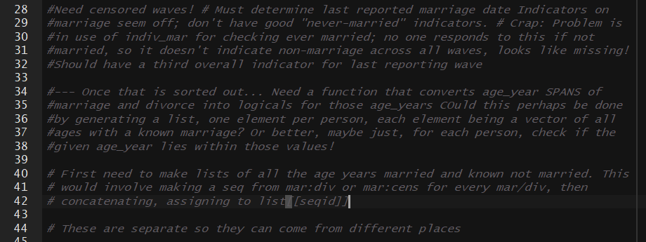

```{r setup, include=FALSE}
options(htmltools.dir.version = FALSE)
knitr::opts_chunk$set(comment = "##")
```

```{r xaringan-themer, include = FALSE}
library(xaringanthemer)

csss508css <- list(
     ".hljs-tomorrow-night-bright .hljs" = list(
        "background" = "#10102c",
        "border-radius"="5px"),
     ".remark-inline-code" = list(
        "background" = "#E0E0E0",
        "color" = "#10102c",
        "border-radius" = "3px",
        "padding" = "2px"),
     ".inverse .remark-inline-code" = list(
        "background" = "#10102c",
        "color" = "#ececf8",
        "border-radius" = "3px",
        "padding" = "2px"),
     ".smallish" = list("font-size" = "85%"),
     ".small" = list("font-size" = "75%"),
     ".smaller" = list("font-size" = "60%"),
     ".remark-code-line-highlighted" = list(
        "background-color" = "rgba(255,0,255,0.2)"),
     "sup" = list("font-size" = "14px"),
     "h1, h2, h3" = list(
        "margin-top"=".25em", 
        "margin-bottom"=".25em"),
     ".pull-left60" = list(
        "float" = "left",
        "width" = "58%" ),
     ".pull-right40" = list(
        "float" = "right",
        "width" = "38%" ),
     "a" = list("text-decoration" = "underline"),
     ".inverse a" = list("color" = "#cbd3a3"),
     "body" = list("line-height" = "1.4"),
     ".inverse" = list("background-image" = "url(https://clanfear.github.io/CSSS508/Lectures/img/UWCSSSBG1_white.svg)"),
     ".short" = list("height" = "30%"),
     ".image-50 img" = list("width" = "50%"),
     ".image-75 img" = list("width" = "75%"),
     ".image-full img" = list(
        "height" = "480px",
        "display"="block",
        "margin-left"="auto",
        "margin-right"="auto"),
     ".title-slide" = list("background-image" = "url(https://clanfear.github.io/CSSS508/Lectures/img/UWCSSSBG1_white.svg), url(https://clanfear.github.io/CSSS508/Lectures/img/title_slide_img.png)",
                           "background-position" = "center center, center bottom",
                           "background-size" = "contain, contain")
    )
 
mono_accent(base_color = "#342c5c",
            code_font_google = google_font("Fira Mono"),
            header_font_google = google_font("Quattrocento"),
            extra_css = csss508css,
            title_slide_background_image = "https://raw.githubusercontent.com/clanfear/CSSS508/master/Lectures/img/title_slide_img.png",
            title_slide_background_position = "bottom",
            title_slide_background_size = "contain",
            background_image = "https://clanfear.github.io/CSSS508/Lectures/img/UWCSSSBG1.svg"
)
```

# Today

### Reproducible Research

### Best Practices

   * Organization
   * Portability
   * Version Control

### Advanced Data Manipulation

---
class: inverse

# Reproducible Research

---
# Why Reproducibility?

Reproducibility is not *replication*.

* **Replication** is running a new study to show if and how results of a prior study hold.
* **Reproducibility** is about rerunning *the same study* and getting the *same results*.

--

Reproducible studies can still be *wrong*... and in fact reproducibility makes proving a study wrong *much easier*.

--

Reproducibility means:

* Transparent research practices.
* Minimal barriers to verifying your results.

--

*Any study that isn't reproducible can be trusted only on faith.*

---
# Reproducibility Definitions

Reproducibility comes in three forms (Stodden 2014):

--

1. **Empirical:** Repeatability in data collection.

--

2. **Statistical:** Verification with alternate methods of inference.

--

3. **Computational:** Reproducibility in cleaning, organizing, and presenting data and results.

--

R is particularly well suited to enabling **computational reproducibility**.<sup>1</sup>

.footnote[[1] Python is equally well suited.]

--

They will not fix flawed research design, nor offer a remedy for improper application of statistical methods.

Those are the difficult, non-automatable things you want skills in.

---

## Computational Reproducibility

Elements of computational reproducibility:

--

* Shared data

   + Researchers need your original data to verify and replicate your work.

--

* Shared code
   + Your code must be shared to make decisions transparent.

--

* Documentation
   + The operation of code should be either self-documenting or have written descriptions to make its use clear.

--

* **Version Control**
   + Documents the research process.
   + Prevents losing work and facilitates sharing.

---

## Levels of Reproducibility

For academic papers, degrees of reproducibility vary:

0. "Read the article"

--

1. Shared data with documentation

--

2. Shared data and all code

--

3. **Interactive document**

--

4. **Research compendium**

--

5. Docker Compendium: Self-contained ecosystem

---
## Interactive Documents

**Interactive documents**—like R Markdown docs—combine code and text together into a self-contained document.
   * Load and process data
   * Run models
   * Generate tables and plots in-line with text
   * In-text values automatically filled in

--

Interactive documents allow a reader to examine your computational methods within the document itself; in effect, they are self-documenting.

--

By re-running the code, they reproduce your results on demand.

--

Common Platforms:

 * **R:** R Markdown ([an example of mine](https://clanfear.github.io/birthtiming/inst/paper/paper.html))
 * **Python:** Jupyter Notebooks

---
## Research Compendia

A **research compendium** is a portable, reproducible distribution of an article or other project.

--

Research compendia feature:

* An interactive document as the foundation

* Files organized in a recognizable structure (e.g. an R package)

* Clear separation of data, method, and output. *Data are read only*.

* A well-documented or even *preserved* computational environment (e.g. Docker)

--

`rrtools` by UW's [Ben Markwick](https://github.com/benmarwick) provides a simplified workflow to accomplish this in R.

[Here is an example compendium of mine.](https://github.com/clanfear/birthtiming)

---
## Bookdown

[`bookdown`](https://bookdown.org/yihui/bookdown/)—which is integrated into `rrtools`—can generate documents in the proper format for articles, theses, books, or dissertations.

--

`bookdown` provides an accessible alternative to writing $\LaTeX$ for typesetting and reference management.

--

You can integrate citations and automate reference page generation using bibtex files (such as produced by Zotero).

--

`bookdown` supports `.html` output for ease and speed and also renders `.pdf` files through $\LaTeX$ for publication-ready documents.

--

For University of Washington theses and dissertations, consider Ben Marwick's [`huskydown` package](https://github.com/benmarwick/huskydown) which uses Markdown but renders via a UW approved $\LaTeX$ template.

---
class: inverse
# Best Practices

## Organization and Portability

---
# Organization Systems

Organizing research projects is something you either do accidentally—and badly—or purposefully with some upfront labor.

--

Uniform organization makes switching between or revisiting projects easier.

--

I suggest something like the following:

.pull-left[
```
project/
   readme.md
   data/
     derived/
       processed_data.RData
     raw/
       core_data.csv
   docs/
     paper.Rmd
   syntax/
     functions.R
     models.R
```
]
.pull-right[
1. There is a clear hierarchy
   * Written content is in `docs`
   * Code is in `syntax`
   * Data is in `data`
2. Naming is uniform
   * All lower case
   * Words separated by underscores
3. Names are self-descriptive

]

---
# Workflow versus Projects

To summarize Jenny Bryan, [one should separate workflow from projects.](https://www.tidyverse.org/articles/2017/12/workflow-vs-script/)

--

.pull-left[
### Workflow

The software you use to write your code (e.g. RStudio)

The location you store your files

The specific computer you use

The code you ran earlier or typed into your console
]

--

.pull-right[
### Project

The raw data

The code that operates on your raw data

The packages you use

The output files or documents
]

--

Projects *should not modify anything outside of the project* nor need to be modified by someone else (or future you) to run.

**Projects *should be independent of your workflow*.**

---
# Portability

For research to be reproducible, it must also be *portable*. Portable software operates *independently of workflow* such as fixed file locations.

--

**Do Not:**

* Use `setwd()` in scripts or .Rmd files.
* Use *absolute paths* except for *fixed, immovable sources* (secure data).
  + `read_csv("C:/my_project/data/my_data.csv")`
* Use `install.packages()` in a script or .Rmd files.
* Use `rm(list=ls())` anywhere but your console.

--

**Do:**

* Use RStudio projects (or the [`here` package](https://github.com/jennybc/here_here)) to set directories.
* Use *relative paths* to load and save files:
  + `read_csv("./data/my_data.csv")`
* Load all required packages using `library()`.
* Clear your environment when closing RStudio.

---
# Divide and Conquer

Often you do not want to include all the code for a project in a single `.Rmd` file:

   * The code takes too long to knit.
   * The file is so long it is difficult to read.

--

There are two ways to deal with this:

1. Use separate `.R` scripts or `.Rmd` files which save results from complicated parts of a project, then load these results in the main `.Rmd` file.

   + This is good for loading and cleaning large data.
   + Also for running slow models.

--

2. Use `source()` to run external `.R` scripts.

   + This can be used to run large files that aren't impractically slow.
   + Also good for loading project-specific functions.

---
# The Way of Many Files

I find it beneficial to break projects into *many* files:
   * Scripts with specialized functions.
   * Scripts to load and clean each set of variables.
   * Scripts to run each set of models and make tables and plots.
   * A main .Rmd that runs some or all of these to reproduce the entire project.

--

Splitting up a project carries benefits:
   * Once a portion of the project is done and in its own file, *it is out of your way.*
   * If you need to make changes, you don't need to search through huge files.
   * Entire sections of the project can be added or removed quickly (e.g. converted to an appendix of an article)
   * **It is the only way to build a proper *pipeline* for a project. **

---
# Pipelines

Professional researchers and teams design projects as a **pipeline**.

--

A **pipeline** is a series of consecutive processing elements (scripts and functions in R).

--

Each stage of a pipeline...

1. Has clearly defined inputs and outputs
2. Does not modify its inputs.
3. Produces the exact same output every time it is re-run.

--

This means...

1. When you modify one stage, you only need to rerun *subsequent stages*.
2. Different people can work on each stage.
3. Problems are isolated within stages.
4. You can depict your project as a *directed graph* of **dependencies**.

---

# Example Pipeline

Every stage (oval) has an unambiguous input and output. Everything that precedes a given stage is a **dependency**—something required to run it.


---
class: inverse
# Tools

### *Some opinionated advice*

---
# On Formats

Avoid "closed" or commercial software and file formats except where absolutely necessary.

--

Use open source software and file formats.

--

* It is always better for *science*:

   + People should be able to explore your research without buying commercial software.
   + You do not want your research to be inaccessible when software is updated.

--

* It is often just *better*.

   + It is usually updated more quickly
   + It tends to be more secure
   + It is rarely abandoned

--

**The ideal:** Use software that reads and writes *raw text*.

---
# Text

Writing and formatting documents are two completely separate jobs.
   * Write first
   * Format later
   * [Markdown](https://en.wikipedia.org/wiki/Markdown) was made for this

--

Word processors—like Microsoft Word—try to do both at the same time, usually badly.

They waste time by leading you to format instead of writing.

--

Find a good modular text editor and learn to use it:
   * [Atom](https://atom.io/)
   * [Sublime](https://www.sublimetext.com/) (Commercial)
   * Emacs
   * Vim

---
class: inverse
# Version Control

---
# Version Control

Version control originates in collaborative software development.

**The Idea:** All changes ever made to a piece of software are documented, saved automatically, and revertible.

--

Version control allows all decisions ever made in a research project to be documented automatically.

--

Version control can:

1. Protect your work from destructive changes
2. Simplify collaboration by merging changes
3. Document design decisions
4. Make your research process transparent

---
# Git and GitHub

[`git`](https://en.wikipedia.org/wiki/Git) is the dominant platform for version control, and [GitHub](https://github.com/) is a free (and now Microsoft owned) platform for hosting **repositories**.

--

**Repositories** are folders on your computer where all changes are tracked by Git.

--

Once satisfied with changes, you "commit" them then "push" them to a remote repository that stores your project.

--

Others can copy your project ("pull"), and if you permit, make suggestions for changes.

--

Constantly committing and pulling changes automatically generates a running "history" that documents the evolution of a project.

--

`git` is integrated into RStudio under the *Tools* menu. [It requires some setup.](http://happygitwithr.com/)<sup>1</sup>

.footnote[[1] You can also use the [GitHub desktop application](https://desktop.github.com/).]


---
# GitHub as a CV

Beyond archiving projects and allowing sharing, GitHub also serves as a sort of curriculum vitae for the programmer.

--

By allowing others to view your projects, you can display competence in programming and research.

--

If you are planning on working in the private sector, an active GitHub profile will give you a leg up on the competition.

--

If you are aiming for academia, a GitHub account signals technical competence and an interest in research transparency.


---
class: inverse
# Advanced Data Manipulation

This section walks you through an example of a real-world data management scenario.

We will use a small extract from the *Denver Youth Survey*, a 10-wave (in this example) panel data set with 1526 respondents aged 7 to 26.

---
# Setup
```{r, message=FALSE, warning=FALSE}
library(tidyverse)
`%!in%` <- Negate(`%in%`) #<<
```

`%!in%` is a useful custom operator. It is the *opposite* of `%in%`.

`%!in%` returns a `TRUE` for every element of the object on its left that is *not* an element of the object on its right.

Because `!` *inverts* logical vectors, these statements are equivalent:

```{r, eval=FALSE}
!(x %in% y)
x %!in% y
```

.footnote[`Negate()` is akin to `!` for functions.]
---
# Example Data

.smallish[
```{r}
load("mar_ages.RData") # Tiny sample of my real data
mar_ages
```
]
---
# What We Have

These data are in "long" format where each individual has multiple observations.

Our "time" is in *age* rather than years and our observations are *person-marriages*.

Variables:

* **seqid**: Individual identifier
* **byr**: Birth year
* **marriage_n**: Marriage number (most never married or once)
* **marriage_age**: If married, the age at which they married
* **divorce_age**: If divorced, the age at which they divorced
* **censored_age**: Last age they were observed in data

---
# What We Want

The goal is to get a "wide" dataframe that looks like this:

* Each *row* corresponds to a *person*
* Each *column* corresponds to an *age*, from 10 to 26.
* Each cell value is...
   + Married = 1
   + Not Married = 0
   + Unknown/Missing = NA

How are we going to do this?

---
# Some Comments

I like to type out long comments that describe my problem and possible strategies!



If interested, [here is a link to my *unedited script* this is all taken from.](https://raw.githubusercontent.com/clanfear/CSSS508/master/Lectures/Week10/marriage_dates_to_age_year_110317.R)
It is a bit messy, long, and inefficient but is a realistic example of "in-use" code. Note that it assumes access to the full data set, which I cannot share.

---
# Strategy

There are many ways to approach this problem, but this was the strategy I came up with:

1. Get the ages in which individuals were known to be *married*.
   * If married once and never divorced, this is all ages from `marriage_age` to `censored_age`
   * If divorced, it is from `marriage_age` to `divorce_age`.
   * Multiple marriages are just more of the above.
2. Get the ages in which individuals were known to be *not married*.
   * If never married, they were not married up until `censored_age`.
   * If married and divorced, they were not married until `marriage_age` and after `divorce_age`, until another marriage.
3. What remains is the unknown or *missing ages*.
4. Make a matrix of individuals (rows) and ages (columns) and populate the cells using 1, 2, and 3.

---
# Coding Married Ages 1

First, get a **list** where each **element** is a **vector** of married ages for *each marriage*.

.smallish[
```{r, eval=TRUE}
married_years <- vector("list", nrow(mar_ages))
names(married_years) <- paste0(mar_ages$seqid, "-", mar_ages$marriage_n)
for (i in 1:nrow(mar_ages)){
  if (is.na(mar_ages$marriage_age[i])){
    married_years[[i]] <- NA # Assign NA if no marriage
  } else if (!is.na(mar_ages$marriage_age[i]) & # Was married...
              is.na(mar_ages$divorce_age[i])) { # but not divorced
      if (mar_ages$marriage_age[i] <= mar_ages$censored_age[i]){
         married_years[[i]] <- # Marriage age to censored age
           mar_ages$marriage_age[i]:mar_ages$censored_age[i]
      } else { # If married for only one year
         married_years[[i]] <- mar_ages$marriage_age[i]
      }
  } else if (!is.na(mar_ages$marriage_age[i]) & # Married...
             !is.na(mar_ages$divorce_age[i])) { # ... and divorced
    married_years[[i]] <- # Marriage age to divorce age
      mar_ages$marriage_age[i]:mar_ages$divorce_age[i]
  } else { # Print ERROR if none of above conditions apply
    married_years[[i]] <- "ERROR"; print(paste0("Error on ", i)) #<<
  }}
```
]

---
# Coding Married Ages 2

```{r, eval=TRUE}
head(married_years)
```

---
# Coding Married Ages 3

Next, *combine* each person's *three vectors* into *one vector* of married ages.

```{r, eval=TRUE}
age_year_yes_list <- vector("list", length(unique(mar_ages$seqid)))
names(age_year_yes_list) <- paste0("seqid_", unique(mar_ages$seqid))
for (i in 1:length(age_year_yes_list)){
  vals <- c(married_years[[(3*i)-2]],
            married_years[[(3*i)-1]], 
            married_years[[(3*i)]])
  if (all(is.na(vals))) {
    age_year_yes_list[[i]] <- NA # NA if all values are NA
  } else { # Otherwise, assign non-NA values
  age_year_yes_list[[i]] <- unique(vals[!is.na(vals)])
  }
}
```

---
# Coding Married Ages 4

```{r, eval=TRUE}
head(age_year_yes_list)
```

---
# Coding Unmarried Ages 1

Similar to the married code, but now I assume no one was married at age 10 and work from there up.

.smallish[
```{r, eval=TRUE}
unmarried_years <- vector("list", nrow(mar_ages))
names(unmarried_years) <- paste0(mar_ages$seqid, "-", mar_ages$marriage_n)
for (i in 1:nrow(mar_ages)){
  if (is.na(mar_ages$censored_age[i])) {
    unmarried_years[[i]] <- NA # NA if always censored
  } else if (is.na(mar_ages$marriage_age[i])) { # If never married
    unmarried_years[[i]] <- 10:mar_ages$censored_age[i]
  } else if (!is.na(mar_ages$marriage_age[i]) & # Married...
              is.na(mar_ages$divorce_age[i])){ # ... without divorce
    unmarried_years[[i]] <- 10:mar_ages$marriage_age[i]
  } else if (!is.na(mar_ages$marriage_age[i]) & # Married...
             !is.na(mar_ages$divorce_age[i])) { # ... and divorced
    unmarried_years[[i]] <- c(10:mar_ages$marriage_age[i],
            mar_ages$divorce_age[i]:mar_ages$censored_age[i])
  } else {
    unmarried_years[[i]] <- "ERROR"; print(paste0("Error on ", i))
  }
}
```
]

---
# Coding Unarried Ages 2

```{r, eval=TRUE}
head(unmarried_years)
```

---
# Coding Unmarried Ages 3

Combine all unmarried ages into a single vector per person.

```{r, eval=TRUE}
age_year_no_list <- vector("list", length(unique(mar_ages$seqid)))
names(age_year_no_list) <- paste0("seqid_", unique(mar_ages$seqid))

for (i in 1:length(age_year_no_list)){
  vals <- c(unmarried_years[[(3*i)-2]],
            unmarried_years[[(3*i)-1]],
            unmarried_years[[(3*i)]])
  if (all(is.na(vals))) {
    age_year_no_list[[i]] <- NA
  } else {
    age_year_no_list[[i]] <- unique(vals[!is.na(vals)])
    age_year_no_list[[i]] <- 
      age_year_no_list[[i]][age_year_no_list[[i]] %!in%
                              age_year_yes_list[[i]]]
  }
}
```

---
# Coding Unmarried Ages 4

```{r, eval=TRUE}
head(age_year_no_list)
```

---
# A Function to Convert from Lists to a Matrix

.smallish[
```{r, eval=TRUE}
ay_list_to_ay_mat <- function(age_year_yes_list, age_year_no_list){
  age_year_mat <- setNames(as.data.frame(matrix(as.numeric(NA), 
              ncol=length(10:27), nrow=6)), paste0("age_", 10:27))
  for(i in 1:6){ # Six individuals!
    if (any(!is.na(age_year_yes_list[[i]]))){
      age_year_mat[i, age_year_yes_list[[i]]-9 ] <- 1
    } # Above: If any married ages, assign 1 to corresponding cells
    if (any(!is.na(age_year_no_list[[i]]))){
      age_year_mat[i, age_year_no_list[[i]]-9 ] <- 0
    } # Above: If any unmarried ages, assign 1 to corresponding cells
  }
  return(age_year_mat)
}

mar_age_year_mat <- 
  ay_list_to_ay_mat(age_year_yes_list = age_year_yes_list,
                    age_year_no_list = age_year_no_list)
mar_age_year_mat <- mar_age_year_mat %>% 
  mutate(seqid=c(1,2,10,18,280,417)) %>% 
  select(seqid, starts_with("age"), -age_27)
```
]

---
# What Did We get?
```{r, eval=TRUE}
mar_age_year_mat %>% select(seqid, age_10:age_17)
mar_age_year_mat %>% select(seqid, age_18:age_25)
```

---
# Conclusion

Data wrangling can be very complicated, with many valid ways of accomplishing it.

I believe the best general approach is the following:

1. Look carefully at the **starting data** to figure out what you can get from them.
2. Determine *precisely* what you want the **end product** to look like.
3. Identify individual steps needed to go from Step 1 to Step 2.
4. Make each discrete step its own set of functions or function calls.
   + If any step is confusing or complicated, **break it into more steps**.
5. Complete each step *separately and in order*.
   + Do not continue until a step is producing what you need for the next step.
   + **Do not worry about combining steps for efficiency until everything works**.
   
Once finished, if you need to do this again, *convert the prior steps into functions*!

