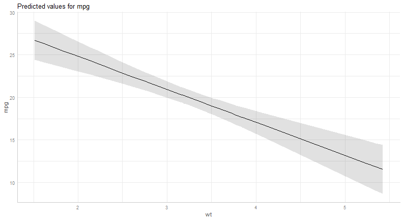
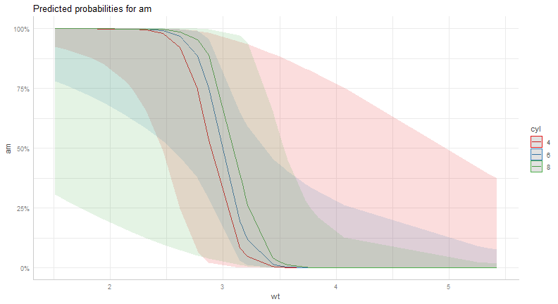
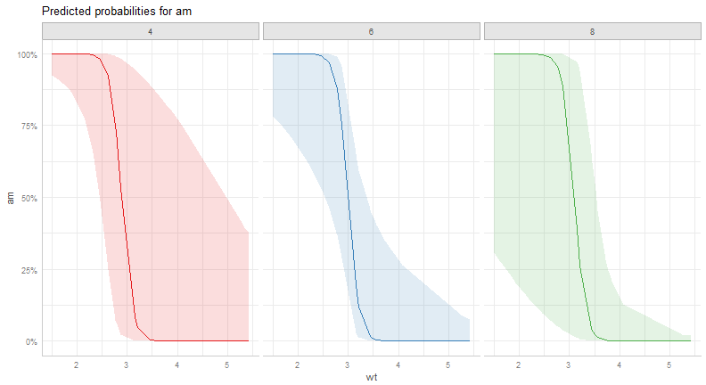
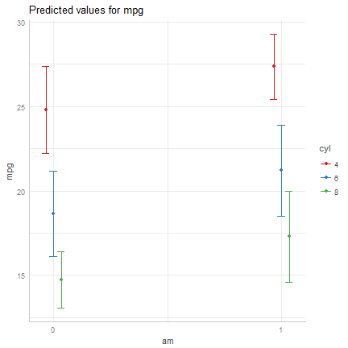

CSSS 508, Week 11: Tidy Model Results and Applied Data Cleaning
====================================================================================
author: Charles Lanfear
date: December 6, 2017
transition: linear
width: 1440
height: 960


Topics for Today
====================================================================================

Displaying Model Results

* `broom`
   + Turning model output lists into dataframes
   + Summarizing models
* `ggeffects`
   + Creating predicted values
   + Plotting marginal effects
* Making regression tables
   + Using `pander` for models
   + Using `sjTable()` in `sjPlot`
* Advanced data manipulation example
* Wrapping up the course
  
  

broom
====================================================================================
type: section

broom
====================================================================================

`broom` is a package that "tidies up" the output from models such a `lm()` and `glm()`.

It has a small number of key functions:

* `tidy()` - Creates a dataframe summary of a model.
* `augment()` - Adds columns---such as fitted values---to the data used in the model.
* `glance()` - Provides one row of fit statistics for models.


```r
library(broom)
```


Standard Output is Lists
====================================================================================

`lm()` and `summary()` produce lists as output, which cannot go directly into 
tidyverse functions, particularly those in `ggplot2`.


```r
data(mtcars)
lm_1 <- lm(mpg~wt+hp, data=mtcars)
summary(lm_1)
```

```

Call:
lm(formula = mpg ~ wt + hp, data = mtcars)

Residuals:
   Min     1Q Median     3Q    Max 
-3.941 -1.600 -0.182  1.050  5.854 

Coefficients:
            Estimate Std. Error t value Pr(>|t|)    
(Intercept) 37.22727    1.59879  23.285  < 2e-16 ***
wt          -3.87783    0.63273  -6.129 1.12e-06 ***
hp          -0.03177    0.00903  -3.519  0.00145 ** 
---
Signif. codes:  0 '***' 0.001 '**' 0.01 '*' 0.05 '.' 0.1 ' ' 1

Residual standard error: 2.593 on 29 degrees of freedom
Multiple R-squared:  0.8268,	Adjusted R-squared:  0.8148 
F-statistic: 69.21 on 2 and 29 DF,  p-value: 9.109e-12
```


Standard Output Varies!
====================================================================================
Each type of model also produces somewhat different output, so you can't just reuse
the same code to handle output from every model.


```r
glm_1 <- glm(am~hp+wt, data=mtcars, family=binomial(link="logit"))
summary(glm_1)
```

```

Call:
glm(formula = am ~ hp + wt, family = binomial(link = "logit"), 
    data = mtcars)

Deviance Residuals: 
    Min       1Q   Median       3Q      Max  
-2.2537  -0.1568  -0.0168   0.1543   1.3449  

Coefficients:
            Estimate Std. Error z value Pr(>|z|)   
(Intercept) 18.86630    7.44356   2.535  0.01126 * 
hp           0.03626    0.01773   2.044  0.04091 * 
wt          -8.08348    3.06868  -2.634  0.00843 **
---
Signif. codes:  0 '***' 0.001 '**' 0.01 '*' 0.05 '.' 0.1 ' ' 1

(Dispersion parameter for binomial family taken to be 1)

    Null deviance: 43.230  on 31  degrees of freedom
Residual deviance: 10.059  on 29  degrees of freedom
AIC: 16.059

Number of Fisher Scoring iterations: 8
```

broom tidy()
====================================================================================

`tidy()` produces the same output, but as a dataframe.


```r
lm_1 %>% tidy()
```

```
         term    estimate  std.error statistic      p.value
1 (Intercept) 37.22727012 1.59878754 23.284689 2.565459e-20
2          wt -3.87783074 0.63273349 -6.128695 1.119647e-06
3          hp -0.03177295 0.00902971 -3.518712 1.451229e-03
```

broom tidy()
====================================================================================

This output is also completely identical between different models. This can be very 
useful and important if running models with different test statistics... or just running
a lot of models!


```r
glm_1 %>% tidy()
```

```
         term   estimate  std.error statistic     p.value
1 (Intercept) 18.8662987 7.44355806  2.534581 0.011258199
2          hp  0.0362556 0.01773415  2.044394 0.040914646
3          wt -8.0834752 3.06867511 -2.634191 0.008433813
```


broom glance()
====================================================================================

`glance()` produces dataframes of fit statistics for models. If you run many models,
you can compare each model row-by-row in each column... or even plot their different
fit statistics to allow holistic comparison.


```r
glance(lm_1)
```

```
  r.squared adj.r.squared    sigma statistic      p.value df    logLik
1 0.8267855     0.8148396 2.593412  69.21121 9.109054e-12  3 -74.32617
       AIC      BIC deviance df.residual
1 156.6523 162.5153 195.0478          29
```


broom augment()
====================================================================================

`augment()` takes values generated by a model and adds them back to the original data.
This includes fitted values, residuals, and leverage statistics.


```r
augment(lm_1) %>% head()
```

```
          .rownames  mpg    wt  hp  .fitted   .se.fit     .resid
1         Mazda RX4 21.0 2.620 110 23.57233 0.5457078 -2.5723294
2     Mazda RX4 Wag 21.0 2.875 110 22.58348 0.5218283 -1.5834826
3        Datsun 710 22.8 2.320  93 25.27582 0.6363166 -2.4758187
4    Hornet 4 Drive 21.4 3.215 110 21.26502 0.5650719  0.1349799
5 Hornet Sportabout 18.7 3.440 175 18.32727 0.4979275  0.3727334
6           Valiant 18.1 3.460 105 20.47382 0.6720442 -2.3738163
        .hat   .sigma      .cooksd .std.resid
1 0.04427691 2.592051 1.589652e-02 -1.0145865
2 0.04048669 2.621576 5.464779e-03 -0.6233275
3 0.06020097 2.594812 2.070651e-02 -0.9847588
4 0.04747494 2.639187 4.724822e-05  0.0533285
5 0.03686288 2.638340 2.736184e-04  0.1464478
6 0.06715104 2.598125 2.155064e-02 -0.9476980
```

The Power of broom
====================================================================================

The real advantage of `broom` becomes apparent when running many models at once:


```r
mtcars %>% group_by(cyl) %>% 
  do(tidy(lm(mpg ~  wt + hp + disp, data=.)))
```

```
# A tibble: 12 x 6
# Groups:   cyl [3]
     cyl        term      estimate  std.error     statistic      p.value
   <dbl>       <chr>         <dbl>      <dbl>         <dbl>        <dbl>
 1     4 (Intercept)  4.488377e+01 5.03250467  8.918773e+00 4.524637e-05
 2     4          wt -2.589188e+00 3.52234453 -7.350752e-01 4.861855e-01
 3     4          hp -6.453608e-02 0.05491552 -1.175188e+00 2.783399e-01
 4     4        disp -6.628463e-02 0.08183066 -8.100219e-01 4.445874e-01
 5     6 (Intercept)  3.027791e+01 5.63124640  5.376768e+00 1.259814e-02
 6     6          wt -3.896183e+00 1.41467458 -2.754120e+00 7.049847e-02
 7     6          hp -1.097072e-02 0.02134356 -5.140061e-01 6.427131e-01
 8     6        disp  1.610061e-02 0.01345708  1.196442e+00 3.174586e-01
 9     8 (Intercept)  2.666388e+01 3.90786097  6.823138e+00 4.607727e-05
10     8          wt -2.176342e+00 1.16058382 -1.875213e+00 9.023139e-02
11     8          hp -1.367310e-02 0.01141140 -1.198197e+00 2.584664e-01
12     8        disp  1.104231e-06 0.01309467  8.432673e-05 9.999344e-01
```


ggeffects
====================================================================================
type: section

ggeffects
====================================================================================

While `broom` produces tidy model *summaries*, `ggeffects` is used to create tidy 
*marginal effects*. That is, tidy dataframes of *ranges* of predicted values that can be
fed straight into `ggplot2` for plotting model results.

* `ggpredict()` - Computes predicted values for the outcome variable at margins of specific variables.
* `plot.ggeffects()` - A plot method for `ggeffects` objects (like `ggredict()` output)


```r
library(ggeffects)
```

ggpredict()
====================================================================================

When you run  `ggpredict()`, it produces a dataframe with a row for every unique 
value of a supplied predictor ("independent") variable (`term`). Each row contains a 
predicted value for the outcome ("dependent") variable, plus confidence intervals.


```r
(lm_1_predicted <- ggpredict(lm_1, terms="wt"))
```

```
# A tibble: 29 x 5
       x predicted conf.low conf.high  group
   <dbl>     <dbl>    <dbl>     <dbl> <fctr>
 1 1.513  26.69942 24.40284  28.99600      1
 2 1.615  26.30388 24.12315  28.48461      1
 3 1.835  25.45076 23.51535  27.38616      1
 4 1.935  25.06297 23.23650  26.88945      1
 5 2.140  24.26802 22.65801  25.87803      1
 6 2.200  24.03535 22.48653  25.58417      1
 7 2.320  23.57001 22.13979  25.00023      1
 8 2.465  23.00772 21.71247  24.30298      1
 9 2.620  22.40666 21.24219  23.57113      1
10 2.770  21.82498 20.76903  22.88094      1
# ... with 19 more rows
```

plot() for ggpredict()
====================================================================================

`ggeffects` features a `plot()` *method* (`plot.ggeffects()`), which automatically produces
a ggplot when you give `plot()` an object created by a `ggeffects` function.


```r
plot(lm_1_predicted)
```




Grouping with ggpredict
====================================================================================

When using a vector of multiple `terms`, `ggeffects` will plot the first along the x-axis and use
subsequent terms for *grouping*.


```r
glm(am ~ hp + wt + cyl, data=mtcars, family=binomial(link="logit")) %>%
  ggpredict(terms=c("wt", "cyl")) %>% plot()
```



Faceting with ggpredict
====================================================================================

You can add `facet=TRUE` to the `plot()` call to facet over *grouping terms*.


```r
glm(am ~ hp + wt + cyl, data=mtcars, family=binomial(link="logit")) %>%
  ggpredict(terms=c("wt", "cyl")) %>% plot(facet=TRUE)
```



Dot plots with ggpredict
====================================================================================

`ggpredict` will produce dot plots with error bars for categorical predictors.


```r
lm(mpg~as.factor(am)+as.factor(cyl), data=mtcars) %>% ggpredict(terms=c("am", "cyl")) %>% plot()
```



Notes on ggeffects
====================================================================================

There is a lot more to the `ggeffects` package that you can see in [the package vignette](https://cran.r-project.org/web/packages/ggeffects/vignettes/marginaleffects.html)
and the [github repository](https://github.com/strengejacke/ggeffects). This includes,
but is not limited to:

* Setting specific counterfactual values of covariates
* Predicted values for polynomial and interaction terms
* Getting predictions from models from dozens of other packages
* Sending `ggeffects` objects to `ggplot2` to freely modify plots

Making Tables
====================================================================================
type: section

Regression Tables with Pander
====================================================================================

We've used `pander` to create nice tables for dataframes. But `pander` has *methods*
to handle all sort of objects that you might want displayed nicely. This includes 
model output, such as from `lm()`, `glm()`, and `summary()`.


```r
library(pander)
```


Pander and lm
====================================================================================

You can send an `lm()` object straight to `pander`:


```r
pander(lm_1)
```

| &nbsp;          | Estimate | Std. Error | t value | Pr(>t)    |
|:----------------|:--------:|:----------:|:-------:|:---------:|
| **(Intercept)** |  37.23   |   1.599    |  23.28  | 2.565e-20 |
| **wt**          |  -3.878  |   0.6327   | -6.129  | 1.12e-06  |
| **hp**          | -0.03177 |  0.00903   | -3.519  | 0.001451  |

Table: Fitting linear model: mpg ~ wt + hp

Pander and summary
====================================================================================

You can do this with `summary()` as well, for added information:


```r
pander(summary(lm_1))
```

| &nbsp;          | Estimate | Std. Error | t value | Pr(>t)  |
|:----------------|:--------:|:----------:|:-------:|:---------:|
| **(Intercept)** |  37.23   |   1.599    |  23.28  | 2.565e-20 |
| **wt**          |  -3.878  |   0.6327   | -6.129  | 1.12e-06  |
| **hp**          | -0.03177 |  0.00903   | -3.519  | 0.001451  |


| Observations | Residual Std. Error | $R^2$  | Adjusted $R^2$ |
|:------------:|:-------------------:|:------:|:--------------:|
|      32      |        2.593        | 0.8268 |     0.8148     |

Table: Fitting linear model: mpg ~ wt + hp

sjPlot
====================================================================================

`pander` tables are great for `rmarkdown` documents or webpages, but they're not 
generally publication ready. The `sjPlot` package produces tables that look more like
those you may find in journal articles.


```r
library(sjPlot)
```

sjPlot Tables
====================================================================================

`sjt.lm()` will produce attractive plots for `lm()` objects. `sjt.glm()` handles `glm()` models.


```r
model_1 <- lm(mpg ~ wt, data = mtcars)
sjt.lm(model_1)
```


Multi-Model Tables with sjTable
====================================================================================

Often in journal articles you will see a single table that compares multiple models.
Typically, authors will start with a simple model on the left, then add variables, 
until they have their most complex model on the right. The `sjPlot` package makes 
this easy to do: just give it more models!


sjTable with Multiple Models
====================================================================================


```r
model_2 <- lm(mpg ~ hp + wt, data = mtcars)
model_3 <- lm(mpg ~ hp + wt + factor(am), data = mtcars)
sjt.lm(model_1, model_2, model_3)
```


sjPlot does a lot more
====================================================================================

The sjPlot package does *a lot* more than just make pretty tables. It is a rabbit hole
of *incredibly* powerful and useful functions for displaying descriptive and inferential results.

View the [package website](http://www.strengejacke.de/sjPlot/) for extensive documentation.

`sjPlot` is a bit more complicated than `ggeffects` but can do just about everything 
it can do; they were written by the same author!

`sjPlot` is fairly new but may be poised to be a comprehensive solution for `ggplot`
based publication-ready social science data visualization. All graphical functions in
`sjPlot` are based on `ggplot2`, so it should not take terribly long to figure out.

sjPlot Example: Likert scale plots
====================================================================================


sjPlot Example: Crosstabs
====================================================================================


LaTeX Tables in Theses / Dissertations / Posters
====================================================================================

For tables in LaTeX documents, which are common for theses, dissertations, and posters,
I recommend either manually generating tables or looking into the `kableExtra` package.

`kableExtra` allows the construction of complex tables in either HTML or LaTeX using
additive syntax similar to `ggplot2`.

In the past, most R users used `xtable` and `stargazer` to generate LaTeX tables, 
but these are getting a bit dated. They definitely work, however!

If you want to edit LaTeX documents, you can do it in R using Sweave documents (.Rnw).
Alternatively, you may want to work in a dedicated LaTeX editor; I recommend [Overleaf](http://www.overleaf.com)
for this purpose.

RMarkdown has support for a fair amount of basic LaTeX syntax if you aren't trying to 
get too fancy.


Advanced Data Manipulation
====================================================================================
type: section


Example Data
====================================================================================


```r
load("mar_ages.RData") # Tiny sample of my real data
mar_ages
```

```
   seqid  byr marriage_n marriage_age divorce_age censored_age
1      1 1978          1           NA          NA           20
2      1 1978          2           NA          NA           20
3      1 1978          3           NA          NA           20
4      2 1974          1           23          NA           24
5      2 1974          2           NA          NA           24
6      2 1974          3           NA          NA           24
7     10 1976          1           15          19           22
8     10 1976          2           NA          NA           22
9     10 1976          3           NA          NA           22
10    18 1976          1           17          18           22
11    18 1976          2           NA          NA           22
12    18 1976          3           NA          NA           22
13   280 1974          1           18          24           24
14   280 1974          2           24          NA           24
15   280 1974          3           NA          NA           24
16   417 1972          1           18          22           26
17   417 1972          2           23          24           26
18   417 1972          3           25          NA           26
```

Structure of the Data
====================================================================================

These data are in "long" format where each individual has multiple observations.
Our "time" is in *age* rather than years and our observations are *person-marriages*.

Variables:

* **seqid** - Individual identifier
* **byr** - Birth year
* **marriage_n** - Marriage number (most never married or once)
* **marriage_age** - If married, the age at which they married
* **divorce_age** - If divorced, the age at which they divorced
* **censored_age** - Last age they were observed in data

The Goal
====================================================================================

The goal is to get a dataframe that looks like this:

* Each *row* corresponds to a *person*
* Each *column* corresponds to an *age*, from 10 to 27.
* Each cell value is...
   + Married = 1
   + Not Married = 0
   + Unknown/Missing = NA

How are we going to do this?

Some Comments
====================================================================================

I like to type out long comments that describe my problem and possible strategies!


If interested, [here is a link to my *unedited script* this is all taken from.](http://clanfear.githhub.io/CSSS508/Lectures/Week11/marriage/marriage_dates_to_age_year_110317.R)
It is a bit messy but a realistic example of "in-use" code. Note that it assumes access to the full data set, which I cannot share.

Strategy
====================================================================================

There are many ways to approach this problem, but this was the strategy I came up with:

1. Get the ages in which individuals were known to be married.
   * If married once and never divorced, this is all ages from `marriage_age` to `censored_age`
   * If divorced, it is from `marriage_age` to `divorce_age`.
   * Multiple marriages are just more of the above.
2. Get the ages in which individuals were known to be not married.
   * If never married, they were not married up until `censored_age`.
   * If married and divorced, they were not married until `marriage_age` and after `divorce_age`, until another marriage.
3. What remains is the unknown or missing ages.
4. Make a matrix of individuals (rows) and ages (columns) and populate the cells using 1, 2, and 3.


Coding Married Ages 1
====================================================================================

First, get a **list** where each **element** is a **vector** of married ages for *each marriage*.


```r
married_years <- vector("list", nrow(mar_ages))
names(married_years) <- paste0(mar_ages$seqid, "-", mar_ages$marriage_n)
for (i in 1:nrow(mar_ages)){
  if (is.na(mar_ages$marriage_age[i])){
    married_years[[i]] <- NA # Assign NA if no marriage
  } else if (!is.na(mar_ages$marriage_age[i]) &
              is.na(mar_ages$divorce_age[i])) {
      if (mar_ages$marriage_age[i] <= mar_ages$censored_age[i]){
         married_years[[i]] <- 
           mar_ages$marriage_age[i]:mar_ages$censored_age[i]
      } else {
         married_years[[i]] <- mar_ages$marriage_age[i]
      }
  } else if (!is.na(mar_ages$marriage_age[i]) &
             !is.na(mar_ages$divorce_age[i])) {
    married_years[[i]] <- 
      mar_ages$marriage_age[i]:mar_ages$divorce_age[i]
  } else { # Built-in error checking here!
    married_years[[i]] <- "ERROR"; print(paste0("Error on ", i))
  }}
```

Coding Married Ages 2
====================================================================================


```r
head(married_years)
```

```
$`1-1`
[1] NA

$`1-2`
[1] NA

$`1-3`
[1] NA

$`2-1`
[1] 23 24

$`2-2`
[1] NA

$`2-3`
[1] NA
```

Coding Married Ages 3
====================================================================================

Next, *combine* each person's *three vectors* into *one vector* of married ages.


```r
age_year_yes_list <- vector("list", length(unique(mar_ages$seqid)))
names(age_year_yes_list) <- paste0("seqid_", unique(mar_ages$seqid))
for (i in 1:length(age_year_yes_list)){
  vals <- c(married_years[[(3*i)-2]], 
            married_years[[(3*i)-1]], 
            married_years[[(3*i)]])
  if (all(is.na(vals))) {
    age_year_yes_list[[i]] <- NA # NA if all values are NA
  } else { # Otherwise, assign non-NA values
  age_year_yes_list[[i]] <- unique(vals[!is.na(vals)])
  }
}
```

Coding Married Ages 4
====================================================================================


```r
head(age_year_yes_list)
```

```
$seqid_1
[1] NA

$seqid_2
[1] 23 24

$seqid_10
[1] 15 16 17 18 19

$seqid_18
[1] 17 18

$seqid_280
[1] 18 19 20 21 22 23 24

$seqid_417
[1] 18 19 20 21 22 23 24 25 26
```


Coding Unmarried Ages 1
====================================================================================

Similar to the married code, but now I assume no one was married at age 10 and work from there up.


```r
unmarried_years <- vector("list", nrow(mar_ages))
names(unmarried_years) <- paste0(mar_ages$seqid, "-", mar_ages$marriage_n)
for (i in 1:nrow(mar_ages)){
  if (is.na(mar_ages$censored_age[i])) {
    unmarried_years[[i]] <- NA
  } else if (is.na(mar_ages$marriage_age[i])) {
    unmarried_years[[i]] <- 10:mar_ages$censored_age[i]
  } else if (!is.na(mar_ages$marriage_age[i]) & 
              is.na(mar_ages$divorce_age[i])){
    unmarried_years[[i]] <- 10:mar_ages$marriage_age[i]
  } else if (!is.na(mar_ages$marriage_age[i]) &
             !is.na(mar_ages$divorce_age[i])) {
    unmarried_years[[i]] <- c(10:mar_ages$marriage_age[i],
            mar_ages$divorce_age[i]:mar_ages$censored_age[i])
  } else {
    unmarried_years[[i]] <- "ERROR"; print(paste0("Error on ", i))
  }
}
```

Coding Unarried Ages 2
====================================================================================


```r
head(unmarried_years)
```

```
$`1-1`
 [1] 10 11 12 13 14 15 16 17 18 19 20

$`1-2`
 [1] 10 11 12 13 14 15 16 17 18 19 20

$`1-3`
 [1] 10 11 12 13 14 15 16 17 18 19 20

$`2-1`
 [1] 10 11 12 13 14 15 16 17 18 19 20 21 22 23

$`2-2`
 [1] 10 11 12 13 14 15 16 17 18 19 20 21 22 23 24

$`2-3`
 [1] 10 11 12 13 14 15 16 17 18 19 20 21 22 23 24
```


Coding Unmarried Ages 3
====================================================================================

Combine all unmarried ages into a single vector per person.


```r
age_year_no_list <- vector("list", length(unique(mar_ages$seqid)))
names(age_year_no_list) <- paste0("seqid_", unique(mar_ages$seqid))
for (i in 1:length(age_year_no_list)){
  vals <- c(unmarried_years[[(3*i)-2]],
            unmarried_years[[(3*i)-1]],
            unmarried_years[[(3*i)]])
  if (all(is.na(vals))) {
    age_year_no_list[[i]] <- NA
  } else {
    age_year_no_list[[i]] <- unique(vals[!is.na(vals)])
    age_year_no_list[[i]] <- 
      age_year_no_list[[i]][age_year_no_list[[i]] %!in%
                              age_year_yes_list[[i]]]
  }
}
```

Coding Unmarried Ages 4
====================================================================================


```r
head(age_year_no_list)
```

```
$seqid_1
 [1] 10 11 12 13 14 15 16 17 18 19 20

$seqid_2
 [1] 10 11 12 13 14 15 16 17 18 19 20 21 22

$seqid_10
[1] 10 11 12 13 14 20 21 22

$seqid_18
 [1] 10 11 12 13 14 15 16 19 20 21 22

$seqid_280
[1] 10 11 12 13 14 15 16 17

$seqid_417
[1] 10 11 12 13 14 15 16 17
```


A Function to Convert from Lists to a Matrix
====================================================================================


```r
ay_list_to_ay_mat <- function(age_year_yes_list, age_year_no_list){
  age_year_mat <- setNames(as.data.frame(matrix(as.numeric(NA), 
              ncol=length(10:27), nrow=6)), paste0("age_", 10:27))
  for(i in 1:6){
    if (any(!is.na(age_year_yes_list[[i]]))){
      age_year_mat[i, age_year_yes_list[[i]]-9 ] <- 1
    }
    if (any(!is.na(age_year_no_list[[i]]))){
      age_year_mat[i, age_year_no_list[[i]]-9 ] <- 0
    }
  }
  return(age_year_mat)
}

mar_age_year_mat <- 
  ay_list_to_ay_mat(age_year_yes_list = age_year_yes_list,
                    age_year_no_list = age_year_no_list)
mar_age_year_mat <- mar_age_year_mat %>% 
  mutate(seqid=c(1,2,10,18,280,417)) %>% 
  select(seqid, starts_with("age"), -age_27)
```

What Did We get?
====================================================================================

```r
mar_age_year_mat %>% select(seqid, age_10:age_17)
```

```
  seqid age_10 age_11 age_12 age_13 age_14 age_15 age_16 age_17
1     1      0      0      0      0      0      0      0      0
2     2      0      0      0      0      0      0      0      0
3    10      0      0      0      0      0      1      1      1
4    18      0      0      0      0      0      0      0      1
5   280      0      0      0      0      0      0      0      0
6   417      0      0      0      0      0      0      0      0
```

```r
mar_age_year_mat %>% select(seqid, age_18:age_25)
```

```
  seqid age_18 age_19 age_20 age_21 age_22 age_23 age_24 age_25
1     1      0      0      0     NA     NA     NA     NA     NA
2     2      0      0      0      0      0      1      1     NA
3    10      1      1      0      0      0     NA     NA     NA
4    18      1      0      0      0      0     NA     NA     NA
5   280      1      1      1      1      1      1      1     NA
6   417      1      1      1      1      1      1      1      1
```

Conclusion
====================================================================================

Data wrangling can be very complicated, with many valid ways of accomplishing it.

I believe the best general approach is the following:

1. Look carefully at the **starting data** to figure out what you can get from them.
2. Determine *precisely* what you want the **end product** to look like.
3. Identify individual steps needed to go from Step 1 to Step 2.
4. Make each discrete step its own set of functions or function calls.
   + If any step is confusing or complicated, **break it into more steps**.
5. Complete each step *separately and in order*.
   + Do not continue until a step is producing what you need for the next step.
   + **Do not worry about combining steps for efficiency until everything works**.
   
Once finished, if you need to do this again, *convert the prior steps into functions*!

Wrapping up the Course
====================================================================================
type: section


What You've Learned
====================================================================================

A lot!

* How to get data into R from a variety of formats
* How to do "data janitor" work to manipulate and clean data
* How to make pretty visualizations
* How to automate with loops and functions
* How to combine text, calculations, plots, and tables into dynamic R Markdown reports 
* How to acquire and work with spatial and social media data


What Comes Next?
====================================================================================

* Statistical inference (e.g. more CSSS courses)
    + Functions for hypothesis testing, hierarchical/mixed effect models, machine learning, survey design, etc. are straightforward to use... once data are clean
    + Access output by working with list structures (like from regression models) or using `broom` and `ggeffects`
* Practice, practice, practice!
    + Replicate analyses you've done in Excel, SPSS, or Stata
    + Think about data using `dplyr` verbs, tidy data principles
    + R Markdown for documenting cleaning and analysis start-to-finish
* More advanced projects
    + Using version control (git) in RStudio
    + Interactive Shiny web apps
    + Write your own functions and put them in a package
* Go deeper!
    + Investigate `sf` for spatial data analysis
    + Mine social media data with `tidytext`
    

Course Plugs
====================================================================================

If you...

* have no stats background yet - **SOC504: Applied Social Statistics**
* liked last week - **SOC590: Big Data and Population Processes**
* have (only) finished SOC506 - **CSSS510: Maximum Likelihood**
* want to master visualization - **CSSS569: Visualizing Data**
* study events or durations - **CSSS544: Event History Analysis**
* want to use network data - **CSSS567: Social Network Analysis**
* want to work with spatial data - **CSSS554: Spatial Statistics**

Thank you!
====================================================================================
type: section
