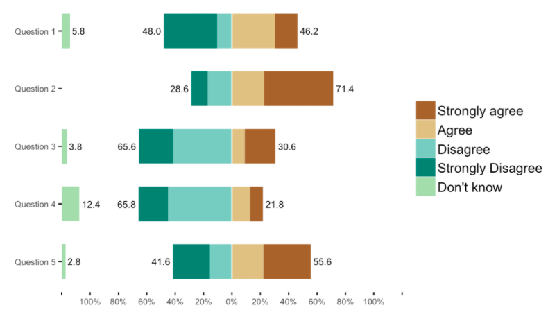

```{r setup, include=FALSE}
options(htmltools.dir.version = FALSE)
knitr::opts_chunk$set(comment = "##")
```

```{r xaringan-themer, include = FALSE}
library(xaringanthemer)

csss508css <- list(
     ".hljs-tomorrow-night-bright .hljs" = list(
        "background" = "#10102c",
        "border-radius"="5px"),
     ".remark-inline-code" = list(
        "background" = "#E0E0E0",
        "color" = "#10102c",
        "border-radius" = "3px",
        "padding" = "2px"),
     ".inverse .remark-inline-code" = list(
        "background" = "#10102c",
        "color" = "#ececf8",
        "border-radius" = "3px",
        "padding" = "2px"),
     ".smallish" = list("font-size" = "85%"),
     ".small" = list("font-size" = "75%"),
     ".smaller" = list("font-size" = "60%"),
     ".remark-code-line-highlighted" = list(
        "background-color" = "rgba(255,0,255,0.2)"),
     "sup" = list("font-size" = "14px"),
     "h1, h2, h3" = list(
        "margin-top"=".25em", 
        "margin-bottom"=".25em"),
     ".pull-left60" = list(
        "float" = "left",
        "width" = "58%" ),
     ".pull-right40" = list(
        "float" = "right",
        "width" = "38%" ),
     "a" = list("text-decoration" = "underline"),
     ".inverse a" = list("color" = "#cbd3a3"),
     "body" = list("line-height" = "1.4"),
     ".inverse" = list("background-image" = "url(https://clanfear.github.io/CSSS508/Lectures/img/UWCSSSBG1_white.svg)"),
     ".short" = list("height" = "30%"),
     ".image-50 img" = list("width" = "50%"),
     ".image-75 img" = list("width" = "75%"),
     ".image-full img" = list(
        "height" = "480px",
        "display"="block",
        "margin-left"="auto",
        "margin-right"="auto"),
     ".title-slide" = list("background-image" = "url(https://clanfear.github.io/CSSS508/Lectures/img/UWCSSSBG1_white.svg), url(https://clanfear.github.io/CSSS508/Lectures/img/title_slide_img.png)",
                           "background-position" = "center center, center bottom",
                           "background-size" = "contain, contain")
    )
 
mono_accent(base_color = "#342c5c",
            code_font_google = google_font("Fira Mono"),
            header_font_google = google_font("Quattrocento"),
            extra_css = csss508css,
            title_slide_background_image = "https://raw.githubusercontent.com/clanfear/CSSS508/master/Lectures/img/title_slide_img.png",
            title_slide_background_position = "bottom",
            title_slide_background_size = "contain",
            background_image = "https://clanfear.github.io/CSSS508/Lectures/img/UWCSSSBG1.svg"
)
```


```{r setup, include=FALSE}
library(tidyverse)
library(pander)
`%!in%` <- Negate(`%in%`)
```

---
# Topics for Today

Displaying Model Results

* `broom`
   + Turning model output lists into dataframes
   + Summarizing models
* `ggeffects`
   + Creating predicted values
   + Plotting marginal effects
* Making regression tables
   + Using `pander` for models
   + Using `sjTable()` in `sjPlot`
* Advanced data manipulation example
* Wrapping up the course

https://modelr.tidyverse.org/ ?
https://broom.tidyverse.org/articles/bootstrapping.html ?
  
---
class: inverse
# broom

---
# broom

`broom` is a package that "tidies up" the output from models such a `lm()` and `glm()`.

It has a small number of key functions:

* `tidy()` - Creates a dataframe summary of a model.
* `augment()` - Adds columns---such as fitted values---to the data used in the model.
* `glance()` - Provides one row of fit statistics for models.

```{r}
library(broom)
```

---
# Standard Output is Lists

`lm()` and `summary()` produce lists as output, which cannot go directly into 
tidyverse functions, particularly those in `ggplot2`.

```{r}
data(mtcars)
lm_1 <- lm(mpg~wt+hp, data=mtcars)
summary(lm_1)
```

---
# Standard Output Varies!

Each type of model also produces somewhat different output, so you can't just reuse
the same code to handle output from every model.

```{r}
glm_1 <- glm(am~hp+wt, data=mtcars, family=binomial(link="logit"))
summary(glm_1)
```

---
`broom::tidy()`

`tidy()` produces the same output, but as a dataframe.

```{r}
lm_1 %>% tidy()
```

---
`broom::tidy()`

This output is also completely identical between different models. This can be very 
useful and important if running models with different test statistics... or just running
a lot of models!

```{r}
glm_1 %>% tidy()
```

---
# `broom::glance()`

`glance()` produces dataframes of fit statistics for models. If you run many models,
you can compare each model row-by-row in each column... or even plot their different
fit statistics to allow holistic comparison.

```{r}
glance(lm_1)
```

---
# `broom augment()`

`augment()` takes values generated by a model and adds them back to the original data.
This includes fitted values, residuals, and leverage statistics.

```{r}
augment(lm_1) %>% head()
```

---
# The Power of broom

The real advantage of `broom` becomes apparent when running many models at once. Here we run separate models for each level of `cyl`:

```{r}
mtcars %>% group_by(cyl) %>% 
  do(tidy(lm(mpg ~  wt + hp + disp, data=.)))
```

---
class: inverse
# `ggeffects`

---
# `ggeffects`

While `broom` produces tidy model *summaries*, `ggeffects` is used to create tidy 
*marginal effects*. That is, tidy dataframes of *ranges* of predicted values that can be
fed straight into `ggplot2` for plotting model results.

* `ggpredict()` - Computes predicted values for the outcome variable at margins of specific variables.
* `plot.ggeffects()` - A plot method for `ggeffects` objects (like `ggredict()` output)

```{r}
library(ggeffects)
```

---
# `ggpredict()`

When you run  `ggpredict()`, it produces a dataframe with a row for every unique 
value of a supplied predictor ("independent") variable (`term`). Each row contains a 
predicted value for the outcome ("dependent") variable, plus confidence intervals. The argument `interval="prediction"` will give predicted intervals instead.

```{r}
(lm_1_predicted <- ggpredict(lm_1, terms="wt"))
```

---
# `plot()` for `ggpredict()`

`ggeffects` features a `plot()` *method* (`plot.ggeffects()`), which automatically produces
a ggplot when you give `plot()` an object created by a `ggeffects` function.

```{r, fig.width=11, fig.height=6, out.width="1100px", out.height="600px"}
plot(lm_1_predicted)
```

---
# Grouping with `ggpredict()`

When using a vector of multiple `terms`, `ggeffects` will plot the first along the x-axis and use
subsequent terms for *grouping*. Note we can pipe a model straight into `ggpredict()`!

```{r, fig.width=11, fig.height=6, out.width="1100px", out.height="600px"}
glm(am ~ hp + wt + cyl, data=mtcars, family=binomial(link="logit")) %>%
  ggpredict(terms=c("wt", "cyl")) %>% plot()
```

---
# Faceting with `ggpredict()`

You can add `facet=TRUE` to the `plot()` call to facet over *grouping terms*.

```{r, fig.width=11, fig.height=6, out.width="1100px", out.height="600px"}
glm(am ~ hp + wt + cyl, data=mtcars, family=binomial(link="logit")) %>%
  ggpredict(terms=c("wt", "cyl")) %>% plot(facet=TRUE)
```

---
# Setting Counterfactual Values with `ggpredict()`

You can add values in square brackets in the `terms=` argument to specify counterfactual values.

```{r, fig.width=11, fig.height=6, out.width="1100px", out.height="600px"}
glm(am ~ hp + wt + cyl, data=mtcars, family=binomial(link="logit")) %>%
  ggpredict(terms=c("wt [2,3,4]", "cyl [4,6]")) %>% plot(facet=TRUE)
```
---
# Representative Values

* meansd
* minmax

```{r, fig.width=11, fig.height=6, out.width="1100px", out.height="600px"}
glm(am ~ hp + wt + cyl, data=mtcars, family=binomial(link="logit")) %>%
  ggpredict(terms=c("wt [meansd]", "hp [minmax]")) %>% plot(facet=TRUE)
```


---
# Dot plots with `ggpredict()`

`ggpredict` will produce dot plots with error bars for categorical predictors.

```{r, fig.width=6, fig.height=6, out.width="600px", out.height="600px"}
lm(mpg~as.factor(am)+as.factor(cyl), data=mtcars) %>% ggpredict(terms=c("am", "cyl")) %>% plot()
```

---
# Notes on `ggeffects`

There is a lot more to the `ggeffects` package that you can see in [the package vignette](https://cran.r-project.org/web/packages/ggeffects/vignettes/marginaleffects.html)
and the [github repository](https://github.com/strengejacke/ggeffects). This includes,
but is not limited to:

* Setting specific counterfactual values of covariates
* Predicted values for polynomial and interaction terms
* Getting predictions from models from dozens of other packages
* Sending `ggeffects` objects to `ggplot2` to freely modify plots

---
# An Advanced Example

```{r}
load("data/any_arrest_data.RData")
mod_arrest <- glm(arrest ~ white_comp_wit_vict*black_arr_susp + 
                  crime_type*white_comp_wit_vict + caller_type + 
                  arr_susp_subj_count + comp_wit_vict_count +
                  black_arr_susp*neighb_type + crime_type*neighb_type + 
                  serious_rate + pbl + pot + dis + year,
                  family=binomial(link="logit"), data= any_arrest_data)
```

---

```{r}
mod_arrest %>% ggpredict(terms=c("black_arr_susp", "white_comp_wit_vict", "neighb_type")) %>% plot()
```
---
# Doing it Manually

.small[
```{r}
sim_model <- mod_arrest

sim_params <- MASS::mvrnorm(n=10000, mu=coef(sim_model), Sigma=vcov(sim_model))
raw_matrix <- model.matrix(sim_model)
x_values   <- colMeans(raw_matrix)

# Reporter * Target * Crime Type * Neighb Type
n_scen <- (2*2*2*3)
x_frame <- setNames(data.frame(matrix(x_values, nrow=n_scen, ncol=length(x_values), byrow=T)), names(x_values))
cf_vals <- arrangements::permutations(c(0,1), k=5, replace=T)
cf_vals <- cf_vals[cf_vals[,4]+cf_vals[,5]!=2 ,]
colnames(cf_vals) <- c("white_comp_wit_vict1", "black_arr_susp1", "crime_typeNuisance", 
                       "neighb_typeBlackDisadv", "neighb_typeChanging")
x_frame[colnames(cf_vals)] <- cf_vals
x_frame <- x_frame %>%
  mutate(`white_comp_wit_vict1:black_arr_susp1` = white_comp_wit_vict1*black_arr_susp1,
         `white_comp_wit_vict1:crime_typeNuisance` = white_comp_wit_vict1*crime_typeNuisance,
         `black_arr_susp1:neighb_typeBlackDisadv` = black_arr_susp1*neighb_typeBlackDisadv,
         `black_arr_susp1:neighb_typeChanging` = black_arr_susp1*neighb_typeChanging,
         `crime_typeNuisance:neighb_typeBlackDisadv` = crime_typeNuisance*neighb_typeBlackDisadv,
         `crime_typeNuisance:neighb_typeChanging` = crime_typeNuisance*neighb_typeChanging,
         `black_arr_susp1:neighb_typeBlackDisadv` = black_arr_susp1*neighb_typeBlackDisadv,
         `black_arr_susp1:neighb_typeChanging` = black_arr_susp1*neighb_typeChanging)

extract_pe_ci <- function(x){
  vals <- c(mean(x), quantile(x, probs=c(.025, .975)))
  names(vals) <- c("PE", "LB", "UB")
  return(vals)
}

sims_logodds <- as.matrix(x_frame) %*% t(sim_params)
sims_prob <- exp(sims_logodds) / (1 + exp(sims_logodds))
estimated_pes <- as.data.frame( t(apply(sims_prob, 1, extract_pe_ci)))

estimated_pes$`Reporter` <- ifelse(cf_vals[,1]==1, "Any White", "All Black")
estimated_pes$`Target` <- ifelse(cf_vals[,2]==1, "Any Black", "All White")
estimated_pes$`Crime Type` <- ifelse(cf_vals[,3]==1, "Nuisance Crime", "Serious Crime")
estimated_pes$`Neighborhood` <- case_when(
  cf_vals[,4]==1 ~ "Disadvantaged",
  cf_vals[,5]==1 ~ "Changing",
  TRUE ~ "Stable White"
)


arrest_pe_plot <- ggplot(estimated_pes, aes(x=Target, y=PE, group=Reporter)) + 
  facet_grid(`Crime Type`~Neighborhood) +
  geom_errorbar(aes(ymin=LB, ymax=UB), position=position_dodge(width=.4), size=0.75, width=0.15) +
  geom_point(shape=21, position=position_dodge(width=.4), size=2, aes(fill=Reporter)) + 
  scale_fill_manual("Reporter", values=c("Any White"="white", "All Black"="black")) +
  ggtitle("Figure 3. Probability of Arrest", 
          subtitle="by Reporter and Target Race, Neighborhood and Crime Type") +
  xlab("Race of Target") + ylab("Estimated Probability") + 
  theme_bw() + theme(legend.position = c(0.86,0.15),legend.background = element_rect(color=1))
```
]

---
class: inverse
# Making Tables

---
# Regression Tables with `pander`

We've used `pander` to create nice tables for dataframes. But `pander` has *methods*
to handle all sort of objects that you might want displayed nicely. This includes 
model output, such as from `lm()`, `glm()`, and `summary()`.


```{r pander}
library(pander)
```

```{r, include=FALSE}
panderOptions("table.style", "rmarkdown")
```

---
# `pander()` and `lm()`
====================================================================================

You can send an `lm()` object straight to `pander`:

```{r, echo=TRUE, eval=FALSE}
pander(lm_1)
```

| &nbsp;          | Estimate | Std. Error | t value | Pr(>t)    |
|:----------------|:--------:|:----------:|:-------:|:---------:|
| **(Intercept)** |  37.23   |   1.599    |  23.28  | 2.565e-20 |
| **wt**          |  -3.878  |   0.6327   | -6.129  | 1.12e-06  |
| **hp**          | -0.03177 |  0.00903   | -3.519  | 0.001451  |

Table: Fitting linear model: mpg ~ wt + hp

---
# `pander()` and `summary()`

You can do this with `summary()` as well, for added information:

```{r, eval=FALSE, echo=TRUE}
pander(summary(lm_1))
```

| &nbsp;          | Estimate | Std. Error | t value | Pr(>t)  |
|:----------------|:--------:|:----------:|:-------:|:---------:|
| **(Intercept)** |  37.23   |   1.599    |  23.28  | 2.565e-20 |
| **wt**          |  -3.878  |   0.6327   | -6.129  | 1.12e-06  |
| **hp**          | -0.03177 |  0.00903   | -3.519  | 0.001451  |


| Observations | Residual Std. Error | $R^2$  | Adjusted $R^2$ |
|:------------:|:-------------------:|:------:|:--------------:|
|      32      |        2.593        | 0.8268 |     0.8148     |

Table: Fitting linear model: mpg ~ wt + hp

---
# `sjPlot`

`pander` tables are great for `rmarkdown` documents or webpages, but they're not 
generally publication ready. The `sjPlot` package produces tables that look more like
those you may find in journal articles.

```{r table_packages}
library(sjPlot)
```

---
# `sjPlot` Tables

`sjt.lm()` will produce attractive plots for `lm()` objects. `sjt.glm()` handles `glm()` models.

```{r, eval=FALSE}
model_1 <- lm(mpg ~ wt, data = mtcars)
tab_model(model_1)
```

```{r, echo=FALSE, out.width = "600px"}
# If you're seeing this, you are looking in my presentation files.
# I actually have to call on a saved image here because sjPlot
# doesn't display properly in .Rpres slides for some reason.
knitr::include_graphics("img/sjPlot_table.PNG")
```

---
# Multi-Model Tables with `sjTable`

Often in journal articles you will see a single table that compares multiple models.
Typically, authors will start with a simple model on the left, then add variables, 
until they have their most complex model on the right. The `sjPlot` package makes 
this easy to do: just give it more models!

---
# `sjTable` with Multiple Models

```{r, eval=FALSE}
model_2 <- lm(mpg ~ hp + wt, data = mtcars)
model_3 <- lm(mpg ~ hp + wt + factor(am), data = mtcars)
tab_model(model_1, model_2, model_3)
```

```{r, echo=FALSE, out.width = "1280px"}
# If you're seeing this, you are looking in my presentation files.
# I actually have to call on a saved image here because sjPlot
# doesn't display properly in .Rpres slides for some reason.
knitr::include_graphics("img/sjPlot_mtable.PNG")
```

---
# `sjPlot` does a lot more

The `sjPlot` package does *a lot* more than just make pretty tables. It is a rabbit hole
of *incredibly* powerful and useful functions for displaying descriptive and inferential results.

View the [package website](http://www.strengejacke.de/sjPlot/) for extensive documentation.

`sjPlot` is a bit more complicated than `ggeffects` but can do just about everything 
it can do; they were written by the same author!

`sjPlot` is fairly new but offers a fairly comprehensive solution for `ggplot`
based publication-ready social science data visualization. All graphical functions in
`sjPlot` are based on `ggplot2`, so it should not take terribly long to figure out.

---
# `sjPlot` Example: Likert scale plots



---
# `sjPlot` Example: Crosstabs


---
# LaTeX Tables in Theses / Dissertations / Posters

For tables in $\LaTeX$ documents, which are common for theses, dissertations, and posters,
I recommend either manually generating tables or looking into the `stargazer` or `kableExtra` packages.

`kableExtra` allows the construction of complex tables in either HTML or $\LaTeX$ using
additive syntax similar to `ggplot2`.

`stargazer` produces nicely formatted $\LaTeX$ tables but is fussy and idiosyncratic.

If you want to edit $\LaTeX$ documents, you can do it in R using Sweave documents (.Rnw).
Alternatively, you may want to work in a dedicated LaTeX editor. I recommend [Overleaf](http://www.overleaf.com)
for this purpose.

RMarkdown has support for a fair amount of basic $\LaTeX$ syntax if you aren't trying to 
get too fancy!

Another approach I have used is to manually format $\LaTeX$ tables but use in-line R calls to 
fill in the values dynamically. This gets you the *exact* format you want but without 
forcing you to update values any time something changes.

---
# Bonus: `corrplot`

The `corrplot` package has functions for displaying correlograms.

These make visualizing the correlations between variables in a data set easier.

The first argument is a call to `cor()`, the base R function for generating a correlation matrix.

[See the vignette for customization options.](https://cran.r-project.org/web/packages/corrplot/vignettes/corrplot-intro.html)

```{r, message=FALSE, warning=FALSE, eval=FALSE}
library(corrplot)
corrplot(
  cor(mtcars),
  addCoef.col = "white",
  addCoefasPercent=T,
  type="upper", 
  order="AOE")
```


***

## Correlogram

```{r, message=FALSE, warning=FALSE, eval=TRUE, echo=FALSE}
library(corrplot)
corrplot(cor(mtcars), addCoef.col = "white", addCoefasPercent=T, type="upper", order="FPC")
```

---
class: inverse
# Counterfactuals and `ggplot2`

### An advanced example

---
class: inverse
# Wrapping up the Course

---
# What You've Learned

A lot!

* How to get data into R from a variety of formats
* How to do "data custodian" work to manipulate and clean data
* How to make pretty visualizations
* How to automate with loops and functions
* How to combine text, calculations, plots, and tables into dynamic R Markdown reports 
* How to acquire and work with spatial data

---
# What Comes Next?

* Statistical inference (e.g. more CSSS courses)
    + Functions for hypothesis testing, hierarchical/mixed effect models, machine learning, survey design, etc. are straightforward to use... once data are clean
    + Access output by working with list structures (like from regression models) or using `broom` and `ggeffects`
* Practice, practice, practice!
    + Replicate analyses you've done in Excel, SPSS, or Stata
    + Think about data using `dplyr` verbs, tidy data principles
    + R Markdown for documenting cleaning and analysis start-to-finish
* More advanced projects
    + Using version control (git) in RStudio
    + Interactive Shiny web apps
    + Write your own functions and put them in a package
    
---
# Course Plugs

If you...

* have no stats background yet - **SOC504: Applied Social Statistics**
* want to learn more social science computing - **SOC590: Big Data and Population Processes**
* have (only) finished SOC506 - **CSSS510: Maximum Likelihood**
* want to master visualization - **CSSS569: Visualizing Data**
* study events or durations - **CSSS544: Event History Analysis**
* want to use network data - **CSSS567: Social Network Analysis**
* want to work with spatial data - **CSSS554: Spatial Statistics**

---
class: inverse
# Thank you!
