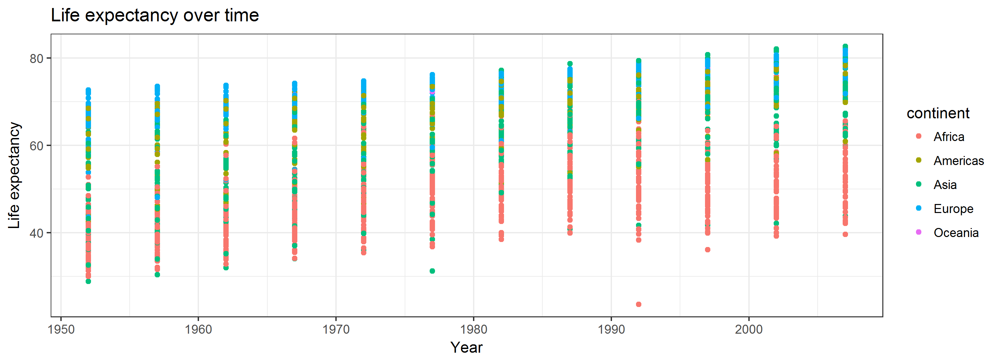
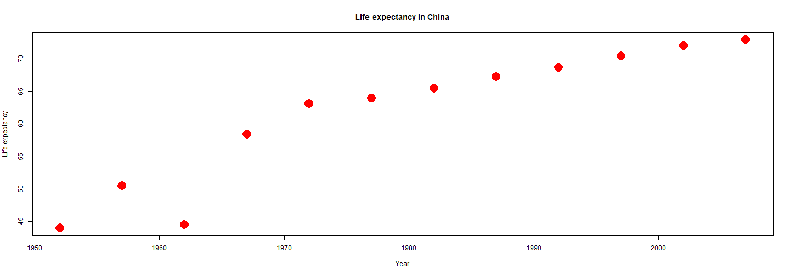
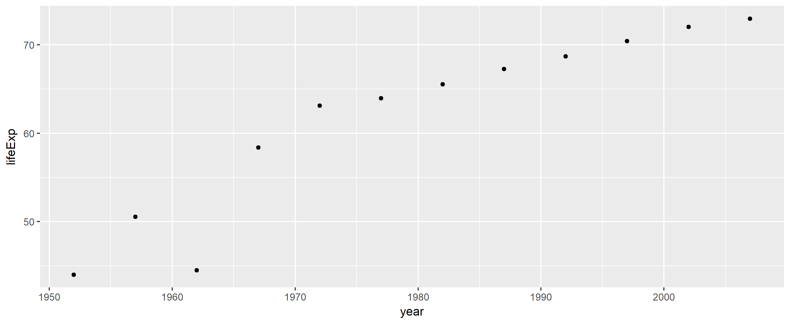
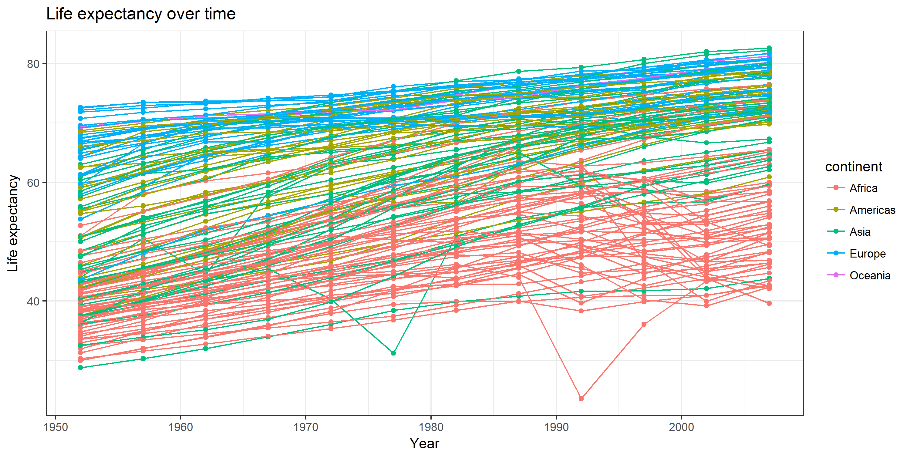
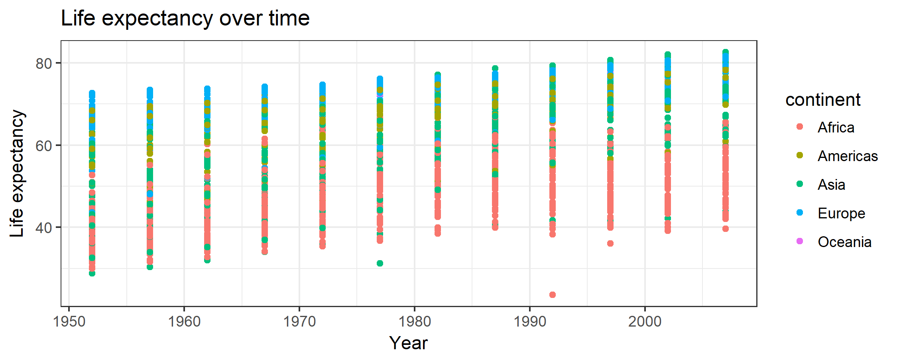
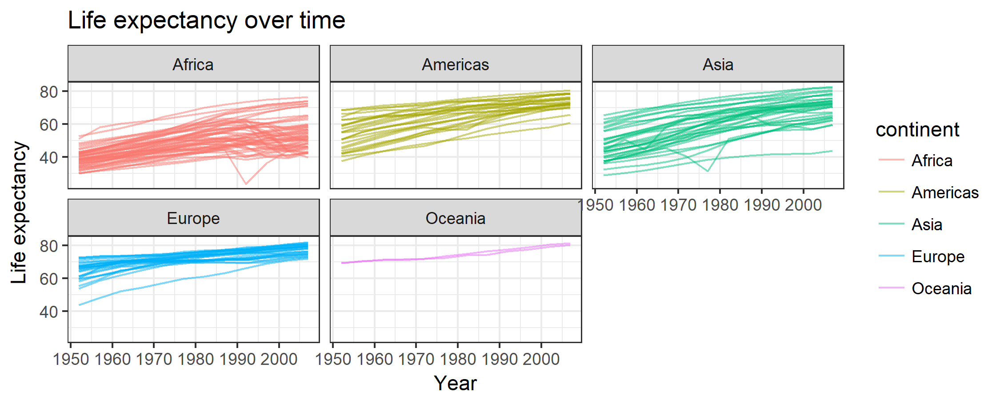
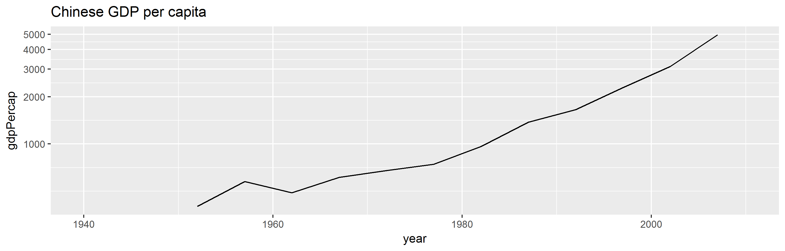
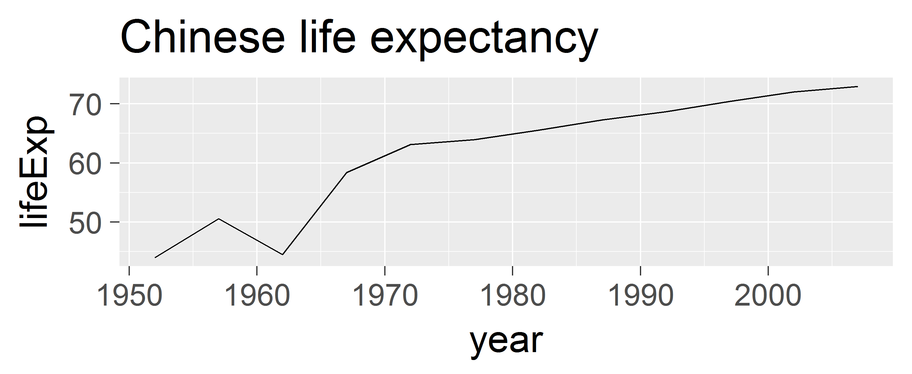
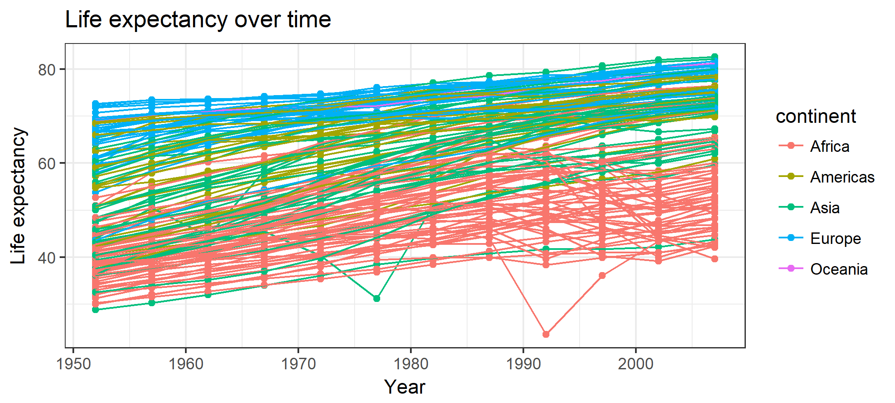

CSSS508, Week2: ggplot2
========================================================
author: Charles Lanfear
date: April 5, 2017
width: 1100
height: 750
transition: rotate

Gapminder data
========================================================


We'll be working with data from Hans Rosling's [Gapminder](http://www.gapminder.org) project.
An excerpt of these data can be accessed through an R package called `gapminder`, cleaned and assembled by Jenny Bryan at UBC.

In the console: `install.packages("gapminder")`

Load the package and data:

```r
library(gapminder)
```

Check Out gapminder
========================================================

The data frame we will work with is called `gapminder`, available once you have loaded the package. Let's see its structure:


```r
str(gapminder)
```

```
Classes 'tbl_df', 'tbl' and 'data.frame':	1704 obs. of  6 variables:
 $ country  : Factor w/ 142 levels "Afghanistan",..: 1 1 1 1 1 1 1 1 1 1 ...
 $ continent: Factor w/ 5 levels "Africa","Americas",..: 3 3 3 3 3 3 3 3 3 3 ...
 $ year     : int  1952 1957 1962 1967 1972 1977 1982 1987 1992 1997 ...
 $ lifeExp  : num  28.8 30.3 32 34 36.1 ...
 $ pop      : int  8425333 9240934 10267083 11537966 13079460 14880372 12881816 13867957 16317921 22227415 ...
 $ gdpPercap: num  779 821 853 836 740 ...
```


What's Interesting Here?
========================================================
incremental: true

* **Factor** variables `country` and `continent`: categorical data with an underlying numeric representation
* Many observations: $n=1704$ rows
* A nested/hierarchical structure: `year` in `country` in `continent`


Subsetting Data
========================================================
type: section


Installing Tidyverse
========================================================
incremental: true

We'll want to be able to slice up this data frame into subsets (e.g. just the rows for Afghanistan, just the rows for 1997). We will use a package called `dplyr` to do this neatly. `dplyr` is part of the [tidyverse](http://tidyverse.org/) family of R packages that are the focus of this course.

In the console: `install.packages("tidyverse")`

This will install a large number of R packages we will use throughout the term, including `dplyr`. 
`dplyr` is a very useful and powerful package that we will talk more about soon, but today we're just going to use it for "filtering" data.


Loading `dplyr`
========================================================


```r
library(dplyr)
```

```

Attaching package: 'dplyr'
```

```
The following objects are masked from 'package:stats':

    filter, lag
```

```
The following objects are masked from 'package:base':

    intersect, setdiff, setequal, union
```


Wait, was that an error?
========================================================
incremental: true

When you load packages in R that have functions sharing the same name as functions you already have, the more recently loaded package trumps the previous ones ("masks").

This **message** is just letting you know that. To avoid this in your R Markdown file, add `message=FALSE` to your chunk options when loading packages.

Sometimes you may get a **warning message**, often if you aren't running the latest version of R:
```
Warning message:
package `gapminder' was built under R version 3.2.3 
```
Chunk option `warning=FALSE` will hide this.

`magrittr` and Pipes
========================================================

`dplyr` allows us to use `magrittr` operators to "pipe"" data between functions. So instead of nesting functions like this:


```r
log(mean(gapminder$pop))
```

```
[1] 17.20333
```

We can pipe them like this:


```r
gapminder$pop %>% mean() %>% log()
```

```
[1] 17.20333
```

In essence, pipes read "left to right" while nested functions read "inside to out."
This may be confusing... we'll cover it more later!


Filtering Data Frames
========================================================


```r
gapminder %>% filter(country == "Oman")
```

```
# A tibble: 12 × 6
   country continent  year lifeExp     pop gdpPercap
    <fctr>    <fctr> <int>   <dbl>   <int>     <dbl>
1     Oman      Asia  1952  37.578  507833  1828.230
2     Oman      Asia  1957  40.080  561977  2242.747
3     Oman      Asia  1962  43.165  628164  2924.638
4     Oman      Asia  1967  46.988  714775  4720.943
5     Oman      Asia  1972  52.143  829050 10618.039
6     Oman      Asia  1977  57.367 1004533 11848.344
7     Oman      Asia  1982  62.728 1301048 12954.791
8     Oman      Asia  1987  67.734 1593882 18115.223
9     Oman      Asia  1992  71.197 1915208 18616.707
10    Oman      Asia  1997  72.499 2283635 19702.056
11    Oman      Asia  2002  74.193 2713462 19774.837
12    Oman      Asia  2007  75.640 3204897 22316.193
```

Logical Operators
========================================================
incremental: true

We used `==` for testing "equals": `country == "Oman"`. There are many other [logical operators](http://www.statmethods.net/management/operators.html):

* `!=`: not equal to
* `>`, `>=`, `<`, `<=`: less than, less than or equal to, etc.
* `%in%`: used with checking equal to one of several values

Or we can combine multiple logical conditions:

* `&`: both conditions need to hold (AND)
* `|`: at least one condition needs to hold (OR)
* `!`: negates a logical condition (`TRUE` -> `FALSE`, `FALSE` -> `TRUE`)


Multiple Conditions Example
========================================================
incremental: true

Let's say we want observations from Oman after 1980 and through 2000.


```r
gapminder %>%
    filter( (country == "Oman") &
                (year > 1980) & (year <= 2000) )
```

```
# A tibble: 4 × 6
  country continent  year lifeExp     pop gdpPercap
   <fctr>    <fctr> <int>   <dbl>   <int>     <dbl>
1    Oman      Asia  1982  62.728 1301048  12954.79
2    Oman      Asia  1987  67.734 1593882  18115.22
3    Oman      Asia  1992  71.197 1915208  18616.71
4    Oman      Asia  1997  72.499 2283635  19702.06
```


Saving a Subset
========================================================

If we think a particular subset will be used repeatedly, we can save it and give it a name like any other object:


```r
China <- gapminder %>% filter(country == "China")
head(China, 4)
```

```
# A tibble: 4 × 6
  country continent  year  lifeExp       pop gdpPercap
   <fctr>    <fctr> <int>    <dbl>     <int>     <dbl>
1   China      Asia  1952 44.00000 556263527  400.4486
2   China      Asia  1957 50.54896 637408000  575.9870
3   China      Asia  1962 44.50136 665770000  487.6740
4   China      Asia  1967 58.38112 754550000  612.7057
```


ggplot2
========================================================
type: section


Base Plots from Last Week
========================================================


```r
plot(lifeExp ~ year, data = China, xlab = "Year", ylab = "Life expectancy", main = "Life expectancy in China", col = "red", cex = 3, pch = 16)
```


ggplot2
========================================================

An alternative way of plotting many prefer (myself included) -- [though this is not without debate](http://simplystatistics.org/2016/02/11/why-i-dont-use-ggplot2/) -- uses the `ggplot2` package in R, which is part
of the `tidyverse`.


```r
library(ggplot2)
```

The core idea underlying this package is the **grammar of graphics**: we can break up elements of a plot into pieces and combine them.


Chinese Life Expectancy in ggplot
========================================================


```r
ggplot(data = China, aes(x = year, y = lifeExp)) +
    geom_point()
```


Axis labels, points, no gray background
========================================================


```r
ggplot(data = China, aes(x = year, y = lifeExp)) +
    geom_point(color = "red", size = 5) +
    xlab("Year") + ylab("Life expectancy") +
    ggtitle("Life expectancy in China") +
    theme_bw()
```


Color observations by some attribute
========================================================


```r
ggplot(data = gapminder, aes(x = year, y = lifeExp, color = continent)) +
    geom_point() +
    xlab("Year") + ylab("Life expectancy") +
    ggtitle("Life expectancy over time") +
    theme_bw()
```



Segment observations by some attribute
========================================================


```r
ggplot(data = gapminder, aes(x = year, y = lifeExp, group = country, color = continent)) +
    geom_line(alpha = 0.5) +
    facet_wrap( ~ continent) +
    xlab("Year") + ylab("Life expectancy") +
    ggtitle("Life expectancy over time") +
    theme_bw()
```



Layers
========================================================

**Layers** are the components of the graph, such as:

* `ggplot()`: initializes `ggplot2` object, specifies input data
* `geom_point()`: layer of scatterplot points
* `geom_line()`: layer of lines
* `ggtitle()`, `xlab()`, `ylab()`: layer of labels
* `facet_wrap()`: layer creating separate panels stratified by some factor wrapping around
* `facet_grid()`: same idea, but can split by two variables along rows and columns (e.g. `facet_grid(gender ~ age_group)`)
* `theme_bw()`: replace default gray background with black-and-white

Layers are separated by a `+` sign. For clarity, I put each layer on a new line.

Aesthetics
========================================================

**Aesthetics** control the appearance of the layers:

* `x`, `y`: $x$- and $y$-values to use
* `color`: set color of elements based on some data value
* `group`: describe which points are conceptually grouped together for the plot (often used with lines)
* `size`: set size of points/lines based on some data value


Aesthetics: Setting vs. mapping
========================================================
incremental: true

Layers take arguments to control their appearance, such as point/line colors or transparency (`alpha` between 0 and 1).

* Arguments like `color`, `size`, `linetype`, `shape`, `fill`, and `alpha` can be used directly on the layers (**setting aesthetics**), e.g. `geom_point(color = "red")`. See the [`ggplot2` documentation](http://docs.ggplot2.org/current/vignettes/ggplot2-specs.html) for options. These *don't depend on the data*.

* Arguments inside `aes()` (**mapping aesthetics**) will *depend on the data*, e.g. `geom_point(aes(color = continent))`.

* `aes()` in the `ggplot()` layer gives overall aesthetics to use in other layers, but can be changed on individual layers (including switching `x` or `y` to different variables)

(Pedantic, but searching for help will be easier for you.)


Storing Plots
========================================================

We can assign a `ggplot` object to a name:


```r
lifeExp_by_year <- ggplot(data = gapminder,
       aes(x = year, y = lifeExp, color = continent)) +
    geom_point() +
    xlab("Year") +
    ylab("Life expectancy") +
    ggtitle("Life expectancy over time") +
    theme_bw()
```

The graph won't be displayed when you do this. You can show the graph using a single line of code with just the object name, or take the object and add more layers.


Showing a stored graph
========================================================


```r
lifeExp_by_year
```




Adding a Layer: Lines connecting each country
========================================================


```r
lifeExp_by_year +
    geom_line(aes(group = country))
```




Lab Break!
========================================================

Start experimenting with making some graphs in `ggplot2` of the Gapminder data. You can look at a subset of the data using `filter` to limit rows, plot different $x$ and $y$ variables, facet by a factor, etc.

Some other options:
* `geom_histogram()`, `geom_density()`, `geom_boxplot()` (see the [Cookbook for R site](http://www.cookbook-r.com/Graphs/Plotting_distributions_%28ggplot2%29/) for a reference)
* `geom_smooth()` for adding loess or regression lines (see the [`ggplot2` documentation](http://docs.ggplot2.org/current/geom_smooth.html))
* Install [Jeff Arnold's `ggthemes` package](https://github.com/jrnold/ggthemes), load it, and try `theme_economist()`, `theme_stata()`, `theme_excel()` instead of no theme or `theme_bw()`


Common Scatterplot Problem: Overplotting
========================================================


```r
ggplot(data = gapminder, aes(x = continent, y = year, color = continent)) +
    geom_point()
```




Fixing Overplotting with Jitter
========================================================


```r
ggplot(data = gapminder, aes(x = continent, y = year, color = continent)) +
    geom_point(position = position_jitter(width = 0.5, height = 2))
```




Changing the axes
========================================================

We can modify the axes in a variety of ways, such as:

* Change the $x$ or $y$ range using `xlim()` or `ylim()` layers
* Change to a logarithmic or square-root scale on either axis: `scale_x_log10()`, `scale_y_sqrt()`
* Change where the major/minor breaks are: `scale_x_continuous(breaks =, minor_breaks = )`


Axis changes
========================================================


```r
ggplot(data = China, aes(x = year, y = gdpPercap)) +
    geom_line() +
    scale_y_log10(breaks = c(1000, 2000, 3000, 4000, 5000)) +
    xlim(1940, 2010) +
    ggtitle("Chinese GDP per capita")
```




Fonts Too Small?
========================================================


```r
ggplot(data = China, aes(x = year, y = lifeExp)) +
    geom_line() +
    ggtitle("Chinese life expectancy") +
    theme_gray(base_size = 30)
```




Text and Tick Adjustments
========================================================

Text size, labels, tick marks, etc. can be messed with more precisely using arguments to the `theme()` layer. Note: `theme()` is a different layer than `theme_gray()` or `theme_bw()`, which you might also be using in a previous layer. See the [`ggplot2` documentation](http://docs.ggplot2.org/current/theme.html) for details.

Examples:

* `plot.title = element_text(size = rel(2), hjust = 0)` makes the title twice as big as usual and left-aligns it
* `axis.text.x = element_text(angle = 45)` rotates $x$ axis labels
* `axis.text = element_text(colour = "blue")` makes the $x$ and $y$ axis labels blue
* `axis.ticks.length = unit(.5, "cm")` makes the axis ticks longer


Color, Shape, etc. Scales
========================================================

**Scales** control how the mapped aesthetics appear. You can modify these with a `scale_[aesthetic]_[option]()` layer where `[aesthetic]` is `color`, `shape`, `linetype`, `alpha`, `size`, `fill`, etc. and `[option]` is something like `manual`, `continuous` or `discrete` (depending on nature of the variable).

Examples:
* `scale_linetype_manual()`: manually specify the linetype for each different value
* `scale_alpha_continuous()`: varies transparency over a continuous range
* `scale_color_brewer(palette = "Spectral")`: uses a palette from <http://colorbrewer2.org> (great site for picking nice plot colors!)

When confused... Google or StackOverflow it!


Legend Name and Manual Color Scales
========================================================


```r
lifeExp_by_year +
    scale_color_manual(name = "Which\ncontinent\nare we\nlooking at?", values = c("Africa" = "seagreen", "Americas" = "turquoise1", "Asia" = "royalblue", "Europe" = "violetred1", "Oceania" = "yellow"))
```




Fussy Manual Legend Example Code
========================================================


```r
ggplot(data = gapminder, aes(x = year, y = lifeExp, group = country)) +
    geom_line(alpha = 0.5, aes(color = "Country", size = "Country")) +
    geom_line(stat = "smooth", method = "loess", aes(group = continent, color = "Continent", size = "Continent"), alpha = 0.5) +
    facet_wrap(~ continent, nrow = 2) +
    scale_color_manual(name = "Unit", values = c("Country" = "black", "Continent" = "dodgerblue1")) +
    scale_size_manual(name = "Unit", values = c("Country" = 1, "Continent" = 3)) +
    theme_minimal(base_size = 16) + 
    theme(legend.position=c(0.75, 0.2))
```

Fussy Manual Legend Example Result!
========================================================


Observation: one could use `filter` to identify the countries with dips in life expectancy and investigate.


More on Customizing Legends
========================================================

You can move the legends around, flip their orientation, remove them altogether, etc. The [Cookbook for R website](http://www.cookbook-r.com/Graphs/Legends_%28ggplot2%29) is my go-to for burning questions such as how to change the legend labels.


Saving ggplots
========================================================

When you knit an R Markdown file, any plots you make are automatically saved in a folder in .png format. If you want to save another copy (perhaps of a different file type for use in a manuscript), use
`ggsave()`:


```r
ggsave("I_saved_a_file.pdf", plot = lifeExp_by_year,
       height = 3, width = 5, units = "in")
```

If you didn't manually set font sizes, these will usually come out at a reasonable size given the dimensions of your output file.

**Bad/non-reproducible way**: choose *Export* on the plot preview or take a screenshot / snip.


Homework
========================================================
type: section

Pick some relationship to look at in the Gapminder data and write up a .Rmd file investigating that question graphically. You might work with a subset of the data (e.g. just Africa). Upload both the .Rmd file and the .html file to Canvas. Include 4 to 8 graphs. All titles, axes, and legends should be labelled clearly (no raw variable names). You must have at least one graph with `facet_wrap` or `facet_grid`. You must include at least one manually specified legend. You can use other `geoms` like histograms, bar charts, add vertical or horizontal lines, etc.

Your document should be pleasant for a peer to look at, with some organization. You must write up your observations in words as well as showing the graphs. Use chunk options `echo` and `results` to limit the code/output you show in the .html.
