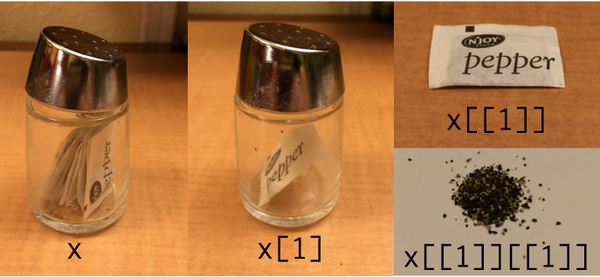

```{r setup, include=FALSE, purl=FALSE}
options(htmltools.dir.version = FALSE, width = 70)
knitr::opts_chunk$set(comment = "##")
library(dplyr)
```

# R Data Types

So far we've been manipulating data frames, making visuals, and summarizing. This got you pretty far!

Now we get more in the weeds of programming.

Today is all about *types of data* in R.

---
# Up Until Now

A data frame is really a **list** of **vectors**, where each vector is a column of the same length (number of rows).

But data frames are not the only object we want to have in R (e.g. linear regression output).

We need to learn about **vectors**, **matrices**, and **lists** to do additional things we can't express with `dplyr` syntax.

---
class: inverse
# Vectors

---
# Making Vectors

In R, we call a set of values of the same type a **vector**. We can create vectors using the `c()` function ("c" for **c**ombine or **c**oncatenate).

```{r}
c(1, 3, 7, -0.5)
```

--

Vectors have one dimension: **length**
```{r}
length(c(1, 3, 7, -0.5))
```

--

All elements of a vector are the same type (e.g. numeric or character)!

If you mix character and numeric data, the resulting vector will be *character*.

---
# Element-wise Vector Math

When doing arithmetic operations on vectors, R handles these *element-wise*:
```{r}
c(1, 2, 3) + c(4, 5, 6) # = c(1+4, 2+5, 3+6)
c(1, 2, 3, 4)^3 # exponentiation with ^
```

Common operations: `*`, `/`, `exp()` = $e^x$, `log()` = $\log_e(x)$

---
# Vector Recycling

If we work with vectors of different lengths, R will **recycle** the shorter one by repeating it to make it match up with the longer one:
```{r}
c(0.5, 3) * c(1, 2, 3, 4) # = c(0.5*1, 3*2, 0.5*3, 3*4)
c(0.5, 3, 0.5, 3) * c(1, 2, 3, 4) # same thing
```

---
# Scalars as Recycling

A special case of recycling involves arithmetic with **scalars** (a single number). These are vectors of length 1 that are recycled to make a longer vector:

```{r}
3 * c(-1, 0, 1, 2) + 1
```

Note R obeys order of operations: Multiplication/division occurs before addition.

You can use parentheses to control order manually!

---
# Warning on Recycling

Recycling doesn't work so well with vectors of incommensurate lengths:

```{r, warning=TRUE}
c(1, 2, 3, 4) + c(0.5, 1.5, 2.5) # = c(1+0.5, 2+1.5, 3+2.5, 4+0.5)
```

Try not to let R's recycling behavior catch you by surprise!

---
# Vector-Wise Math

Some functions operate on an entire vector and return *one number* rather than working element-wise:

```{r}
sum(c(1, 2, 3, 4))
max(c(1, 2, 3, 4))
```

Some others: `min()`, `mean()`, `median()`, `sd()`, `var()`

You've seen these used with `dplyr::summarize()`.

---
# Example: Standardizing Data

Let's say we had some test scores and we wanted to put these on a standardized scale: 

$$z_i = \frac{x_i - \text{mean}(x)}{\text{SD}(x)}$$

--

```{r}
x <- c(97, 68, 75, 77, 69, 81, 80, 92, 50, 34, 66, 83, 62)
z <- (x - mean(x)) / sd(x)
round(z, 2)
```

The `scale()` function performs the above operation!

---
# Types of Vectors

`class()`,  `typeof`, and `str()` will tell you what kind of vector you have. There are a few common types of vectors:

--

* **numeric**: `c(1, 10*3, 4, -3.14)` <sup>1</sup>
.footnote[[1] R is perfectly happy with you including a calculation--or any other valid object--as an element!]

--

    + **integer**: `0:10`

--

* **character**: `c("red", "blue", "yellow", "blue")`

--

* **factor**: `factor(c("red", "blue", "yellow", "blue"))`

--

* **logical**: `c(FALSE, TRUE, TRUE, FALSE)`

---
# Generating Numeric Vectors

Numeric vectors contain only numbers, with any number of decimal places.

There are shortcuts for generating common kinds of vectors:
```{r}
seq(-3, 6, by = 1.75) # Sequence from -3 to 6, increments of 1.75
rep(c(-1, 0, 1), times = 3) # Repeat c(-1,0,1) 3 times
rep(c(-1, 0, 1), each = 3) # Repeat each element 3 times
```

---
# Generating Integer Vectors

Integer vectors are a special case of numeric vectors where all the values are whole numbers.

--

We can produce them using the `:` shortcut:

```{r}
n <- 12
1:n
n:4
```

--

You can also specify a single integer using a whole number followed by `L`:

```{r}
class(9L)
```

---
# Character Vectors

Character vectors store data as text and typically come up when dealing names, addresses, and IDs:

```{r}
first_names <- c("Andre", "Beth", "Carly", "Dan")
class(first_names)
```

Note you can store numbers as character data as well, but you cannot perform math on them unless you convert them to numeric.

---
# Factor Vectors

Factors are categorical data that encode a (modest) number of **levels**, like for sex, experimental group, or geographic region: 

```{r}
sex <- factor(c("M", "F", "F", "M"))
sex
```

--

Character data usually can't go directly into a statistical model<sup>1</sup>, but factor data can. It has an *underlying numeric representation*:

```{r}
as.numeric(sex)
```

.footnote[[1] Most R models will automatically convert character data to factors. The default reference is chosen alphabetically.]

---
# Logical Vectors

Logical vectors take only TRUE and FALSE values, and are typically the product of logical tests (e.g. `x==5`). We can make logical vectors by defining binary conditions to check for. For example, we can look at which of the first names has at least 4 letters:

```{r}
name_lengths <- nchar(first_names) # number of characters
name_lengths
name_lengths >= 4
```

---
# Logical Vectors as Numeric

You can do math with logical vectors, because `TRUE`=1 and `FALSE`=0:

```{r}
name_lengths >= 4
mean(name_lengths >= 4)
```

What did this last line do?

--

It told us the *proportion* of name lengths greater than or equal to four!

---
# Combining Logical Conditions

Suppose we are interested in which names have an even number of letters:

```{r}
even_length <- (name_lengths %% 2 == 0)
# %% is the modulo operator: gives remainder when dividing
even_length
```

--

or whose second letter is "a":
```{r}
second_letter_a <- (substr(first_names, start=2, stop=2) == "a")
# substr: substring (portion) of a char vector
second_letter_a
```

---
# Logical Operators

* `&` is **AND** (both conditions must be `TRUE` to be `TRUE`):

```{r}
even_length & second_letter_a
```

--

* `|` is **OR** (at least one condition must be `TRUE` to be `TRUE`):

```{r}
even_length | second_letter_a
```

--

* `!` is **NOT** (switches `TRUE` and `FALSE`):

```{r}
!(even_length | second_letter_a)
```

---
# Subsetting Vectors

We can **subset** a vector in a number of ways:

* Passing a single index or vector of entries to **keep**:

```{r}
first_names[c(1, 4)]

```

--

* Passing a single index or vector of entries to **drop**:

```{r}
first_names[-c(1, 4)]
```

---
# Subsetting Vectors

* Passing a logical vector (`TRUE`=keep, `FALSE`=drop):

```{r}
first_names[even_length | second_letter_a]
first_names[sex != "F"] # != is "not equal to"
```

---
# Some Logical/Subsetting Functions

`%in%` lets you avoid typing a lot of logical ORs (`|`):

```{r}
first_names %in% c("Andre", "Carly", "Dan")
```

--

`which()` gives the *indices* of `TRUE`s in a logical vector:

```{r}
which(first_names %in% c("Andre", "Carly", "Dan"))
```

---
# Missing Values

Missing values are coded as `NA` entries without quotes:

```{r}
vector_w_missing <- c(1, 2, NA, 4, 5, 6, NA)
```

--

Even one `NA` "poisons the well": You'll get `NA` out of your calculations unless you remove them manually or with the extra argument `na.rm = TRUE` (in some functions):

```{r}
mean(vector_w_missing)
mean(vector_w_missing, na.rm=TRUE)
```

---
# Finding Missing Values

**WARNING:** You can't test for missing values by seeing if they "equal" (`==`) `NA`:

```{r}
vector_w_missing == NA
```

--

Instead, use the `is.na()` function:

```{r}
is.na(vector_w_missing)
mean(vector_w_missing[!is.na(vector_w_missing)])
```

This is the same as using `mean(na.rm=T)`

---
# `NA` and `%in%`

When testing logical conditions, `NA` will produce an `NA` rather than `TRUE` or `FALSE`:

```{r}
vector_w_missing == 5
```

--

It is noteworthy, however, that `%in%` will handle NAs:

```{r}
vector_w_missing %in% 5
vector_w_missing %in% NA
```

It is still usually best to handle NAs *directly*, however!

---
# `Inf` and `NaN`

Sometimes we might get positive or negative infinity (`Inf`, `-Inf`) or `NaN` (**N**ot **A** **N**umber) from our calculations:

```{r}
c(-2, -1, 0, 1, 2) / 0
```

--

You can check for these using functions like `is.finite()` or `is.nan()`.<sup>1</sup>

```{r}
is.finite(c(-2, -1, 0, 1, 2) / 0)
is.nan(c(-2, -1, 0, 1, 2) / 0)
```

.footnote[[1] Infinity is a number... but isn't finite.]

---
# Previewing Vectors

Like with data frames, we can use `head()` and `tail()` to preview vectors:

```{r}
head(letters) # letters is a built-in vector
head(letters, 10)
tail(letters)
```

---
# Named Vector Entries

We can also index vectors by assigning **names** to the entries.

```{r}
a_vector <- 1:26
names(a_vector) <- LETTERS # capital version of letters #<<
head(a_vector)
a_vector[c("R", "S", "T", "U", "D", "I", "O")]
```

Names are nice for subsetting because they don't depend on your data being in a certain order.

---
class: inverse
# Matrices

---

# Matrices: Two Dimensions

**Matrices** extend vectors to two **dimension**s: **rows** and **columns**. We can construct them directly using `matrix`.

Note the `byrow=` argument which determines whether the data fill the matrix by row or by column.
```{r}
(a_matrix <- matrix(letters[1:6], nrow=2, ncol=3))
(b_matrix <- matrix(letters[1:6], nrow=2, ncol=3, byrow=TRUE))
```

---
# Binding Vectors

We can also make matrices by *binding* vectors together with `rbind()` (**r**ow **bind**) and `cbind()` (**c**olumn **bind**).

```{r}
(c_matrix <- cbind(c(1, 2), c(3, 4), c(5, 6)))
(d_matrix <- rbind(c(1, 2, 3), c(4, 5, 6)))
```

---
# Subsetting Matrices

We subset matrices using the same methods as with vectors, except we index them with `[rows, columns]`:

```{r}
a_matrix[1, 2] # row 1, column 2
a_matrix[1, c(2, 3)] # row 1, columns 2 and 3
```

--

We can obtain the dimensions of a matrix using `dim()`.

```{r}
dim(a_matrix)
```

Note that using `length()` on a matrix will not give you the number of rows or columns but rather the number of elements!

---
# Matrices Becoming Vectors

If a matrix ends up having just one row or column after subsetting, by default R will make it into a vector. You can prevent this behavior using `drop=FALSE`.

```{r}
a_matrix[, 1] # all rows, column 1, becomes a vector
a_matrix[, 1, drop=FALSE] # all rows, column 1, stays a matrix
```

---
# Matrix Data Type Warning

Matrices can be numeric, integer, factor, character, or logical, just like vectors. Also like vectors, *all elements must be the same data type*.

```{r}
(bad_matrix <- cbind(1:2, LETTERS[c(6,1)]))
typeof(bad_matrix)
```

In this case, everything was converted to character so as not to lose information.

---
# Matrix Dimension Names

We can access dimension names or name them ourselves:

```{r}
rownames(bad_matrix) <- c("Wedge", "Biggs")
colnames(bad_matrix) <- c("Pilot grade", "Mustache grade")
bad_matrix
bad_matrix["Biggs", , drop=FALSE]
```

---
# Matrix Arithmetic

Matrices of the same dimensions can have math performed entry-wise with the usual arithmetic operators:

```{r}
cbind(c_matrix, d_matrix) # look at side by side
3 * c_matrix / d_matrix
```

---
# Matrix Transposition and Multiplication

To do matrix transpositions, use `t()`.

```{r}
(e_matrix <- t(c_matrix))
```

--

To do actual matrix multiplication (not entry-wise), use `%*%`.

```{r}
(f_matrix <- d_matrix %*% e_matrix)
```

---
# Matrix Inversion

To invert an invertible square matrix, use `solve()`.

```{r}
(g_matrix <- solve(f_matrix))
f_matrix %*% g_matrix
```

--

Note the [floating point imprecision](https://floating-point-gui.de/basic/): The off-diagonals are *very close to zero* rather than actually zero!

--

Be careful testing for equality of numbers after calculations--imprecision produces strange results!

---
# Diagonal Matrices

To extract the diagonal of a matrix or make a diagonal matrix (usually the identity matrix), use `diag()`.

```{r}
diag(2)
diag(g_matrix)
```

---
class: inverse
# Lists

---
# What are Lists?

**Lists** are an object that can store multiple types of data.

.small[
```{r}
(my_list <- list("first_thing"  = 1:5,
                 "second_thing" = matrix(8:11, nrow = 2),
                 "third_thing"  = lm(dist ~ speed, data = cars)))
```
]

---
# Accessing List Elements

You can access a list element by its name or number in `[[ ]]`, or a `$` followed by its name:

```{r}
my_list[["first_thing"]]
my_list$first_thing
my_list[[1]]
```

---
# Why Two Brackets `[[` `]]`?

If you use single brackets to access list elements, you get a **list** back. Double brackets get *the actual element*—as whatever data type it is stored as—in that location in the list.

```{r}
str(my_list[1])
str(my_list[[1]])
```

--

Note that you can only select a single element at a time using `[[ ]]`, because this would have to return *multiple objects*!

An R function can only return one object at a time—otherwise operations like assignment would be impossible.

---
# `[x]` versus `[[x]]`

.image-100[

]

`[x]` chooses elements but keeps the list, while `[[x]]` extracts the element from the list.

.footnote[Source: Hadley Wickham]

---
# Subsetted Lists Can Be of Length > 1

You can use vector-style subsetting to get a sublist of multiple elements:
```{r}
length(my_list[c(1, 2)])
str(my_list[c(1, 2)])
```

---
# Regression Output is a List!

.small[
```{r, R.options=list(max.print=2)}
str(my_list[[3]], list.len=7) # Displaying on first 7 elements
```
]

---
# `names()` and List Elements

You can use `names()` to get a vector of list element names:

```{r}
names(my_list[[3]])
```

---
# Data Frames are Lists!

data frames are lists of equal-length vectors.

```{r}
str(cars)
length(cars)
length(cars$dist) # should be same as nrow(cars)
```

---
# You Can Treat Data Frames like a Matrix

```{r}
cars[1, ]
cars[1:5, "speed", drop = FALSE]
```

---
# Base R vs. `dplyr`

Two ways of calculating the same thing: which do you like better?

Classic R:
```{r, eval=FALSE}
mean(swiss[swiss$Education > mean(swiss$Education), "Education"])
```

--

`dplyr`:
```{r, eval=FALSE}
library(dplyr)
swiss %>%
    filter(Education > mean(Education)) %>%
    summarize(mean = mean(Education))
```

---
# Tibbles

.smallish[
`tidyverse` functions often use a type of data frame called a *tibble*. You can create them manually with `tibble()` as with `data.frame()` or convert existing data frames into tibbles using `as_tibble()`. Tibbles display better than data frames: they truncate output and include column types. They also do not convert strings to factors!

Because the `tidyverse` has abolished row names, `tibbles()` have none. You can convert row names to columns using `tibble::rownames_to_column()` or with the `rownames=` argument in `as_tibble()`.
]

.small[
.pull-left[
```{r}
swiss %>% select(2:3) %>% head()
```
]
.pull-right[
```{r}
swiss %>% select(2:3) %>% 
  as_tibble(rownames="Name") %>% head()
```
]
]


---
class: inverse
# An Aside

## for People with Statistics Training

---
# Getting Fitted Regression Coefficients

Recall that `my_list[[3]]` is output from a regression model.

```{r}
my_list[[3]][["coefficients"]]
(speed_beta <- my_list[[3]][["coefficients"]]["speed"])
```

---
# Regression Summaries

`summary(lm_object)` is also a list with more information, which has the side effect of printing some output to the console:

.small[
```{r}
summary(my_list[[3]]) # this prints output
```
]

---
# Getting Standard Errors

.smallish[
```{r}
summary(my_list[[3]])[["coefficients"]] # a matrix
(speed_SE <- summary(my_list[[3]])[["coefficients"]]["speed", "Std. Error"])
```
]

---
# Example: 95% confidence interval

```{r}
speed_CI <- speed_beta + c(-qnorm(0.975), qnorm(0.975)) * speed_SE #<<
names(speed_CI) <- c("lower", "upper")
```
.footnote[ `qnorm(0.975)` is `r round(qnorm(0.975),2)`]

--

Now you can include these values in a Markdown document:

```{r, eval=FALSE}
A 1 mph increase in speed is associated with a `r 
round(speed_beta, 1)` ft increase in stopping distance 
(95% CI: (`r round(speed_CI["lower"],1)`,
          `r round(speed_CI["upper"],1)`)).
```

A 1 mph increase in speed is associated with a `r round(speed_beta, 1)` ft increase in stopping distance (95% CI: (`r round(speed_CI["lower"],1)`, `r round(speed_CI["upper"],1)`)).

---
class: inverse
# Practice and Homework

---
# Suggested Practice: `swirl`

You can do interactive R tutorials in `swirl` that cover these structure basics. To set up `swirl`:

1. `install.packages("swirl")`
2. `library(swirl)`
3. `swirl()`
4. Choose `R Programming`, pick a tutorial, and follow directions
5. To get out of `swirl`, type `bye()` in the middle of a lesson, or `0` in the menus

At this point, tutorials 1-8 are appropriate.

---
class: inverse
# Homework: Two Choices

### Data Structure Practice (Less Advanced):
Fill in a template R Markdown file that walks you through 
creating, accessing, and manipulating R data structures. Enter values in 
the R Markdown document and knit it to check your answers. *Knit after entering each answer*. 
If you get an error, check to see if undoing your last edit solves the problem; coding an assignment to handle
all possible mistakes is really hard! This assignment is also long, so *start early*.

### Manual Linear Regression (More Advanced)
Fill in a template R markdown file that walks you through (1) doing linear regression
manually and (2) comparing it to the built-in `lm()` function. Includes simulating data and
creating and modifying data structures. *Knit after entering each answer*. This
assignment does not check answers as you go. This is also long, so *start early*!