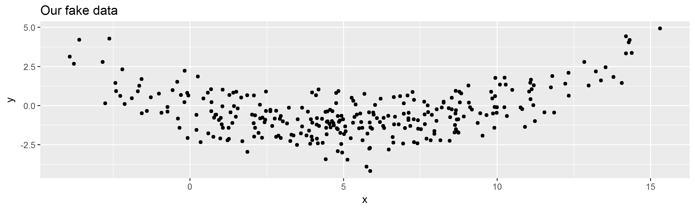
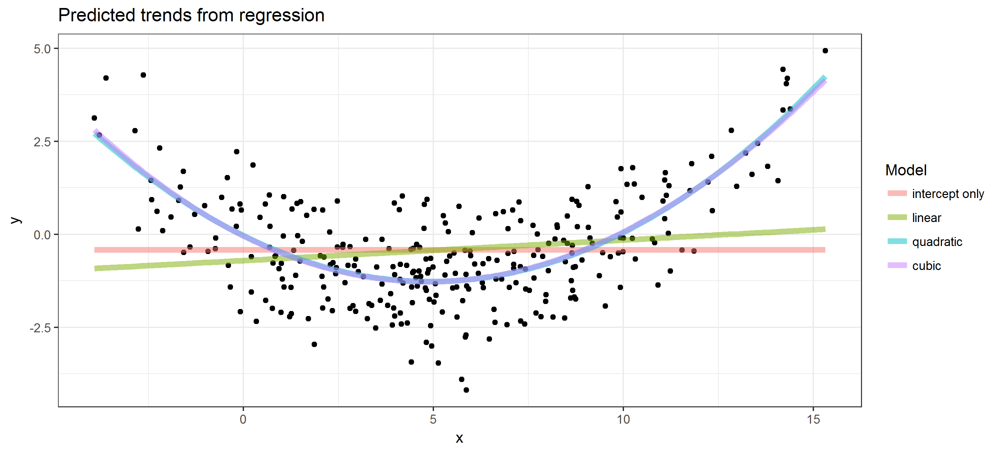

CSSS 508, Week 6: Loops
====================================================================================
author: Charles Lanfear
date: November 1, 2017
transition: linear
width: 1440
height: 960


Programming with Goofus and Gallant
====================================================================================


Goofus Approach to Repetitive Data Analysis
====================================================================================
incremental: true

Goofus finds the means of variables in the `swiss` data by typing in a line of code for each column:


```r
mean1 <- mean(swiss$Fertility)
mean2 <- mean(swiss$Agriculture)
mean3 <- mean(swissExamination)
mean4 <- mean(swiss$Fertility)
mean5 <- mean(swiss$Catholic)
mean5 <- mean(swiss$Infant.Mortality)
c(mean1, mean2 mean3, mean4, mean5, man6)
```

Can you spot the problems?

How angry would Goofus be if the `swiss` data had 200 columns instead of 6?


Gallant
====================================================================================
incremental: true


You will learn more Gallant solutions today (and better ones next week):

```r
swiss_means <- setNames(numeric(ncol(swiss)), colnames(swiss))
for(i in seq_along(swiss)) {
    swiss_means[i] <- mean(swiss[[i]])
}
swiss_means
```

```
       Fertility      Agriculture      Examination        Education 
            70.1             50.7             16.5             11.0 
        Catholic Infant.Mortality 
            41.1             19.9 
```


Don't Repeat Yourself (DRY)!
====================================================================================

The **DRY** idea: Computers are much better at doing the same thing over and over again than we are. Writing code to repeat tasks for us prevents Goofus goofs.


Programming and Looping Agenda 
====================================================================================

**Today:**

* `for()` and `while()` loop programming (general methods)
* Vectorization to *avoid* loops

**Next week:**

* Writing your own functions!
* Looping methods based on functions


What is a Loop?
====================================================================================

I'll be bad and cite Wikipedia:

>A loop is a sequence of statements which is specified once but which may be carried out several times in succession. The code "inside" the loop is obeyed a specified number of times, or once for each of a collection of items, or until some condition is met, or indefinitely.'' ([Wikipedia](https://en.wikipedia.org/wiki/Control_flow#Loops))


for() Loops
====================================================================================
type: section


The for() Loop
====================================================================================
incremental: true

`for()` loops are the most general kind of *loop*, found in pretty much every programming language.

Conceptually:

* Given a set of values...
* You set a variable equal to the first value and enter the loop...
* In the loop:
    + Do some set of things (maybe depending on current value)...
    + Update to the next value...
* ...and keep going until you run out of values.


for() Loop: Toy example
====================================================================================
incremental: true


```r
for(i in 1:10) {
    # inside for, output won't show up w/o "print"
    print(i^2) 
}
```

```
[1] 1
[1] 4
[1] 9
[1] 16
[1] 25
[1] 36
[1] 49
[1] 64
[1] 81
[1] 100
```


These Do the Same Thing
====================================================================================
incremental: true


```r
for(i in 1:3) {
    print(i^2) 
}
```

```
[1] 1
[1] 4
[1] 9
```

***


```r
i <- 1
print(i^2) 
```

```
[1] 1
```

```r
i <- 2
print(i^2)
```

```
[1] 4
```

```r
i <- 3
print(i^2)
```

```
[1] 9
```


Iteration Conventions
====================================================================================
incremental: true

* We call what happens in the loop for a particular value one **iteration**. 

* Iterating over indices `1:n` is *very* common. `n` might be the length of a vector, the number of rows or columns in a matrix or data frame, or the length of a list. 

* Common notation: `i` is the object that holds the current value inside the loop.
    + If loops are nested, you will often see `j` and `k` used for the inner loops.
    + This notation is similar to indexing in mathematical symbols (e.g $\sum\limits_{i=1}^n$)
    

Iterate Over Character Vectors
====================================================================================
incremental: true

What we iterate over doesn't have to be numbers `1:n`. You can also iterate over a character vector in R:

```r
some_letters <- letters[4:6]
for(i in some_letters) {
    print(i)
}
```

```
[1] "d"
[1] "e"
[1] "f"
```

```r
i # in R, this will exist outside of the loop!
```

```
[1] "f"
```


seq_along() and Building Messages
====================================================================================
incremental: true

When you want to loop over something that isn't numeric but want to use a numeric index of where you are in the loop, `seq_along` is useful:


```r
for(a in seq_along(some_letters)) {
    print(paste0("Letter ", a, ": ", some_letters[a]))
}
```

```
[1] "Letter 1: d"
[1] "Letter 2: e"
[1] "Letter 3: f"
```

```r
a
```

```
[1] 3
```


Pre-Allocation
====================================================================================
incremental: true

Usually in a `for()` loop, you aren't just printing output, but want to store results from calculations in each iteration somewhere.

To do that, figure out what you want to store, and **pre-allocate** an object of the right size as a placeholder (typically with zeroes or missing values as placeholders).

Examples of what to pre-allocate based on what you store:

* Single numeric value per iteration: `numeric(num_of_iters)`
* Single character value per iteration: `character(num_of_iters)`
* Single true/false value per iteration: `logical(num_of_iters)`
* Numeric vector per iteration: `matrix(NA, nrow = num_of_iters, ncol = length_of_vector)`
* Some complicated object per iteration: `vector("list", num_of_iters)`


Pre-Allocation: Numeric example
====================================================================================
incremental: true


```r
# preallocate numeric vector
iters <- 10
output <- numeric(iters)

for(i in 1:iters) {
    output[i] <- (i-1)^2 + (i-2)^2
}
output
```

```
 [1]   1   1   5  13  25  41  61  85 113 145
```


setNames()
====================================================================================
incremental: true

The function `setNames()` can be handy for pre-allocating a named vector:


```r
(names_to_use <- paste0("iter ", letters[1:5]))
```

```
[1] "iter a" "iter b" "iter c" "iter d" "iter e"
```

```r
# without setNames:
a_vector <- numeric(5)
names(a_vector) <- names_to_use

# with setNames: first arg = values, second = names
(a_vector <- setNames(numeric(5), names_to_use))
```

```
iter a iter b iter c iter d iter e 
     0      0      0      0      0 
```


Extended Regression Example
====================================================================================
type: section


The premise
====================================================================================

Suppose we have some data that we want to try fitting several regression models to. We want to store the results of fitting each regression in a list so that we can compare them. To do this consistently, we'll write a loop. That way no matter if we had 2 models or 200 models, we wouldn't make a typo.

After we do this, we'll try something more advanced with loops: **Cross-validating** regressions to get an estimate of their true accuracy in predicting values out-of-sample.


Making up data
====================================================================================
incremental: true

Let's simulate some fake data for this using the `rnorm()` function to generate random values from a normal distribution.


```r
set.seed(98195)
# simulating example data:
n <- 300
x <- rnorm(n, mean = 5, sd = 4)
fake_data <- data.frame(x = x, y = -0.5 * x + 0.05 * x^2 + rnorm(n, sd = 1))
```

Aside: If you followed the scandal in political science two years about a grad student allegedly faking data for a publication in *Science*, [it is believed he used the `rnorm()` function](http://stanford.edu/~dbroock/broockman_kalla_aronow_lg_irregularities.pdf) to add noise to an existing dataset to get his values.


Plot of fake_data
====================================================================================


```r
library(ggplot2)
ggplot(data = fake_data, aes(x = x, y = y)) +
    geom_point() + ggtitle("Our fake data")
```




Candidate Regression Models
====================================================================================
incremental: true

Let's say we want to consider several different regression models to draw trendlines through these data:

* "Intercept only": draw a horizontal line that best fits the `y` values, i.e. $E[y_i | x_i] = \beta_0$
* "Linear model": draw a line that best fits the `y` values as a function of `x`, i.e. $E[y_i | x_i] = \beta_0 + \beta_1 \cdot x_i$
* "Quadratic model": draw a quadratic curve that best summarizes the `y` values as a function of `x`, i.e. $E[y_i | x_i ] = \beta_0 + \beta_1 \cdot x_i + \beta_2 \cdot x_i^2$
* "Cubic model": draw a cubic curve that best summarizes the `y` values as a function of `x`, i.e. $E[y_i | x_i ] = \beta_0 + \beta_1 \cdot x_i + \beta_2 \cdot x_i^2 + \beta_3 \cdot x_i^3$


Preallocating a List for the Regression Models
====================================================================================
incremental: true

Let's make a named character vector for the formulas we'll use in `lm()`:

```r
models <- c("intercept only" = "y ~ 1",
            "linear" = "y ~ x",
            "quadratic" = "y ~ x + I(x^2)",
            "cubic" = "y ~ x + I(x^2) + I(x^3)")
```

Then pre-allocate a list to store the fitted models:

```r
fitted_lms <- vector("list", length(models)) # initialize list
names(fitted_lms) <- names(models) # give entries good names
```

Fitting the Models in a for() Loop
====================================================================================
incremental: true

Next, we'll loop over the `models` vector and fit each one, storing it in the appropriate slot. We can go from a character string describing a model to a formula using the `formula()` function:

```r
for(mod in names(models)) {
    fitted_lms[[mod]] <- lm(formula(models[mod]), data = fake_data)
}
```


Getting Predictions from Fitted Models
====================================================================================

To plot the fitted models, we can first get predicted `y` values from each at the `x` values in our data. 


```r
# initialize data frame to hold predictions
predicted_data <- fake_data
for(mod in names(models)) {
    # make a new column in predicted data for each model's predictions
    predicted_data[[mod]] <- predict(fitted_lms[[mod]],
                                newdata = predicted_data)
}
```


Gathering Predictions
====================================================================================

Use `tidyr::gather` to make the predictions tidy, and set the levels of the `Model` variable.


```r
library(tidyr)
library(dplyr)
tidy_predicted_data <- predicted_data %>%
    gather(Model, Prediction, -x, -y) %>%
    mutate(Model = factor(Model, levels = names(models)))
```

Plotting Predictions
====================================================================================

We'll use `ggplot2` to plot these tidied up predictions. You'll see us use multiple data sets on the same plot: Look at the `geom_line` call.

```r
ggplot(data = fake_data, aes(x = x, y = y)) +
    geom_point() +
    geom_line(data = tidy_predicted_data,
              aes(x = x, y = Prediction, group = Model, color = Model),
              alpha = 0.5, size = 2) +
    ggtitle("Predicted trends from regression") +
    theme_bw()
```

Plotted Predictions
====================================================================================



Which looks best to you?


Cross Validation: What is it?
====================================================================================
incremental: true

**Cross validation** is a widely-used way to estimate how accurately a model makes predictions on unseen data (data not used in fitting the model). The procedure:

* Split your data into $K$ **folds** (disjoint pieces)
* For each fold $i = 1, \ldots, K$:
    + Fit the model to all the data except that in fold $i$
    + Make predictions for the held-out data in fold $i$
* Calculate the mean squared error (or your favorite measure of accuracy comparing predictions to actuals): $\text{MSE} = \frac{1}{n} \sum_{i=1}^n (\text{actual } y_i - \text{predicted } y_i)^2$

A model that fits well will have *low mean squared error*. Models that are either too simple or too complicated will tend to make bad predictions and have high mean squared error.


Pre-Allocating for CV
====================================================================================

Let's split the data into $K=10$ folds. We'll make a new data frame to hold the data and sampled fold numbers that we will add predictions onto later. We'll get the folds by using the `sample()` function without replacement on a vector as long as our data that has the numbers 1 through $K$ repeated:

```r
K <- 10
CV_predictions <- fake_data
CV_predictions$fold <- sample(rep(1:K, length.out = nrow(CV_predictions)),
                              replace = FALSE)
CV_predictions[, names(models)] <- NA
head(CV_predictions, 2)
```

```
      x      y fold intercept only linear quadratic cubic
1  1.41  0.830   10             NA     NA        NA    NA
2 10.76 -0.125    3             NA     NA        NA    NA
```

Double-Looping for CV
====================================================================================

Next, let's loop over models, and within each model, loop over folds to fit the model and make predictions:


```r
for(mod in names(models)) {
    for(k in 1:K) {
        # TRUE/FALSE vector of rows in the fold
        fold_rows <- (CV_predictions$fold == k)
        # fit model to data not in fold
        temp_mod <- lm(formula(models[mod]),
                       data = CV_predictions[!fold_rows, ])
        # predict on data in fold
        CV_predictions[fold_rows, mod] <- predict(temp_mod, newdata = CV_predictions[fold_rows, ])
    }
}
```


Which Did Best?
====================================================================================
incremental: true

Let's write another loop to compute the mean squared error of these CV predictions:


```r
CV_MSE <- setNames(numeric(length(models)), names(models))
for(mod in names(models)) {
    pred_sq_error <- (CV_predictions$y - CV_predictions[[mod]])^2
    CV_MSE[mod]   <- mean(pred_sq_error)
}
CV_MSE
```

```
intercept only         linear      quadratic          cubic 
          2.18           2.15           1.05           1.06 
```

Based on these results, which model would you choose?


Conditional Flow
====================================================================================
type: section

if() then else()
====================================================================================
incremental: true

You've seen `ifelse()` before for logical checks on a whole vector. For checking whether a *single* logical statement holds and then conditionally executing a set of actions, use `if()` and `else`:


```r
for(i in 1:10) {
    if(i %% 2 == 0) {
        print(paste0("The number ", i, " is even"))
    } else if(i %% 3 == 0) {
        print(paste0("The number ", i, " is divisible by 3"))
    } else {
        print(paste0("The number ", i, " is not divisible by 2 or 3"))
    }
}
```

**Warning!** `else` needs to be on same line as the closing brace `}` of previous `if()`.


if(), else: Example from previous slide
====================================================================================
incremental: true


```
[1] "The number 1 is not divisible by 2 or 3"
[1] "The number 2 is even"
[1] "The number 3 is not even but divisible by 3"
[1] "The number 4 is even"
[1] "The number 5 is not divisible by 2 or 3"
[1] "The number 6 is even"
[1] "The number 7 is not divisible by 2 or 3"
[1] "The number 8 is even"
[1] "The number 9 is not even but divisible by 3"
[1] "The number 10 is even"
```


Handling Special Cases
====================================================================================
incremental: true

Aside from the previous toy example, `if()` statements are useful when you have to handle special cases. For your "homework", you will learn about some very special cases on a journey into...

**data hell!**


Loading Many Data Files with a Loop
====================================================================================
incremental: true

One common use of a loop in R is for loading many individual data files at once---like
an entire directory of Excel files--to combine them into one data set.

We will actually do this *next week*.

Alternatively, you might want to use a loops and `if()` to download and clean files that are all
from different URLs... which might go poorly:

**HOMEWORK**: Read Rebecca Ferrell's [extended writeup on data hell on the course page](https://clanfear.github.io/CSSS508/Lectures/Week6/data_download_demo.html).


while() Loops
====================================================================================
type: section


while()
====================================================================================
incremental: true

A lesser-used looping structure is the `while()` loop. Rather than iterating over a predefined vector, the loop keeps going until some condition is no longer true.


```r
num_heads <- 0; num_flips <- 0
while(num_heads < 4) {
    coin_flip <- rbinom(n=1, size=1, prob=0.5)
    if (coin_flip == 1) { num_heads <- num_heads + 1 }
    num_flips <- num_flips + 1
}
num_flips # follows negative binomial distribution
```

```
[1] 7
```

Vectorization
====================================================================================
type: section

Non-Vectorized Example
====================================================================================
incremental: true

We have a vector of numbers, and we want to add 1 to each element.

```r
my_vector <- rnorm(10000000)
```

A `for()` loop works but is super slow:

```r
for_start <- proc.time() # start the clock
new_vector <- rep(NA, length(my_vector))
for(position in 1:length(my_vector)) {
    new_vector[position] <- my_vector[position] + 1
}
(for_time <- proc.time() - for_start) # time elapsed
```

```
   user  system elapsed 
   0.75    0.03    0.78 
```


Vectorization Wins
====================================================================================
incremental: true

Recognize that we can instead use R's vector addition (with recycling):

```r
vec_start  <- proc.time()
new_vector <- my_vector + 1
(vec_time  <- proc.time() - vec_start)
```

```
   user  system elapsed 
   0.06    0.00    0.06 
```

```r
for_time / vec_time
```

```
   user  system elapsed 
   12.5     Inf    13.0 
```

Vector/matrix arithmetic is implemented using fast, optimized functions that a `for()` loop can't compete with.


Vectorization Examples
====================================================================================
incremental: true

* `rowSums()`, `colSums()`, `rowMeans()`, `colMeans()` give sums or averages over rows or columns of matrices/data frames


```r
(a_matrix <- matrix(1:12, nrow = 3, ncol = 4))
```

```
     [,1] [,2] [,3] [,4]
[1,]    1    4    7   10
[2,]    2    5    8   11
[3,]    3    6    9   12
```

```r
rowSums(a_matrix)
```

```
[1] 22 26 30
```


More Vectorization Examples
====================================================================================
incremental: true

* `cumsum()`, `cumprod()`, `cummin()`, `cummax()` give back a vector with cumulative quantities (e.g. running totals)

```r
cumsum(1:7)
```

```
[1]  1  3  6 10 15 21 28
```

* `pmax()` and `pmin()` take a matrix or set of vectors, output the min or max for each **p**osition (after recycling):

```r
pmax(c(0, 2, 4), c(1, 1, 1), c(2, 2, 2))
```

```
[1] 2 2 4
```


Homework
====================================================================================
type: section

Read Rebecca Ferrell's [data downloading demonstration on the course page](https://clanfear.github.io/CSSS508/Lectures/Week6/data_download_demo.html) (it is shorter than it looks; it is more than half error messages). I hope any future forays into automated data downloading and cleaning are smoother than this one was!

**Reminder: HW 5 assigned last week is due midnight Tuesday 11/7.**
