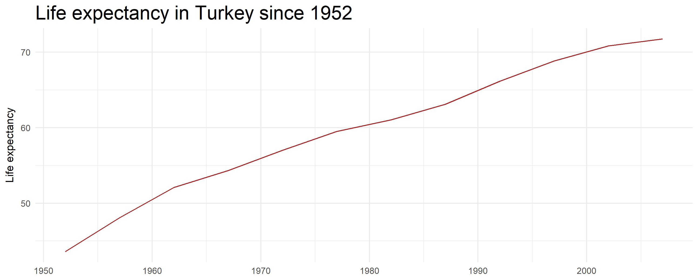
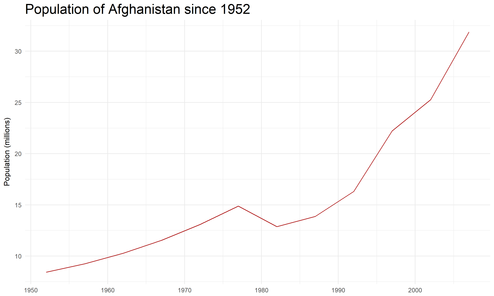

CSSS 508, Week 7: Vectorization and Functions
====================================================================================
author: Charles Lanfear
date: November 8, 2017
transition: linear
width: 1400
height: 960

A Quick Aside
====================================================================================
type: section


Visualize the Goal Before Coding
====================================================================================
incremental: true

Before you can write effective code, you need to know *exactly* what you want that code to produce. e.g.:
* Do I want a single value? A vector? List?
* Do I want one observation per person? Person-year? Year?

Most programming problems can be reduced to having an unclear idea of your end **goal** (or your beginning state).

If you know what you *have* (the data structure) and what you *want*, the intermediate steps are usually obvious.

When in doubt, *sketch* the beginning state and the intended end state. Then consider what translates the former into the latter in the least complicated way.

Vectorization
====================================================================================
type: section


Back to Goofus Example from Last Week
====================================================================================
incremental: true

Remember when Goofus tried find the mean for each variable in the `swiss` data? The most Gallant solution is to just use `colMeans()` without even thinking about pre-allocation or `for()` loops:

```r
colMeans(swiss)
```

```
       Fertility      Agriculture      Examination        Education 
        70.14255         50.65957         16.48936         10.97872 
        Catholic Infant.Mortality 
        41.14383         19.94255 
```

Vectorization Means Avoiding Loops
====================================================================================
incremental: true

Loops are very powerful and applicable in almost any situation.

They are also very slow and require writing more code than vectorized commands.

Whenever possible, use existing vectorized commands like `colMeans()` or `dplyr` functions.

Sometimes no functions exist to do what you need, so you'll be tempted to write a loop. This makes sense on a *fast, one-time operation, on small data*.

If your data are large or you're going to do it repeatedly, however, consider *writing your own functions*!


Writing Your Own Functions
====================================================================================
type: section


Examples of Existing Functions
====================================================================================
incremental: true

* `mean()`:
    + Input: a vector
    + Output: a single number
* `dplyr::filter()`:
    + Input: a data frame, logical conditions
    + Output: a data frame with rows removed using those conditions
* `readr::read_csv()`:
    + Input: a file path, optionally variable names or types
    + Output: a data frame containing info read in from file


Why Write Your Own Functions?
====================================================================================
incremental: true

Functions can encapsulate repeated actions such as:

* Given a vector, compute some special summary stats
* Given a vector and definition of "invalid" values, replace with `NA`
* Templates for favorite `ggplot`s used in reports

Advanced uses for functions (not covered in this class):

* Parallel processing
* Generating *other* functions
* Making custom packages containing your functions


Simple Homebrewed Function
====================================================================================
incremental: true

Let's look at a function that takes a vector as input and outputs a named vector of the first and last elements:


```r
first_and_last <- function(x) {
    first <- x[1]
    last  <- x[length(x)]
    return(c("first" = first, "last" = last))
}
```

Test it out:


```r
first_and_last(c(4, 3, 1, 8))
```

```
first  last 
    4     8 
```


More Testing of Simple Function
====================================================================================
incremental: true

What if I give `first_and_last()` a vector of length 1?


```r
first_and_last(7)
```

```
first  last 
    7     7 
```

Of length 0?


```r
first_and_last(numeric(0))
```

```
first 
   NA 
```

Maybe we want it to be a little smarter.


Checking Inputs
====================================================================================
incremental: true

Let's make sure we get an error message when the vector is too small:


```r
smarter_first_and_last <- function(x) {
    if(length(x) == 0L) { # specify integers with L
        stop("The input has no length!")
    } else {
        first <- x[1]
        last  <- x[length(x)]
        return(c("first" = first, "last" = last))        
    }
}
```


Testing the Smarter Function
====================================================================================
incremental: true


```r
smarter_first_and_last(numeric(0))
```

```
Error in smarter_first_and_last(numeric(0)): The input has no length!
```

```r
smarter_first_and_last(c(4, 3, 1, 8))
```

```
first  last 
    4     8 
```


Cracking Open Functions
====================================================================================
incremental: true

If you type the function name without any parentheses or arguments, you can see its guts:


```r
smarter_first_and_last
```

```
function(x) {
    if(length(x) == 0L) { # specify integers with L
        stop("The input has no length!")
    } else {
        first <- x[1]
        last  <- x[length(x)]
        return(c("first" = first, "last" = last))        
    }
}
<bytecode: 0x0000000015a608a0>
```

You can also put your cursor over a function in your syntax and hit **F2**.

Anatomy of a Function
====================================================================================
incremental: true

* Name: What you assign the function to so you can use it later
    + You can have "anonymous" (no-name) functions
* Arguments (aka inputs, parameters): things the user passes to the function that affect how it works
    + e.g. `x` or `na.rm` in `my_new_func <- function(x, na.rm = FALSE) {...}`
    + `na.rm = FALSE` is example of setting a default value: if user doesn't say what `na.rm` is, it'll be `FALSE`
    + `x`, `na.rm` values won't exist in R outside of the function
* Body: The guts!
* Return Value: The output thing inside `return()`. Could be a vector, list, data frame, another function, or even nothing
    + If unspecified, will be the last thing calculated (maybe not what you want?)
    

Example: Reporting Quantiles
====================================================================================
incremental: true

Maybe you want to know more detailed quantile information than `summary()` gives you with interpretable names. Here's a starting point:


```r
quantile_report <- function(x, na.rm = FALSE) {
    quants <- quantile(x, na.rm = na.rm, 
                probs = c(0.01, 0.05, 0.10, 0.25, 0.5, 0.75, 0.90, 0.95, 0.99))
    names(quants) <- c("Bottom 1%", "Bottom 5%", "Bottom 10%", "Bottom 25%",
                       "Median", "Top 25%", "Top 10%", "Top 5%", "Top 1%")
    return(quants)
}
quantile_report(rnorm(10000))
```

```
  Bottom 1%   Bottom 5%  Bottom 10%  Bottom 25%      Median     Top 25% 
-2.35670154 -1.68023965 -1.30974362 -0.69055478 -0.01712307  0.65109329 
    Top 10%      Top 5%      Top 1% 
 1.25589186  1.60349155  2.30856998 
```


lapply(): List + Applying Functions
====================================================================================

`lapply()` is used **apply** a function over a **l**ist of any kind (e.g. a data frame) and return a list. This is a lot easier than preparing a `for()` loop!


```r
lapply(swiss, FUN = quantile_report)
```

```
$Fertility
 Bottom 1%  Bottom 5% Bottom 10% Bottom 25%     Median    Top 25% 
    38.588     47.580     56.240     64.700     70.400     78.450 
   Top 10%     Top 5%     Top 1% 
    84.600     90.670     92.454 

$Agriculture
 Bottom 1%  Bottom 5% Bottom 10% Bottom 25%     Median    Top 25% 
     4.190     15.650     17.360     35.900     54.100     67.650 
   Top 10%     Top 5%     Top 1% 
    76.820     84.810     87.952 

$Examination
 Bottom 1%  Bottom 5% Bottom 10% Bottom 25%     Median    Top 25% 
      3.00       5.00       6.00      12.00      16.00      22.00 
   Top 10%     Top 5%     Top 1% 
     26.00      30.40      36.08 

$Education
 Bottom 1%  Bottom 5% Bottom 10% Bottom 25%     Median    Top 25% 
      1.46       2.00       3.00       6.00       8.00      12.00 
   Top 10%     Top 5%     Top 1% 
     23.20      29.00      43.34 

$Catholic
 Bottom 1%  Bottom 5% Bottom 10% Bottom 25%     Median    Top 25% 
    2.2052     2.4480     2.8320     5.1950    15.1400    93.1250 
   Top 10%     Top 5%     Top 1% 
   99.0000    99.6140    99.8666 

$Infant.Mortality
 Bottom 1%  Bottom 5% Bottom 10% Bottom 25%     Median    Top 25% 
    12.778     15.600     16.420     18.150     20.000     21.700 
   Top 10%     Top 5%     Top 1% 
    23.680     24.470     25.818 
```


More Usable lapply() Output with sapply()
====================================================================================

A downside to `lapply()` is that lists are not always natural to work with. `sapply()` will **s**implify the list output by converting each list element to a column in a matrix:


```r
sapply(swiss, FUN = quantile_report)
```

```
           Fertility Agriculture Examination Education Catholic
Bottom 1%     38.588       4.190        3.00      1.46   2.2052
Bottom 5%     47.580      15.650        5.00      2.00   2.4480
Bottom 10%    56.240      17.360        6.00      3.00   2.8320
Bottom 25%    64.700      35.900       12.00      6.00   5.1950
Median        70.400      54.100       16.00      8.00  15.1400
Top 25%       78.450      67.650       22.00     12.00  93.1250
Top 10%       84.600      76.820       26.00     23.20  99.0000
Top 5%        90.670      84.810       30.40     29.00  99.6140
Top 1%        92.454      87.952       36.08     43.34  99.8666
           Infant.Mortality
Bottom 1%            12.778
Bottom 5%            15.600
Bottom 10%           16.420
Bottom 25%           18.150
Median               20.000
Top 25%              21.700
Top 10%              23.680
Top 5%               24.470
Top 1%               25.818
```


apply()
====================================================================================
incremental: true

There's also a function just called `apply()` that works over matrices or data frames. You tell it whether to apply the function to each row (`MARGIN = 1`) or column (`MARGIN = 2`).


```r
apply(swiss, MARGIN = 2, FUN = quantile_report)
```

```
           Fertility Agriculture Examination Education Catholic
Bottom 1%     38.588       4.190        3.00      1.46   2.2052
Bottom 5%     47.580      15.650        5.00      2.00   2.4480
Bottom 10%    56.240      17.360        6.00      3.00   2.8320
Bottom 25%    64.700      35.900       12.00      6.00   5.1950
Median        70.400      54.100       16.00      8.00  15.1400
Top 25%       78.450      67.650       22.00     12.00  93.1250
Top 10%       84.600      76.820       26.00     23.20  99.0000
Top 5%        90.670      84.810       30.40     29.00  99.6140
Top 1%        92.454      87.952       36.08     43.34  99.8666
           Infant.Mortality
Bottom 1%            12.778
Bottom 5%            15.600
Bottom 10%           16.420
Bottom 25%           18.150
Median               20.000
Top 25%              21.700
Top 10%              23.680
Top 5%               24.470
Top 1%               25.818
```


Example: Discretizing Continuous Data
====================================================================================
type: incremental

Maybe you often want to bucket variables in your data into groups based on quantiles:

| Person | Income | Income Bucket |
|:------:|-------:|--------------:|
|    1   |   8000 |             1 |
|    2   | 103000 |             3 |
|    3   |  12000 |             1 |
|    4   |  52000 |             2 |
|    5   | 150000 |             3 |
|    6   |  45000 |             2 |


Bucketing Function
====================================================================================
incremental: true

There's already a function in R called `cut()` that does this, but you need to tell it cutpoints or the number of buckets. Let's make a convenience function that calls `cut()` using quantiles for splitting and returns an integer:


```r
bucket <- function(x, quants = c(0.333, 0.667)) {
    # set low extreme, quantile points, high extreme
    new_breaks <- c(min(x)-1, quantile(x, probs = quants), max(x)+1)
    # labels = FALSE will return integer codes instead of ranges
    return(cut(x, breaks = new_breaks, labels = FALSE))
}
```

Trying Out the Bucket
====================================================================================


```r
rando_data <- rnorm(100)
bucketed_rando_data <- bucket(rando_data, quants = c(0.05, 0.25, 0.5, 0.75, 0.95))
plot(x = bucketed_rando_data, y = rando_data,
     main = "Buckets and values")
```


Example: Removing Bad Data Values
====================================================================================
type: incremental

Let's say we have data where impossible values occur:


```r
(school_data <- 
   data.frame(school = letters[1:10],
   pct_passing_exam = c(0.78, 0.55, 0.91, -1, 0.88, 0.81, 0.90, 0.76, 999, 999),
   pct_free_lunch = c(0.33, 999, 0.25, 0.05, 0.12, 0.09, 0.22, -13, 0.21, 999)))
```

```
   school pct_passing_exam pct_free_lunch
1       a             0.78           0.33
2       b             0.55         999.00
3       c             0.91           0.25
4       d            -1.00           0.05
5       e             0.88           0.12
6       f             0.81           0.09
7       g             0.90           0.22
8       h             0.76         -13.00
9       i           999.00           0.21
10      j           999.00         999.00
```


Function to Remove Extreme Values
====================================================================================
incremental: true

* Input: a vector `x`, cutoff for `low`, cutoff for `high`
* Output: a vector with `NA` in the extreme places


```r
remove_extremes <- function(x, low, high) {
    x_no_low <- ifelse(x < low, NA, x)
    x_no_low_no_high <- ifelse(x_no_low > high, NA, x)
    return(x_no_low_no_high)
}
remove_extremes(school_data$pct_passing_exam, low = 0, high = 1)
```

```
 [1] 0.78 0.55 0.91   NA 0.88 0.81 0.90 0.76   NA   NA
```


dplyr::mutate_each(), summarize_each()
====================================================================================

`dplyr` functions `summarize_each()` and `mutate_each()` take an argument `funs()`. This will apply our function to every variable (besides `school`) to update the columns in `school_data`:


```r
library(dplyr)
school_data %>%
   mutate_at(vars(-school), funs(remove_extremes(x = ., low = 0, high = 1)))
```

```
   school pct_passing_exam pct_free_lunch
1       a             0.78           0.33
2       b             0.55             NA
3       c             0.91           0.25
4       d               NA           0.05
5       e             0.88           0.12
6       f             0.81           0.09
7       g             0.90           0.22
8       h             0.76             NA
9       i               NA           0.21
10      j               NA             NA
```


mutate_each() in Data Downloading Demo
====================================================================================

In the data downloading demo, Rebecca had this block of code to fix ID values that were mangled like `"12345678.000000"`:


```r
CA_OSHPD_util <- CA_OSHPD_util %>%
    # translating the regular expression pattern:
    # \\. matches the location of the period.
    # 0+ matches at least one zero and possibly more following that period.
    # replacement for period + 0s is nothing (empty string)
    mutate_each(funs(gsub(pattern = "\\.0+",  # Old version of mutate_at()
                          x = .,
                          replacement = "")),
                # variables to fix
                FAC_NO, HSA, HFPA)
```


Standard and Non-Standard Evaluation
====================================================================================

`dplyr` uses what is called **non-standard evaluation** that lets you refer to "naked" variables (no quotes around them) like `FAC_NO, HSA, HFPA`. `dplyr` verbs (like `mutate()`) recently started supporting *standard evaluation* allowing you to use quoted object names as well. This makes programming with `dplyr` easier.

Example converting character data to dates from the data downloading demo:

```r
yearly_frames[[i]] <- yearly_frames[[i]] %>%
    # cnames is a character vector of var names
    # 4th and 5th variables are strings to become dates
    mutate_at(vars(cnames[4:5]), (funs(mdy))
```

Anonymous Functions in dplyr
====================================================================================

You can skip naming your function in `dplyr` if you won't use it again. Code below will return the mean divided by the standard deviation for each variable in `swiss`:


```r
swiss %>%
    summarize_all(funs( mean(., na.rm = TRUE) / sd(., na.rm = TRUE) ))
```

```
  Fertility Agriculture Examination Education  Catholic Infant.Mortality
1  5.615134    2.230597    2.066884  1.141785 0.9865478         6.846766
```


Anonymous Functions in lapply()
====================================================================================

Like with `dplyr`, you can use anonymous functions in `lapply()`, but a difference is you'll need to have the `function()` part at the beginning:


```r
lapply(swiss, function(x) mean(x, na.rm = TRUE) / sd(x, na.rm = TRUE))
```

```
$Fertility
[1] 5.615134

$Agriculture
[1] 2.230597

$Examination
[1] 2.066884

$Education
[1] 1.141785

$Catholic
[1] 0.9865478

$Infant.Mortality
[1] 6.846766
```


Example: ggplot Templates
====================================================================================

Let's say you have a particular way you like your charts:


```r
library(gapminder); library(ggplot2)
ggplot(gapminder %>% filter(country == "Afghanistan"),
       aes(x = year, y = pop / 1000000)) +
       geom_line(color = "firebrick") +
       xlab(NULL) + ylab("Population (millions)") +
       ggtitle("Population of Afghanistan since 1952") +
       theme_minimal() + 
       theme(plot.title = element_text(hjust = 0, size = 20))
```

* How could we make this flexible for any country?
* How could we make this flexible for any `gapminder` variable?

Example of Desired Chart
====================================================================================


Another Example of Desired Chart
====================================================================================


Making Country Flexible
====================================================================================

We can have the user input a character string for `cntry` as an argument to the function to get subsetting and the title right:

```r
gapminder_lifeplot <- function(cntry) {
    ggplot(gapminder %>% filter(country == cntry),
       aes(x = year, y = lifeExp)) +
    geom_line(color = "firebrick") +
    xlab(NULL) + ylab("Life expectancy") + theme_minimal() + 
    ggtitle(paste0("Life expectancy in ", cntry, " since 1952")) +
    theme(plot.title = element_text(hjust = 0, size = 20))
}
```
 

Testing Out Life Expectancy Plot Function
====================================================================================


```r
gapminder_lifeplot(cntry = "Turkey")
```



Making y Value Flexible
====================================================================================

Now let's allow the user to say which variable they want plotted on the y-axis. First, let's think about how we can get the right labels for the axis and title. A named character vector to serve as a "lookup table" inside the function would work:


```r
y_axis_label <- c("lifeExp" = "Life expectancy",
                  "pop" = "Population (millions)",
                  "gdpPercap" = "GDP per capita, USD")
title_text <- c("lifeExp" = "Life expectancy in ",
                "pop" = "Population of ",
                "gdpPercap" = "GDP per capita in ")
# example use:
y_axis_label["pop"]
```

```
                    pop 
"Population (millions)" 
```

aes_string()
====================================================================================

`ggplot()` is usually looking for "naked" variables, but we can tell it to take them as quoted strings using `aes_string()` instead of `aes()`, which is handy when making functions:

```r
gapminder_plot <- function(cntry, yvar) {
    y_axis_label <- c("lifeExp" = "Life expectancy",
                      "pop" = "Population (millions)",
                      "gdpPercap" = "GDP per capita, USD")[yvar]
    title_text <- c("lifeExp" = "Life expectancy in ",
                    "pop" = "Population of ",
                    "gdpPercap" = "GDP per capita in ")[yvar]
    ggplot(gapminder %>% filter(country == cntry) %>% 
             mutate(pop = pop / 1000000),
           aes_string(x = "year", y = yvar)) + 
      geom_line(color = "firebrick") + 
      ggtitle(paste0(title_text, cntry, " since 1952")) + 
      xlab(NULL) + ylab(y_axis_label) + theme_minimal() + 
      theme(plot.title = element_text(hjust = 0, size = 20))
}
```


Testing Out the Gapminder Plot Function
====================================================================================


```r
gapminder_plot(cntry = "Turkey", yvar = "pop")
```




Debugging
====================================================================================

Something not working as hoped? Try using `debug()` on a function, which will show you the world as perceived from inside the function:


```r
debug(gapminder_plot)
```

Then when you've fixed your problem, use `undebug()` so that you won't go into debug mode every time you run it:


```r
undebug(gapminder_plot)
```

Overview: The Process
====================================================================================
Data processing can be very complicated, with many valid ways of accomplishing it.

I believe the best general approach is the following:

1. Look carefully at the **starting data** to figure out what you can get from them.
2. Determine *precisely* what you want the **end product** to look like.
3. Identify individual steps needed to go from Step 1 to Step 2.
4. Make each discrete step its own set of functions or function calls.
   + If any step is confusing or complicated, **break it into more steps**.
5. Complete each step *separately and in order*.
   + Do not continue until a step is producing what you need for the next step.
   + **Do not worry about combining steps for efficiency until everything works**.
   
Once finished, if you need to do this again, *convert the prior steps into functions*!

Homework
====================================================================================
type: section

[Download](https://s3.amazonaws.com/pronto-data/open_data_year_one.zip) and analyze data from the first year of Seattle's Pronto! bike sharing program.

Using the provided template, you will write: 

1. A loop to read in the data from multiple files.
2. Functions to clean up the data 
3. A function to visualize ridership over the first year.

There is some string processing needed---much of which you have already seen or can probably Google---but *some will come in next week's lecture*. I can cover string processing in detail in lab.
