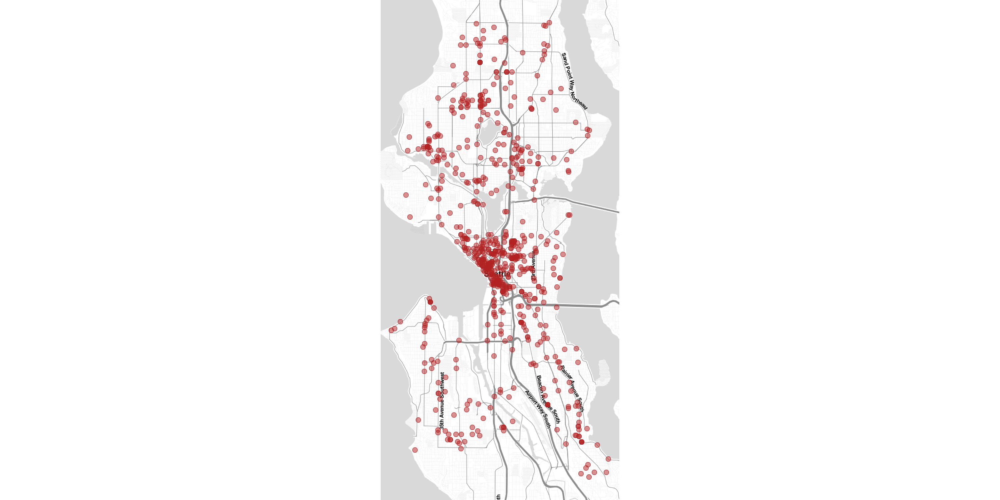
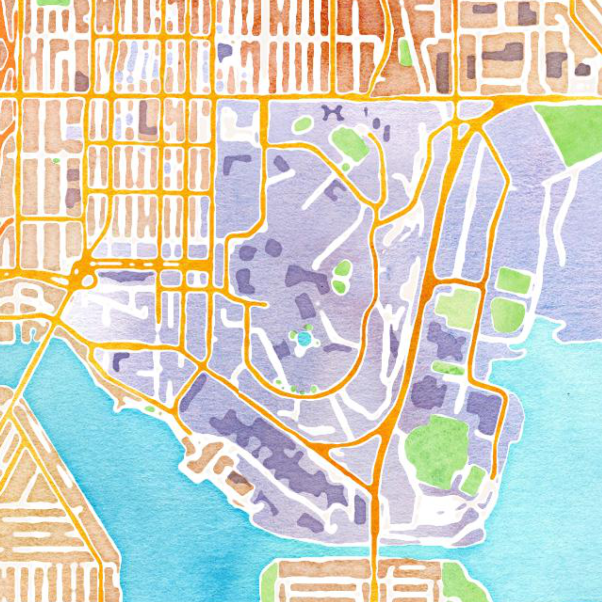
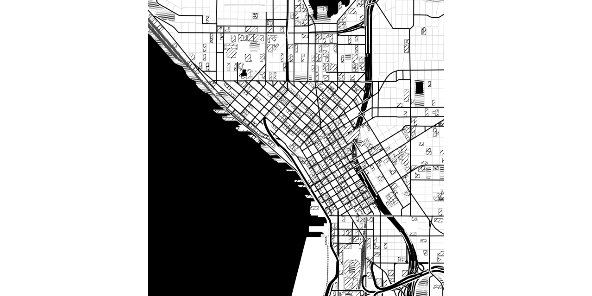
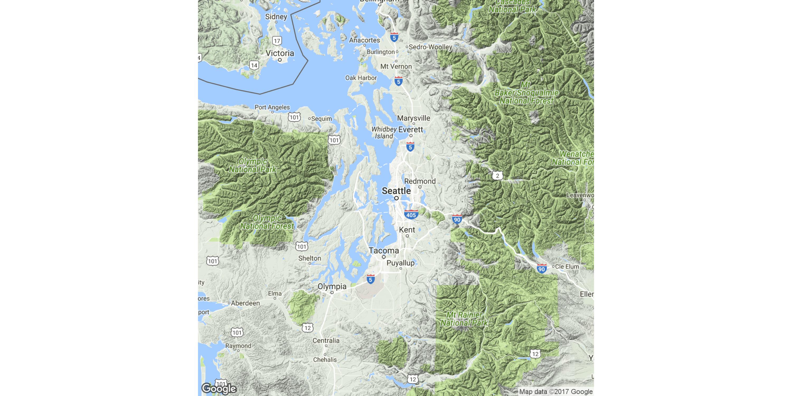
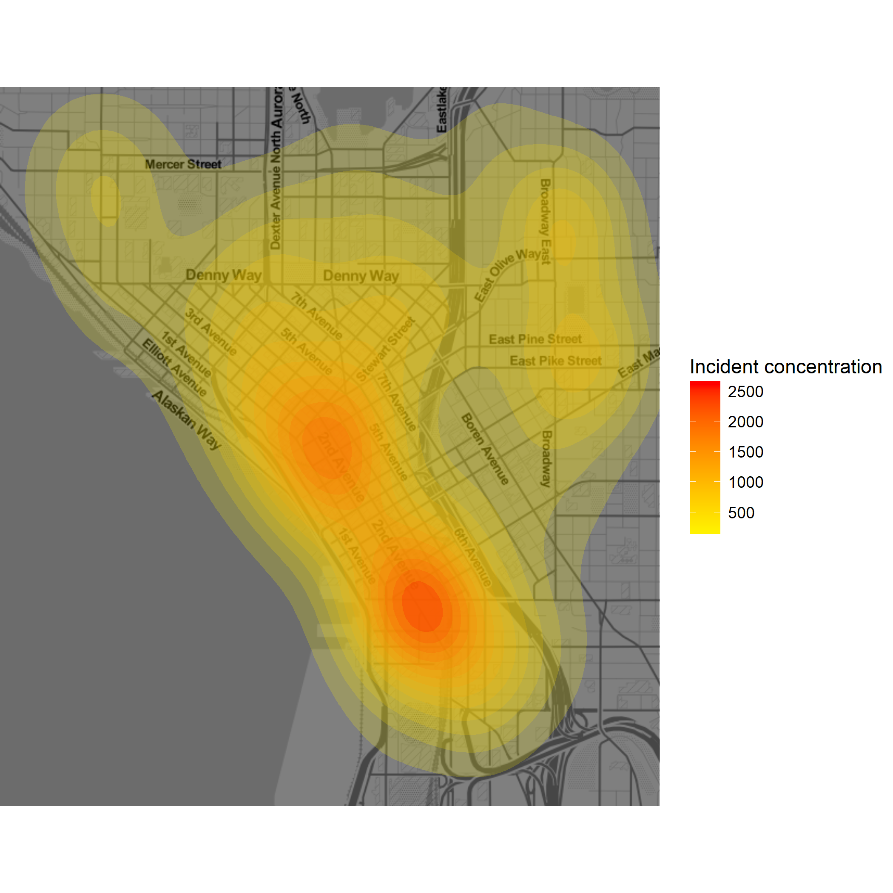
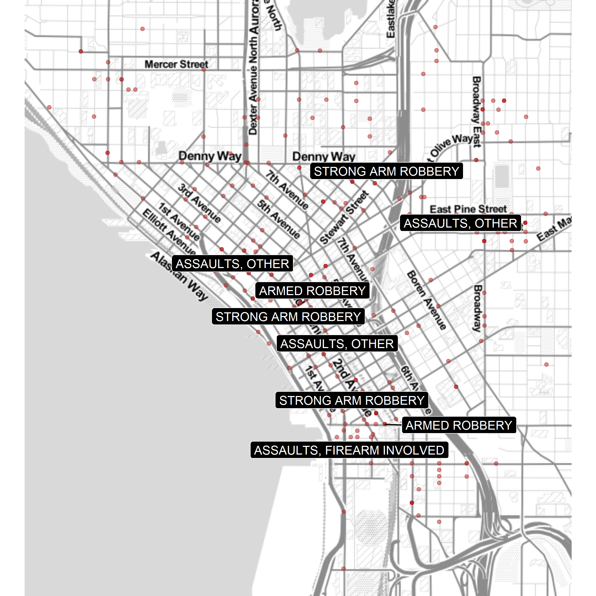
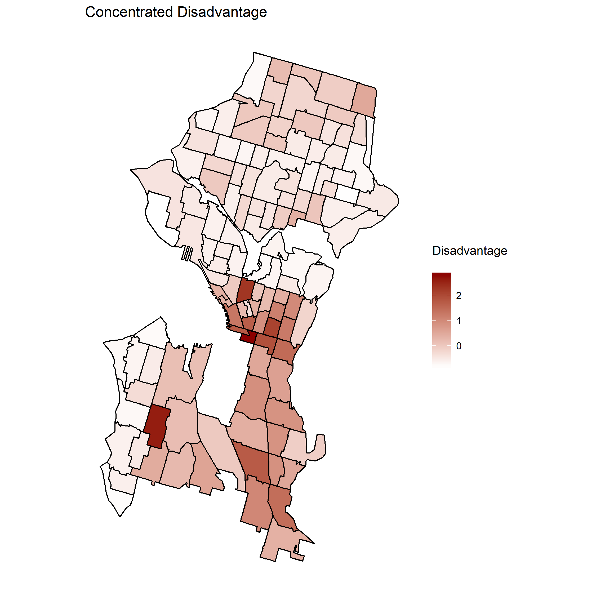
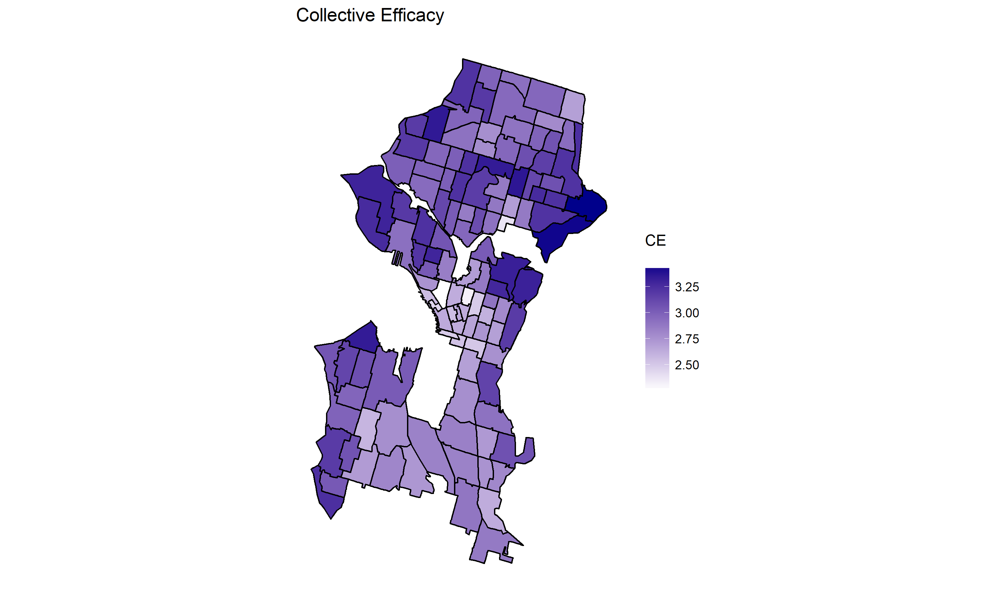
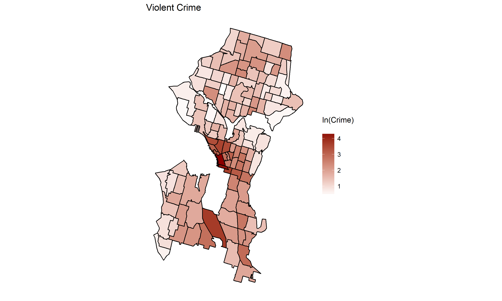
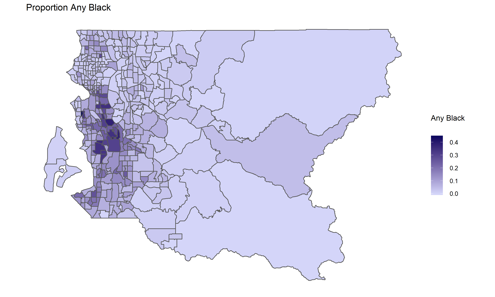

CSSS 508, Week 9: Mapping
====================================================================================
author: Charles Lanfear
date: November 22, 2017
transition: linear
width: 1440
height: 960


Today
====================================================================================

* `ggmap` for mashing up maps with `ggplot2`
* Labeling points and `ggrepel`
* Mapping with raw `ggplot2`
* `tidycensus` and `sf`


Mapping in R: A quick plug
====================================================================================


***

If you are interested in mapping, GIS, and geospatial analysis in R, *acquire this book*.

You may also consider taking Jon Wakefield's **CSSS 554: Statistical Methods for Spatial Data**, however it is challenging and focuses more heavily on statistics than mapping.

Also, in most terms, CSDE offers workshops in GIS using both QGIS and ArcGIS.


ggmap
====================================================================================
type: section


ggmap
====================================================================================

`ggmap` is a package that goes with `ggplot2` so that you can plot spatial data directly onto map images downloaded from Google Maps, OpenStreetMap, and Stamen Maps (good artistic/minimal options).

What this package does for you:

1. Queries servers for a map (`get_map()`) at the location and scale you want
2. Plots the raster image as a `ggplot` object
3. Lets you add more `ggplot` layers like points, 2D density plots, text annotations
4. Additional functions for interacting with Google Maps (e.g. getting distances by bike)


One Day of SPD Incidents
====================================================================================

In Week 5, we looked at types of incidents the Seattle Police Department responded to in a single day. Now, we'll look at where those were.


```r
library(tidyverse); library(ggmap)
```


```r
spd_raw <- read_csv("https://clanfear.github.io/CSSS508/Seattle_Police_Department_911_Incident_Response.csv")
```


Quick Map Plotting with qmplot()
====================================================================================

`qmplot` will automatically set the map region based on your data:

```r
qmplot(data = spd_raw, x = Longitude, y = Latitude, color = I("firebrick"), alpha = I(0.5))
```




Mapping Without Data: qmap()
====================================================================================


```r
qmap(location = "mary gates hall university of washington", zoom = 15, maptype = "watercolor", source = "stamen")
```




get_map()
====================================================================================

Both `qmplot()` and `qmap()` are wrappers for a function called `get_map()` that retrieves a base map layer. Some options:

* `location =` search query or numeric vector of longitude and latitude
* `zoom = ` a zoom level (3 = continent, 10 = city, 21 = building)
* `source = ` `"google"`, `"osm"`, `"stamen"`
* `maptype = `
    + Google types: `"terrain"`, `"terrain-background"`, `"satellite"`, `"roadmap"`, `"hybrid"`
    + Stamen types: `"watercolor"`, `"toner"`, `"toner-background"`, `"toner-lite"`
* `color = ` `"color"` or `"bw"`


Toner Example
====================================================================================


```r
qmap(location = "pike place market", zoom = 14, maptype = "toner-background", source = "stamen")
```




Google Maps Example
====================================================================================


```r
qmap(location = "seattle", zoom = 8, maptype = "terrain", source = "google")
```



Subsetting Geographic Data
====================================================================================

Let's look at locations of incidents near downtown.


```r
# query the map server
downtown_map <- get_map(location = "pike place market", zoom = 14)
# grab the bounding box coordinate data frame
downtown_bb <- attributes(downtown_map)[["bb"]]
# subset the data based on bounding box
downtown_seattle_incidents <- spd_raw %>%
    filter(downtown_bb[["ll.lat"]] <= Latitude &
               Latitude <= downtown_bb[["ur.lat"]] &
               downtown_bb[["ll.lon"]] <= Longitude &
               Longitude <= downtown_bb[["ur.lon"]])
```


Adding Density Layers
====================================================================================

Call `qmplot()` with no `geom()`, and then add density layers:


```r
qmplot(data = downtown_seattle_incidents, geom = "blank", x = Longitude,
       y = Latitude, maptype = "toner-lite", darken = 0.5) + 
  stat_density_2d(aes(fill = ..level..), geom = "polygon", alpha = .2,
                  color = NA) + 
  scale_fill_gradient2("Incident concentration", low = "white", 
                       mid = "yellow", high = "red")
```


Density Plot
====================================================================================




Labeling Points
====================================================================================

Let's label the assaults and robberies specifically in downtown:


```r
assaults <- downtown_seattle_incidents %>% 
  mutate(assault_label = 
           ifelse(`Event Clearance Group` %in%  c("ASSAULTS", "ROBBERY"), 
                  `Event Clearance Description`, "")) %>% 
  filter(assault_label != "")
```

Now let's plot the events and label these specifically using `geom_label()` (`geom_text()` also works without the background/border):


```r
qmplot(data = downtown_seattle_incidents, x = Longitude, y = Latitude,
       maptype = "toner-lite", color = I("firebrick"), alpha = I(0.5)) + 
  geom_label(data = assaults, aes(label = assault_label))
```


Labeled Point Example
====================================================================================


ggrepel
====================================================================================

You can also try `geom_label_repel()` or `geom_text_repel()` if you install and load in the `ggrepel` package to fix overlaps:


```r
library(ggrepel)
qmplot(data = downtown_seattle_incidents, x = Longitude, y = Latitude,
       maptype = "toner-lite", color = I("firebrick"), alpha = I(0.5)) + 
  geom_label_repel(data = assaults, aes(label = assault_label), 
                   fill = "black", color = "white", segment.color = "black")
```


Repelled Labels Example
====================================================================================




ggplot without ggmap
====================================================================================

It is also common (and easy) to plot geospatial data using standard `ggplot2` functions. Just provide `x` and `y`
coordinates to use to draw points or lines.

You need only provide ggplot the following:
* Longitude for the `x` aesthetic
* Latitude for the `y` aesthetic
* Data to fill polygons if making a chloropleth


```r
sea_tract_data <- read_csv("https://raw.githubusercontent.com/clanfear/CSSS508/master/Lectures/Week9/sea_tract_data.csv")
```

Chloropleth Using geom_polygon()
====================================================================================

```r
ggplot(sea_tract_data, aes(x = long, y = lat, group = group,
                           fill = con_disdvntg)) +
  geom_polygon()  + 
  scale_fill_gradient(low = "white", high = "darkred") +
  coord_equal() + 
  geom_path(color = "black", linetype = 1) +
  theme(axis.title = element_blank(), 
        axis.text = element_blank(), 
        panel.grid.major = element_blank(), 
        panel.grid.minor = element_blank(), 
        panel.background = element_blank(),
        axis.ticks = element_blank(),
        axis.line = element_blank()) +
  labs(title = "Concentrated Disadvantage", fill = "Disadvantage\n")
```

Chloropleths Using geom_polygon()
====================================================================================


Chloropleths Using geom_polygon()
====================================================================================


Chloropleths Using geom_polygon()
====================================================================================


tidycensus
====================================================================================
type: section

tidycensus
====================================================================================
incremental: true

`tidycensus` can be used to search the American Community Survey (ACS) and Dicennial
Census for variables, then download them and automatically format them as tidy dataframes.

**These dataframes include geographical boundaries such as tracts!**

This package utilizes the Census API, so you will need to obtain a Census API key.
We'll talk more about APIs next week.


```r
library(tidycensus)
# census_api_key("PUT YOUR KEY HERE", install=TRUE)
```


Development ggplot2
====================================================================================

Note that you may need to install the development version of ggplot2 to use `tidycensus` plotting functions

This will change when the `geom` functions for `sf` objects are finalized.

Use the code below if you want to install `devtools` and the development version of `ggplot2`


```r
install.packages("devtools")
devtools::install_github("tidyverse/ggplot2")
```

Key tidycensus Functions
====================================================================================

* `census_api_key()` - Install a census api key
* `load_variables()` - Load searchable variable lists
* `get_decennial()` - Load Census variables and geographical boundaries.
* `get_acs()` - Load ACS variables and boundaries


Searching for Variables
====================================================================================


```r
acs_2015_vars <- load_variables(2015, "acs5")
acs_2015_vars[10:18,] %>% print() 
```

```
# A tibble: 9 x 3
         name                                     label
        <chr>                                     <chr>
1 B01001_001E                                    Total:
2 B01001_001M               Margin Of Error For!!Total:
3 B01001_002E                                     Male:
4 B01001_002M                Margin Of Error For!!Male:
5 B01001_003E                      Male:!!Under 5 years
6 B01001_003M Margin Of Error For!!Male:!!Under 5 years
7 B01001_004E                       Male:!!5 to 9 years
8 B01001_004M  Margin Of Error For!!Male:!!5 to 9 years
9 B01001_005E                     Male:!!10 to 14 years
# ... with 1 more variables: concept <chr>
```

Processing Data
====================================================================================


```r
king_county <- get_acs(geography="tract", state="WA", county="King",
                       geometry = TRUE,
                       variables=c("B02001_001E", "B02009_001E")) %>% 
  select(-moe) %>% group_by(GEOID) %>% spread(variable, estimate) %>% 
  rename(`Total Population`=B02001_001, `Any Black`=B02009_001) %>%
  mutate(`Any Black` = `Any Black` / `Total Population`)
head(king_county)
```

```
# A tibble: 6 x 5
# Groups:   GEOID [6]
        GEOID                                       NAME
        <chr>                                      <chr>
1 53033000100    Census Tract 1, King County, Washington
2 53033000200    Census Tract 2, King County, Washington
3 53033000300    Census Tract 3, King County, Washington
4 53033000401 Census Tract 4.01, King County, Washington
5 53033000402 Census Tract 4.02, King County, Washington
6 53033000500    Census Tract 5, King County, Washington
# ... with 3 more variables: geometry <S3: sfc_MULTIPOLYGON>, `Total
#   Population` <dbl>, `Any Black` <dbl>
```

Mapping Code
====================================================================================


```r
king_county %>% ggplot(aes(fill=`Any Black`)) + geom_sf() + 
  coord_sf(crs = "+proj=longlat +datum=WGS84", datum=NA) + 
  scale_fill_continuous(name="Any Black\n", 
                        low="#d4d5f9", high="#00025b") + 
  theme_minimal() + ggtitle("Proportion Any Black")
```

New functions:

* `geom_sf()` draws Simple Feature coordinate data.
* `coord_sf()` is used here with these arguments:
   * `crs`: Modifies the coordinate reference system (CRS), often called a "projection"; WGS84 is possibly the most commonly used CRS.
   * `datum=NA`: Removes graticule lines, which are geographical lines such as meridians and parallels.

Map
====================================================================================



Getting Deeper with Geospatial Data
====================================================================================

Until recently, the main way to work with geospatial data in R was through the `sp` 
package. `sp` works well but does not store data the same way as most GIS packages
and can be bulky and complicated.

The more recent `sf` package implements [Simple Features](https://en.wikipedia.org/wiki/Simple_Features) spatial data encoding, which
is an ISO standard for spatial data storage used by GIS packages and spatial databases.
`sf` is also integrated into the `tidyverse`: e.g. `geom_sf()` in `ggplot2`.

The package is somewhat new but is expected to *replace* `sp` eventually. The principle
authors and contributors to `sf` are the same authors as `sp` (including Bivan and Pebesma) but with new developers
from the `tidyverse` as well.

If you are going to enter the world of GIS in R seriously, learn to navigate `sf`!

Homework Exercise
====================================================================================
type: section


Use the HW 7 template to practice making maps of the restaurant inspection data. 
If you wish to submit it for bonus points, turn it in via Canvas by midnight on Tuesday the 28th.
