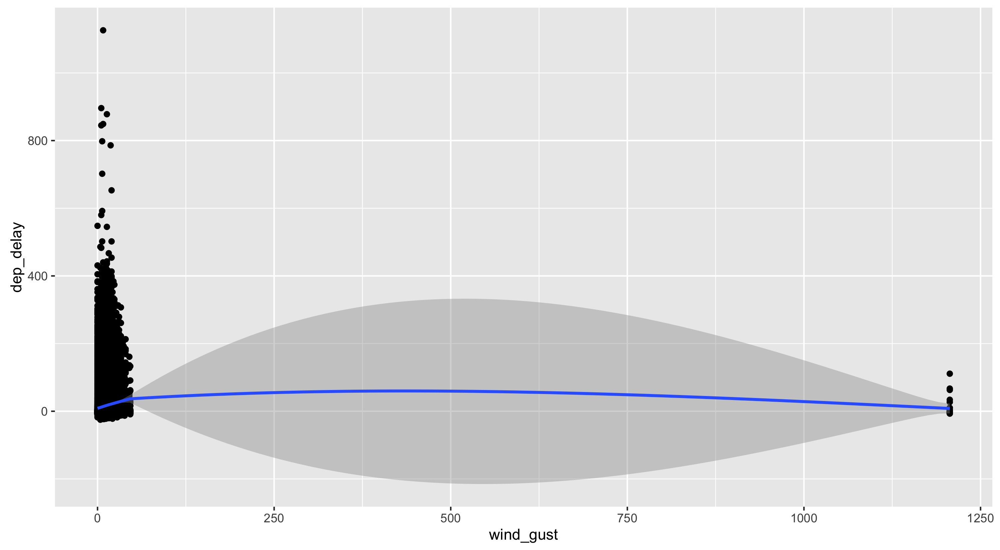

CSSS 508, Week 3
===
author: Rebecca Ferrell
date: April 13, 2016
transition: rotate
width: 1100
height: 750


Weaning you off of spreadsheets
===


Today we'll talk about `dplyr`: a package that does in R just about any calculation you've tried to do in Excel, but more *transparently*, *reproducibly*, and *safely*. Don't be the sad research assistant who made this mistake ([Reinhart and Rogoff](http://www.bloomberg.com/news/articles/2013-04-18/faq-reinhart-rogoff-and-the-excel-error-that-changed-history)):


Modifying data frames with dplyr
===
type: section


Filtering rows (subsetting)
===

Recall last week we used the `filter` command to subset data like so:

```r
library(dplyr)
library(gapminder)

Canada <- gapminder %>%
    filter(country == "Canada")
```

Excel analogue:


%in%
===

Common use case: want to filter rows to things in some set. The `c()` function (**c**ombine, **c**oncatenate) is how we make **vectors** in R, which is an important data type. (We'll talk more about those next week.)


```r
former_yugoslavia <- c("Bosnia and Herzegovina", "Croatia", "Macedonia", "Montenegro", "Serbia", "Slovenia")
yugoslavia <- gapminder %>%
    filter(country %in% former_yugoslavia)
tail(yugoslavia, 2)
```

```
Source: local data frame [2 x 6]

   country continent  year lifeExp     pop gdpPercap
    (fctr)    (fctr) (int)   (dbl)   (int)     (dbl)
1 Slovenia    Europe  2002  76.660 2011497  20660.02
2 Slovenia    Europe  2007  77.926 2009245  25768.26
```


What values are out there? Use distinct
===

You can see all the values in your data for columns using `distinct`:


```r
gapminder %>% distinct(continent, year)
```

```
Source: local data frame [60 x 6]

       country continent  year lifeExp      pop gdpPercap
        (fctr)    (fctr) (int)   (dbl)    (int)     (dbl)
1  Afghanistan      Asia  1952  28.801  8425333  779.4453
2  Afghanistan      Asia  1957  30.332  9240934  820.8530
3  Afghanistan      Asia  1962  31.997 10267083  853.1007
4  Afghanistan      Asia  1967  34.020 11537966  836.1971
5  Afghanistan      Asia  1972  36.088 13079460  739.9811
6  Afghanistan      Asia  1977  38.438 14880372  786.1134
7  Afghanistan      Asia  1982  39.854 12881816  978.0114
8  Afghanistan      Asia  1987  40.822 13867957  852.3959
9  Afghanistan      Asia  1992  41.674 16317921  649.3414
10 Afghanistan      Asia  1997  41.763 22227415  635.3414
..         ...       ...   ...     ...      ...       ...
```


Time to talk about pipes (%>%)
===

The `dplyr` package makes use of an operator (not native to R) called a **pipe**. We write pipes like `%>%` (*Cntl-Shift-M*). Pipes take the object on the left and apply the function on the right: `x %>% f(y) = f(x, y)`. Read out loud: "and then..."


```r
gapminder %>% filter(country == "Canada") %>% head(2)
```

```
Source: local data frame [2 x 6]

  country continent  year lifeExp      pop gdpPercap
   (fctr)    (fctr) (int)   (dbl)    (int)     (dbl)
1  Canada  Americas  1952   68.75 14785584  11367.16
2  Canada  Americas  1957   69.96 17010154  12489.95
```

Pipes save us typing and allow chaining like above, so we use them all the time when manipulating data frames.


Piping
===
incremental: true

- Pipes are clearer to read when you have each function on a separate line (inconsistent in these slides because of space constraints).

```r
take_this_data %>%
    do_first_thing(with = this_value) %>%
    do_next_thing(using = that_value) %>% ...
```

- Stuff to the left of the pipe is passed to the *first argument* of the function on the right. Other arguments go on the right in the function. 

- If you ever find yourself piping a function where the data is not the first argument, use `.` in the data argument instead.

```r
yugoslavia %>% lm(pop ~ year, data = .)
```


Sampling rows: sample_n
===

We can also filter *at random* to work with a smaller dataset using `sample_n` or `sample_frac`.


```r
set.seed(0413) # makes random numbers repeatable
yugoslavia %>% sample_n(size = 6, replace = FALSE)
```

```
Source: local data frame [6 x 6]

     country continent  year lifeExp     pop gdpPercap
      (fctr)    (fctr) (int)   (dbl)   (int)     (dbl)
1 Montenegro    Europe  1962  63.728  474528  4649.594
2 Montenegro    Europe  1982  74.101  562548 11222.588
3     Serbia    Europe  1962  64.531 7616060  6289.629
4   Slovenia    Europe  1952  65.570 1489518  4215.042
5     Serbia    Europe  1952  57.996 6860147  3581.459
6    Croatia    Europe  1997  73.680 4444595  9875.605
```


Sorting: arrange
===

Along with filtering the data to see certain rows, we might want to sort it:


```r
yugoslavia %>% arrange(year, desc(pop))
```

```
Source: local data frame [60 x 6]

                  country continent  year lifeExp     pop gdpPercap
                   (fctr)    (fctr) (int)   (dbl)   (int)     (dbl)
1                  Serbia    Europe  1952  57.996 6860147 3581.4594
2                 Croatia    Europe  1952  61.210 3882229 3119.2365
3  Bosnia and Herzegovina    Europe  1952  53.820 2791000  973.5332
4                Slovenia    Europe  1952  65.570 1489518 4215.0417
5              Montenegro    Europe  1952  59.164  413834 2647.5856
6                  Serbia    Europe  1957  61.685 7271135 4981.0909
7                 Croatia    Europe  1957  64.770 3991242 4338.2316
8  Bosnia and Herzegovina    Europe  1957  58.450 3076000 1353.9892
9                Slovenia    Europe  1957  67.850 1533070 5862.2766
10             Montenegro    Europe  1957  61.448  442829 3682.2599
..                    ...       ...   ...     ...     ...       ...
```


Keeping columns: select
===

Not only can we limit rows, but we can limit columns (and put them in the order listed) using `select`. 


```r
yugoslavia %>% select(country, year, pop) %>% head(4)
```

```
Source: local data frame [4 x 3]

                 country  year     pop
                  (fctr) (int)   (int)
1 Bosnia and Herzegovina  1952 2791000
2 Bosnia and Herzegovina  1957 3076000
3 Bosnia and Herzegovina  1962 3349000
4 Bosnia and Herzegovina  1967 3585000
```


Dropping columns: select
===

We can instead drop columns with `select` using `-` signs:


```r
yugoslavia %>% select(-continent, -pop, -lifeExp) %>% head(4)
```

```
Source: local data frame [4 x 3]

                 country  year gdpPercap
                  (fctr) (int)     (dbl)
1 Bosnia and Herzegovina  1952  973.5332
2 Bosnia and Herzegovina  1957 1353.9892
3 Bosnia and Herzegovina  1962 1709.6837
4 Bosnia and Herzegovina  1967 2172.3524
```


Helper functions for select
===

`select()` has a variety of helper functions like `starts_with`, `ends_with`, and `contains`, or giving a range of continguous columns `startvar:endvar`. These are very useful if you have a "wide" data frame with column names following a pattern or ordering. See `?select`.


(US Dept. of Education "College Scorecard" data: > 100 columns)


Renaming columns with select
===

We can rename columns using `select`, but that drops everything that isn't mentioned:


```r
yugoslavia %>%
    select(Life_Expectancy = lifeExp) %>%
    head(4)
```

```
Source: local data frame [4 x 1]

  Life_Expectancy
            (dbl)
1           53.82
2           58.45
3           61.93
4           64.79
```


Safer: rename columns with...rename
===


```r
yugoslavia %>%
    select(country, year, lifeExp) %>%
    rename(Life_Expectancy = lifeExp) %>%
    head(4)
```

```
Source: local data frame [4 x 3]

                 country  year Life_Expectancy
                  (fctr) (int)           (dbl)
1 Bosnia and Herzegovina  1952           53.82
2 Bosnia and Herzegovina  1957           58.45
3 Bosnia and Herzegovina  1962           61.93
4 Bosnia and Herzegovina  1967           64.79
```


Column naming practices
===
incremental: true

- *Good* column names will be self-describing. Don't use inscrutable abbreviations to save typing. RStudio's autocompleting functions take away the pain of long variable names: hit tab while writing code.

- *Valid* "naked" column names can contain upper or lowercase letters, numbers, periods, and underscores. They must start with a letter or period and not be a special reserved word (e.g. `TRUE`, `if`).

- Names are case-sensitive: `Year` and `year` are not the same thing!

- You can include spaces or use reserved words if you put backticks around the name. Spaces can be worth including when preparing data for `ggplot2` or `pander` since you don't have to rename axes or table headings.


Column name with space example
===


```r
library(pander)
yugoslavia %>% filter(country == "Serbia") %>%
    select(year, lifeExp) %>%
    rename(Year = year, `Life Expectancy` = lifeExp) %>%
    head(5) %>%
    pander(style = "rmarkdown", caption = "Serbian life expectancy")
```


|  Year  |  Life Expectancy  |
|:------:|:-----------------:|
|  1952  |      57.996       |
|  1957  |      61.685       |
|  1962  |      64.531       |
|  1967  |      66.914       |
|  1972  |      68.700       |

Table: Serbian life expectancy


Create new columns: mutate and transmute
===

Thing you do in spreadsheets: add column to data, drag down.


`dplyr` way: add new columns to a data frame using `mutate`. (Add new columns and drop old ones using `transmute`.)


mutate example
===


```r
yugoslavia %>% filter(country == "Serbia") %>%
    select(year, pop, lifeExp) %>%
    mutate(pop_million = pop / 1000000,
           life_exp_past_40 = lifeExp - 40) %>%
    head(5)
```

```
Source: local data frame [5 x 5]

   year     pop lifeExp pop_million life_exp_past_40
  (int)   (int)   (dbl)       (dbl)            (dbl)
1  1952 6860147  57.996    6.860147           17.996
2  1957 7271135  61.685    7.271135           21.685
3  1962 7616060  64.531    7.616060           24.531
4  1967 7971222  66.914    7.971222           26.914
5  1972 8313288  68.700    8.313288           28.700
```


ifelse()
===

A common function used in `mutate` (and in general in R programming) is `ifelse()`. This returns a value depending on logical tests.


```r
yugoslavia %>%
    mutate(short_country = ifelse(country == "Bosnia and Herzegovina", "B and H", as.character(country))) %>%
    select(short_country, year, pop) %>%
    arrange(year, short_country) %>%
    head(3)
```

```
Source: local data frame [3 x 3]

  short_country  year     pop
          (chr) (int)   (int)
1       B and H  1952 2791000
2       Croatia  1952 3882229
3    Montenegro  1952  413834
```


Summarizing with dplyr
===
type: section


General aggregation: summarize
===

`summarize` takes your rows of data and computes something across them: count how many rows there are, calculate the mean or total, etc. You can use any function that aggregates multiple values into a single one (like `sd`).

In a spreadsheet:


Summarize example
===


```r
yugoslavia %>%
    filter(year == 1982) %>%
    summarize(n_obs = n(),
              total_pop = sum(pop),
              mean_life_exp = mean(lifeExp),
              range_life_exp = max(lifeExp) - min(lifeExp))
```

```
Source: local data frame [1 x 4]

  n_obs total_pop mean_life_exp range_life_exp
  (int)     (int)         (dbl)          (dbl)
1     5  20042685       71.2952          3.939
```


Avoiding repetition: summarize_each
===

Maybe you need to calculate the mean and standard deviation of a bunch of columns. With `summarize_each()`, you put the functions to use in a `funs()` list, and the variables to compute over after that (like `select` syntax).


```r
yugoslavia %>%
    filter(year == 1982) %>%
    summarize_each(funs(mean, sd),
                   lifeExp, pop)
```

```
Source: local data frame [1 x 4]

  lifeExp_mean pop_mean lifeExp_sd  pop_sd
         (dbl)    (dbl)      (dbl)   (dbl)
1      71.2952  4008537   1.602685 3237282
```


Splitting data into groups: group_by
===

The special function `group_by()` changes how functions operate on the data, most importantly `summarize`. These functions are computed *within each group* as defined by variables given, rather than over all rows at once. Typically the variables you group by will be integers, factors, or characters, and not continuous real values.

Excel analogue: pivot tables


group_by() example
===


```r
yugoslavia %>% group_by(year) %>%
    summarize(num_countries = n_distinct(country),
              total_pop = sum(pop),
              total_gdp_per_cap = sum(pop * gdpPercap) / total_pop) %>%
    head(5)
```

```
Source: local data frame [5 x 4]

   year num_countries total_pop total_gdp_per_cap
  (int)         (int)     (int)             (dbl)
1  1952             5  15436728          3029.794
2  1957             5  16314276          4187.491
3  1962             5  17099107          5256.578
4  1967             5  17878535          6655.827
5  1972             5  18579786          8730.215
```


Window functions
===

Grouping can also be used with `mutate` or `filter` to give rank orders within a group, lagged values, and cumulative sums. Much more on window functions is in a [vignette](https://cran.r-project.org/web/packages/dplyr/vignettes/window-functions.html).


```r
yugoslavia %>% select(country, year, pop) %>%
    filter(year >= 2002) %>% group_by(country) %>%
    mutate(lag_pop = lag(pop, order_by = year),
           pop_chg = pop - lag_pop) %>% head(4)
```

```
Source: local data frame [4 x 5]
Groups: country [2]

                 country  year     pop lag_pop pop_chg
                  (fctr) (int)   (int)   (int)   (int)
1 Bosnia and Herzegovina  2002 4165416      NA      NA
2 Bosnia and Herzegovina  2007 4552198 4165416  386782
3                Croatia  2002 4481020      NA      NA
4                Croatia  2007 4493312 4481020   12292
```


Lab break!
===

With the Gapminder data, practice the following analyses:

* Find the population (in units of millions of people) in 2007 for countries in Asia. Make a histogram.
* Use population and GDP per capita to find the 10 largest economies in 1952 as measured by overall GDP (not per capita).
* For each country and each year, find the percentage growth of the population relative to the population of the country 5 years prior (the Gapminder data are reported every 5 years). Then find the 10 country-year pairs that had the highest percentage growth relative to 5 years prior, and the 10 country-year pairs that had the lowest percentage growth.


Joining data frames
===
type: section


When do we need to join tables?
===

* Want to make columns using criteria too complicated for `ifelse()`
* Combine data stored in separate places: e.g. UW registrar information with student homework grades

Excel equivalents: `VLOOKUP`, `MATCH`


Joining: conceptually
===

We need to think about the following when we want to merge data frames `A` and `B`:

* Which rows are we keeping from each data frame?
* Which columns are we keeping from each data frame?
* Which variables determine whether rows match?


Types of joins: rows and columns to keep
===

* `A %>% inner_join(B)`: keep rows from `A` that match rows in `B`, columns from both `A` and `B`
* `A %>% left_join(B)`: keep all rows from `A`, matched with `B` wherever possible (`NA` when not), columns from both `A` and `B`
* `A %>% right_join(B)`: keep all rows from `B`, matched with `A` wherever possible (`NA` when not), columns from both `A` and `B`
* `A %>% full_join(B)`: keep all rows from either `A` or `B`, matched wherever possible (`NA` when not), columns from both `A` and `B`
* `A %>% semi_join(B)`: keep rows from `A` that match rows in `B`, columns from just `A`
* `A %>% anti_join(B)`: keep rows from `A` that *don't* match a row in `B`, columns from just `A`


Matching criteria
===

We say rows should match because they have some columns containing the same value. We list these in a `by = ` argument to the join.

* No `by`: matches using all variables in `A` and `B` that have identical names
* `by = c("var1", "var2", "var3")`: matches on identical values of `var1`, `,var2`, `var3` in both `A` and `B`
* `by = c("Avar1" = "Bvar1", "Avar2" = "Bvar2")`: matches identical values of `Avar1` variable in `A` to `Bvar1` variable in `B`, and `Avar2` variable in `A` to `Bvar2` variable in `B`

Note: if there are multiple matches, you'll get one row for each possible combo (except with `semi_join` and `anti_join`).

(Need to get more complicated? You'll want to learn SQL.)


nycflights13 data
===

We'll use data in the [`nycflights13` package](https://cran.r-project.org/web/packages/nycflights13/nycflights13.pdf). Install and load it:

```r
# install.packages("nycflights13")
library(nycflights13)
```

It includes five tables, some of which contain missing data (`NA`):

* `flights`: flights leaving JFK, LGA, or EWR in 2013
* `airlines`: airline abbreviations
* `airports`: airport metadata
* `planes`: airplane metadata
* `weather`: hourly weather data for JFK, LGA, and EWR

Join example #1
===

Who manufactures the planes that flew to Seattle?

```r
flights %>% filter(dest == "SEA") %>% select(tailnum) %>%
    left_join(planes %>% select(tailnum, manufacturer), by = "tailnum") %>%
    distinct(manufacturer)
```

```
Source: local data frame [6 x 2]

  tailnum       manufacturer
    (chr)              (chr)
1  N594AS             BOEING
2  N503JB   AIRBUS INDUSTRIE
3  N3ETAA                 NA
4  N712JB             AIRBUS
5  N508JB CIRRUS DESIGN CORP
6  N531JB      BARKER JACK L
```

Join example #2
===

Which airlines had the most flights to Seattle from NYC?

```r
flights %>% filter(dest == "SEA") %>% select(carrier) %>%
    left_join(airlines, by = "carrier") %>%
    group_by(name) %>% tally() %>% arrange(desc(n))
```

```
Source: local data frame [5 x 2]

                    name     n
                  (fctr) (int)
1   Delta Air Lines Inc.  1213
2  United Air Lines Inc.  1117
3   Alaska Airlines Inc.   714
4        JetBlue Airways   514
5 American Airlines Inc.   365
```


Join example #3
===

Is there a relationship between departure delays and wind gusts?


```r
library(ggplot2)
flights %>% select(origin, year, month, day, hour, dep_delay) %>%
    inner_join(weather, by = c("origin", "year", "month", "day", "hour")) %>%
    select(dep_delay, wind_gust) %>%
    # removing rows with missing values
    filter(!is.na(dep_delay) & !is.na(wind_gust)) %>% 
    ggplot(aes(x = wind_gust, y = dep_delay)) +
    geom_point() + geom_smooth()
```

Wind gusts and delays
===



Redo after removing extreme outliers, just trend
===


```r
flights %>% select(origin, year, month, day, hour, dep_delay) %>%
    inner_join(weather, by = c("origin", "year", "month", "day", "hour")) %>%
    select(dep_delay, wind_gust) %>%
    filter(!is.na(dep_delay) & !is.na(wind_gust) & wind_gust < 250) %>% 
    ggplot(aes(x = wind_gust, y = dep_delay)) +
    geom_smooth() + theme_bw(base_size = 16) +
    xlab("Wind gusts in departure hour (mph)") +
    ylab("Average departure delay (minutes)")
```

Wind gusts and delays: mean trend
===


Lab break!
===

Some possible questions to investigate:

* What are the names of the most common destination airports?
* Which airlines fly from NYC to your home city?
* Is there a relationship between departure delays and precipitation?
* Use the time zone data in `airports` to convert flight arrival times to NYC local time.
    + What is the distribution of arrival times for flights leaving NYC over a 24 hour period?
    + Are especially late or early arrivals particular to some regions or airlines?

**Warning!** `flights` has 336776 rows, so if you do a sloppy join, you can end up with many matches per observation and have the data blow up.


Homework
===
type: section

Pick something to look at in the `nycflights13` data and write up a .Rmd file showing your investigation. Upload both the .Rmd file and the .html file to Canvas. You must use at least once: `mutate`, `summarize`, `group_by`, and joins. Include at least one formatted plot or table.

This time, include all your code in your output document, using comments and line breaks separating commands so that it is clear to a peer what you are doing. You must write up your observations in words as well. 


Grading rubric
===

* 0: Didn't turn anything in
* 1: Turned in but low effort, ignoring many directions
* 2: Decent effort, followed directions with some minor issues
* 3: Nailed it
